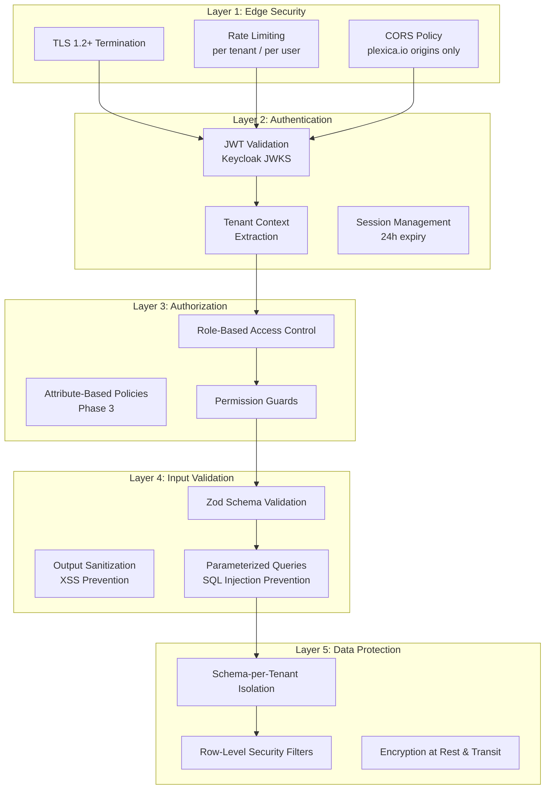
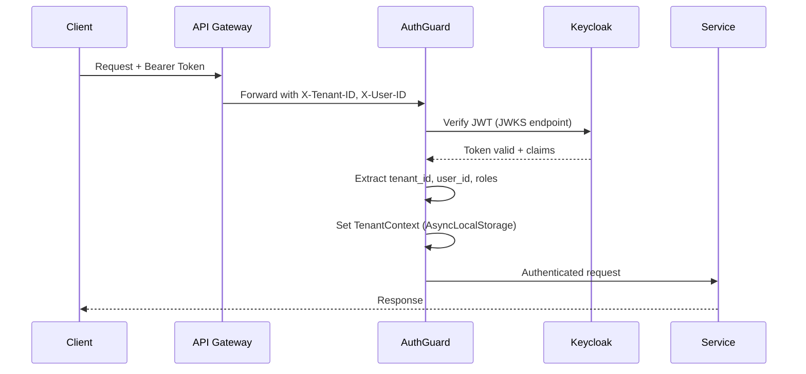
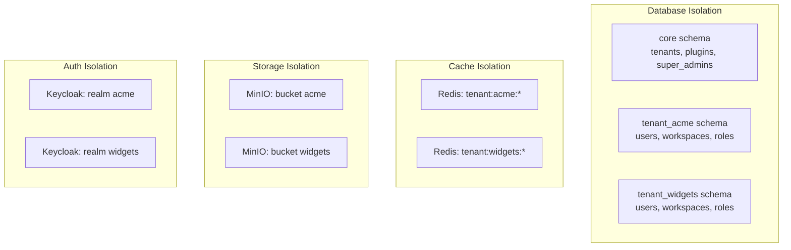

# Security Architecture

**Version**: 1.1
**Last Updated**: February 16, 2026
**Status**: Active
**Owner**: Security & Platform Engineering Team
**FORGE Track**: Feature

---

## Overview

This document defines Plexica's security architecture — the layered defense model that protects a multi-tenant SaaS platform where tenant data isolation is a critical security invariant. It covers authentication, authorization, input validation, data protection, network security, plugin sandboxing, and audit logging.

Per **Constitution Article 1.2**, security is a non-negotiable principle: no feature ships without security review.

---

## Security Principles

| Principle        | Description                                                     | Constitution Ref |
| ---------------- | --------------------------------------------------------------- | ---------------- |
| Defense in Depth | Multiple layers of security controls at every boundary          | Art. 5           |
| Least Privilege  | Grant minimum necessary permissions to users, services, plugins | Art. 5.1         |
| Tenant Isolation | Complete data isolation between tenants at every layer          | Art. 1.2, 5.2    |
| Fail Secure      | System denies access by default; failures don't open access     | Art. 5.1         |
| Input Distrust   | All external input is untrusted and must be validated           | Art. 5.3         |
| Audit Everything | All security-relevant actions are logged with full context      | Art. 6.3         |

---

## Security Layers



---

## Authentication

### Keycloak Integration

Plexica uses Keycloak as the identity provider for all authentication. Per **Constitution Article 5.1**, all endpoints require authentication unless explicitly marked `public`.

**Architecture**:

| Component       | Responsibility                             | Implementation            |
| --------------- | ------------------------------------------ | ------------------------- |
| KeycloakService | Token verification, realm management       | JWKS-based JWT validation |
| JwtService      | Token parsing, claims extraction           | `jsonwebtoken` library    |
| AuthGuard       | Request-level authentication enforcement   | Fastify preHandler hook   |
| TenantGuard     | Tenant context validation on every request | AsyncLocalStorage context |

**Token Verification Flow**:



**Keycloak Configuration**:

- One Keycloak **realm per tenant** for complete auth isolation
- Realm naming: raw tenant slug (e.g., `acme-corp` — no prefix)
- Base roles per realm: `tenant_admin`, `user` (realm-level; see Spec 002 FR-006)
- Workspace-level roles: `ADMIN`, `MEMBER`, `VIEWER` (see Spec 009, WorkspaceRole enum)
- Session tokens expire after **24 hours** of inactivity (Constitution Art. 5.1)

### Authentication Code Pattern

```typescript
// Middleware: Verify token on every request
export const authenticateUser = async (request: FastifyRequest) => {
  const token = request.headers.authorization?.replace('Bearer ', '');

  if (!token) {
    throw new UnauthorizedException('No token provided');
  }

  const decoded = await keycloakService.verifyToken(token);
  return decoded;
};
```

---

## Authorization

### Role-Based Access Control (RBAC)

Per **Constitution Article 5.1**, RBAC is enforced for all protected resources.

**Role Hierarchy**:

| Role         | Scope     | Keycloak Location          | Capabilities                                  |
| ------------ | --------- | -------------------------- | --------------------------------------------- |
| Super Admin  | Global    | Master realm role          | Manage all tenants, plugins, system config    |
| Tenant Admin | Tenant    | Realm role: `tenant_admin` | Manage tenant settings, users, roles, plugins |
| User         | Tenant    | Realm role: `user`         | Base tenant access, join workspaces           |
| Team Admin   | Team      | Application-level          | Team management within tenant                 |
| Admin        | Workspace | `WorkspaceRole.ADMIN`      | Full workspace management                     |
| Member       | Workspace | `WorkspaceRole.MEMBER`     | Read/write within workspace, limited settings |
| Viewer       | Workspace | `WorkspaceRole.VIEWER`     | Read-only access                              |

> **Note**: Realm-level roles (`tenant_admin`, `user`) are provisioned in
> Keycloak per Spec 002 FR-006. Workspace-level roles (`ADMIN`, `MEMBER`,
> `VIEWER`) are managed in the application database via the `WorkspaceRole`
> enum (Spec 009). System roles (`super_admin`, `tenant_admin`, `team_admin`,
> `user`) are defined in Spec 003 FR-003 and are immutable.

**Permission Model**:

Permissions follow the format `resource:action` (e.g., `crm:contacts:read`, `workspace:members:write`). Plugins register their own permissions during installation.

**Authorization Components**:

| Component         | Responsibility                           |
| ----------------- | ---------------------------------------- |
| PermissionService | Permission lookup and caching            |
| PermissionGuard   | Endpoint-level permission checks         |
| PolicyEngine      | ABAC policy evaluation (Phase 3)         |
| RoleService       | Role assignment, role-permission mapping |

**Authorization Code Pattern**:

```typescript
// Check workspace membership and role
const membership = await workspaceService.getMembership(workspaceId, userId, tenant);

if (!membership) {
  throw new ForbiddenException('Not a workspace member');
}

if (membership.role !== WorkspaceRole.ADMIN) {
  throw new ForbiddenException('Admin role required');
}
```

### ABAC Policy Engine (Phase 3)

Attribute-Based Access Control extends RBAC with conditional policies:

```json
{
  "name": "Allow sales team to view deals",
  "resource": "crm:deals",
  "effect": "allow",
  "conditions": {
    "user.department": "sales",
    "time.hour": { "between": [9, 18] }
  },
  "priority": 10
}
```

---

## Input Validation

### Zod Schema Validation

Per **Constitution Article 5.3**, all external input must be validated with Zod schemas.

**Validation Layers**:

1. **Client-side**: For UX feedback (can be bypassed)
2. **API Gateway**: Format validation (JWT, headers)
3. **Service Layer**: Business logic validation (uniqueness, constraints)
4. **Database**: Integrity constraints (NOT NULL, UNIQUE, FK)

**Example**:

```typescript
import { z } from 'zod';

const createWorkspaceSchema = z.object({
  slug: z
    .string()
    .min(3, 'Slug must be at least 3 characters')
    .max(50, 'Slug must be at most 50 characters')
    .regex(/^[a-z0-9-]+$/, 'Slug must contain only lowercase letters, numbers, and hyphens'),
  name: z.string().min(1).max(100),
  description: z.string().max(500).optional(),
});
```

### SQL Injection Prevention

Per **Constitution Article 5.3**, SQL injection prevention via parameterized queries is **MANDATORY**.

| Method                          | Use Case                | Security Level             |
| ------------------------------- | ----------------------- | -------------------------- |
| Prisma ORM methods              | CRUD operations         | Safest                     |
| `$queryRaw` template literals   | Complex queries         | Safe                       |
| `$queryRawUnsafe` with `$1, $2` | Legacy / specific needs | Safe if used correctly     |
| `Prisma.raw()` for identifiers  | Schema/table names      | Acceptable with validation |
| String concatenation            | **NEVER USE**           | **Vulnerable**             |

**Safe Pattern**:

```typescript
// Always validate identifiers (schema/table names)
const schemaPattern = /^[a-z0-9_]+$/;
if (!schemaPattern.test(schemaName)) {
  throw new Error(`Invalid schema name: ${schemaName}`);
}

// Parameterize all values
const users = await db.$queryRaw<User[]>`
  SELECT * FROM ${Prisma.raw(`"${schemaName}"."users"`)}
  WHERE email = ${email}
`;
```

**Forbidden Pattern**:

```typescript
// NEVER: String interpolation in SQL
await db.$queryRawUnsafe(`SELECT * FROM users WHERE email = '${email}'`);
```

### XSS Prevention

Output sanitization for user-generated content:

```typescript
import DOMPurify from 'isomorphic-dompurify';
const sanitizedDescription = DOMPurify.sanitize(workspace.description);
```

### CSRF Protection

CSRF protection on all state-changing endpoints (POST, PUT, DELETE, PATCH).

---

## Multi-Tenant Data Isolation

### Isolation Architecture

Per **Constitution Articles 1.2 and 5.2**, complete tenant data isolation is enforced at every layer.



**Isolation Matrix**:

| Layer          | Isolation Method                      | Enforcement                 |
| -------------- | ------------------------------------- | --------------------------- |
| Database       | Separate PostgreSQL schema per tenant | Tenant context middleware   |
| Cache          | Redis key prefix `tenant:{slug}:`     | Cache service wrapper       |
| Object Storage | Separate MinIO bucket per tenant      | Storage service wrapper     |
| Authentication | Separate Keycloak realm per tenant    | Realm named by raw slug     |
| Event Bus      | Topic prefix `tenant.{slug}.`         | Event bus service wrapper   |
| Workspaces     | Logical isolation via `workspace_id`  | Workspace membership guards |

### Tenant Context Middleware

Every request passes through tenant context middleware that:

1. Extracts `tenant_id` from JWT claims or X-Tenant-ID header
2. Validates the tenant exists and is active
3. Sets the PostgreSQL `search_path` to the tenant's schema
4. Stores tenant context in `AsyncLocalStorage` for the request lifecycle
5. All downstream queries automatically use the tenant's schema

**Critical Rule**: Cross-tenant data access is a **critical security violation** that blocks all releases (Constitution Art. 1.2).

### Workspace-Level Isolation

Within a tenant, workspaces provide logical isolation:

- Shared PostgreSQL schema (filtered by `workspace_id`)
- Shared storage bucket (prefixed path by workspace)
- Same Keycloak realm (workspace as user attribute)
- Every workspace-scoped query MUST include `workspace_id` filter
- Workspace membership enforced via middleware

---

## Network Security

### CORS Configuration

```typescript
app.enableCors({
  origin: (origin, callback) => {
    const allowedOrigins = ['https://app.plexica.io', 'https://*.plexica.io', /\.plexica\.io$/];
    // Validate origin against allowlist
  },
  credentials: true,
  methods: ['GET', 'POST', 'PUT', 'DELETE', 'PATCH'],
  allowedHeaders: ['Content-Type', 'Authorization', 'X-Tenant-ID', 'X-Trace-ID'],
});
```

### Rate Limiting

Rate limiting is enforced at two levels:

1. **API Gateway level**: Kong/Traefik rate limiting (100 req/min default)
2. **Application level**: Redis-based rate limiter with tenant-aware keys

```
Rate limit key: rate_limit:{tenantId}:{userId}:{route}
```

| Tenant Plan | Limit (per minute) |
| ----------- | ------------------ |
| Standard    | 100                |
| Premium     | 1,000              |

### TLS

Per **Constitution Article 5.2**, all data in transit must use TLS 1.2+:

- External traffic: TLS terminated at ingress/load balancer
- Internal traffic: mTLS planned for service-to-service communication

---

## Plugin Sandboxing

Per **Constitution Article 1.2** (Plugin System Integrity), plugins must not bypass core security controls.

### Plugin Security Controls

| Control                 | Description                                           |
| ----------------------- | ----------------------------------------------------- |
| Container Isolation     | Separate container per plugin (remote plugins)        |
| Network Policies        | K8s NetworkPolicy limits plugin communication         |
| Resource Limits         | CPU and memory limits enforced per plugin             |
| Secret Injection        | Secrets injected via environment variables only       |
| API Contracts           | Plugins communicate with core only via defined APIs   |
| Permission Registration | Plugins must declare required permissions in manifest |

### Plugin Manifest Security

```json
{
  "id": "crm",
  "permissions": ["crm:contacts:read", "crm:contacts:write", "crm:deals:*"],
  "dependencies": ["core:users", "core:notifications"],
  "resourceLimits": {
    "cpu": "500m",
    "memory": "512Mi"
  }
}
```

---

## Secrets Management

Per **Constitution Article 5.2**, secrets, API keys, and credentials must never be committed to source control.

### Secrets Strategy

| Environment | Method                    | Tool                    |
| ----------- | ------------------------- | ----------------------- |
| Development | `.env` files (gitignored) | dotenv                  |
| CI          | GitHub Secrets            | GitHub Actions          |
| Production  | External secret store     | AWS SSM Parameter Store |

### AWS SSM Integration

```typescript
// Secrets are cached for 5 minutes to reduce API calls
export class SecretsManager {
  async getSecret(key: string): Promise<string> {
    const command = new GetParameterCommand({
      Name: `/plexica/${process.env.NODE_ENV}/${key}`,
      WithDecryption: true,
    });
    const response = await this.ssmClient.send(command);
    return response.Parameter.Value;
  }
}
```

---

## Audit Logging

### Events to Log

Per **Constitution Article 6.3**, all security-relevant actions must be logged.

| Event Category     | Examples                                    | Log Level |
| ------------------ | ------------------------------------------- | --------- |
| Authentication     | Login, logout, token refresh, failed login  | `info`    |
| Authorization      | Permission denied, role change              | `warn`    |
| Tenant Operations  | Tenant create, delete, config change        | `info`    |
| Data Mutation      | CRUD on sensitive resources                 | `info`    |
| Admin Access       | Super admin actions, system config changes  | `info`    |
| Security Incidents | Cross-tenant access attempt, rate limit hit | `error`   |

### Log Format

Per **Constitution Article 6.3**, all logs must include:

```json
{
  "timestamp": "2026-02-13T10:30:00.000Z",
  "level": "info",
  "message": "Contact created",
  "requestId": "req-abc123",
  "userId": "user-789",
  "tenantId": "acme-corp",
  "traceId": "trace-xyz456"
}
```

**Critical**: Never log passwords, tokens, PII, credit cards, API keys, or session IDs (Constitution Art. 6.3).

---

## Dependency Security

Per **Constitution Article 5.4**:

| Severity | Patch SLA   | Enforcement          |
| -------- | ----------- | -------------------- |
| Critical | 48 hours    | Automated CI block   |
| High     | 1 week      | Automated CI warning |
| Medium   | Next sprint | Tracked in backlog   |
| Low      | Best effort | Quarterly review     |

- **Automated Scanning**: Vulnerability scanning in CI pipeline for all dependencies
- **Weekly Audits**: Weekly dependency audit reports reviewed by security team

---

## Security Testing

### Required Security Tests

| Test Type              | Scope                                         | Framework      |
| ---------------------- | --------------------------------------------- | -------------- |
| SQL Injection Tests    | All raw query endpoints                       | Vitest         |
| Tenant Isolation Tests | Cross-tenant data access attempts             | Vitest (E2E)   |
| Auth Bypass Tests      | Unauthenticated access to protected endpoints | Vitest         |
| RBAC Tests             | Permission enforcement at every endpoint      | Vitest         |
| Input Validation Tests | Malformed input, boundary values              | Vitest         |
| Rate Limiting Tests    | Burst traffic patterns                        | k6 / Artillery |

Per **Constitution Article 4.1**, security code requires **100% test coverage** for authentication, authorization, and tenant isolation logic.

### Security Code Review Checklist

Before merging any PR:

- [ ] All queries use parameterized inputs (no string concatenation in SQL)
- [ ] Tenant context validated in every data access path
- [ ] User permissions checked before sensitive operations
- [ ] All user input validated with Zod schemas
- [ ] No secrets, tokens, or PII in logs or error messages
- [ ] No hardcoded secrets in source code
- [ ] Output sanitized to prevent XSS
- [ ] CSRF protection on state-changing endpoints
- [ ] Error messages are actionable but don't leak internal details

---

## Incident Response

Per **Constitution Article 9.3**:

| Severity | Description                       | Response Time | Notification        |
| -------- | --------------------------------- | ------------- | ------------------- |
| P1       | Data breach, cross-tenant leak    | Immediate     | All stakeholders    |
| P2       | Auth bypass, privilege escalation | < 1 hour      | Security + Eng lead |
| P3       | Rate limiting failure, DoS risk   | < 4 hours     | Engineering team    |
| P4       | Non-critical vulnerability        | Next sprint   | Security backlog    |

Post-incident review required for all P1 and P2 incidents.

---

## Constitution Compliance Summary

| Article  | Requirement                              | How Addressed                                          |
| -------- | ---------------------------------------- | ------------------------------------------------------ |
| Art. 1.2 | Security First                           | Defense-in-depth with 5 security layers                |
| Art. 1.2 | Multi-Tenancy Isolation                  | Schema-per-tenant + per-layer isolation                |
| Art. 1.2 | Plugin System Integrity                  | Container isolation, network policies, resource limits |
| Art. 5.1 | Keycloak for all auth                    | Realm-per-tenant Keycloak integration                  |
| Art. 5.1 | All endpoints require auth by default    | AuthGuard as default preHandler                        |
| Art. 5.1 | RBAC for all protected resources         | PermissionGuard + RoleService                          |
| Art. 5.1 | Session tokens expire after 24h          | Keycloak session configuration                         |
| Art. 5.2 | TLS 1.2+ for all data in transit         | Ingress TLS termination                                |
| Art. 5.2 | No PII in logs                           | Log sanitization, structured logging                   |
| Art. 5.2 | No secrets in Git                        | AWS SSM + K8s Secrets + .env (gitignored)              |
| Art. 5.3 | Zod validation on all external input     | Fastify schema validation with Zod                     |
| Art. 5.3 | SQL injection prevention (parameterized) | Prisma ORM + template literal queries only             |
| Art. 5.3 | XSS prevention                           | DOMPurify output sanitization                          |
| Art. 5.3 | CSRF protection                          | CSRF tokens on state-changing endpoints                |
| Art. 5.4 | Critical vuln patch within 48h           | Automated CI scanning + SLA enforcement                |
| Art. 6.3 | Structured logging with required fields  | Pino JSON logger with tenant/trace context             |
| Art. 6.3 | No sensitive data in logs                | Log sanitization rules enforced                        |

---

## Related Documents

- [System Architecture](../architecture/system-architecture.md) — Component overview, layer architecture
- [Deployment Architecture](../architecture/deployment-architecture.md) — Infrastructure security controls
- [Spec 001: Multi-Tenancy](../specs/001-multi-tenancy/spec.md) — Tenant isolation requirements
- [Spec 002: Authentication](../specs/002-authentication/spec.md) — Authentication requirements
- [Spec 003: Authorization](../specs/003-authorization/spec.md) — Authorization and RBAC requirements
- [ADR-002: Database Multi-Tenancy](../knowledge/adr/adr-002-database-multi-tenancy.md) — Schema-per-tenant decision
- [ADR-006: Fastify Framework](../knowledge/adr/adr-006-fastify-framework.md) — Backend framework security features
- [Constitution](../constitution.md) — Articles 1.2, 5, 6
- Source: `docs/SECURITY.md`, `specs/FUNCTIONAL_SPECIFICATIONS.md` Section 15, `specs/TECHNICAL_SPECIFICATIONS.md` Section 12

---

_Converted to FORGE format from `docs/SECURITY.md`, `specs/FUNCTIONAL_SPECIFICATIONS.md` (Section 15),
and `specs/TECHNICAL_SPECIFICATIONS.md` (Section 12)._
