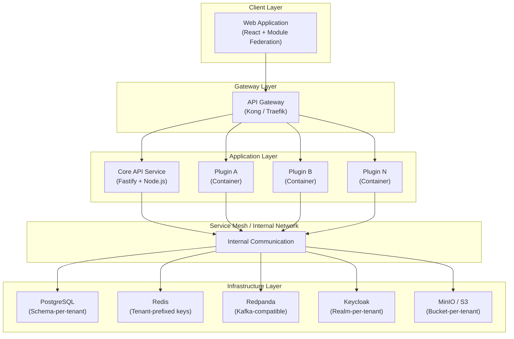
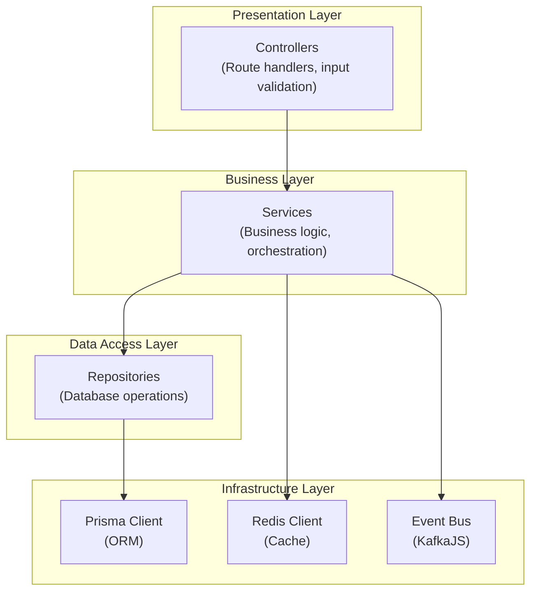
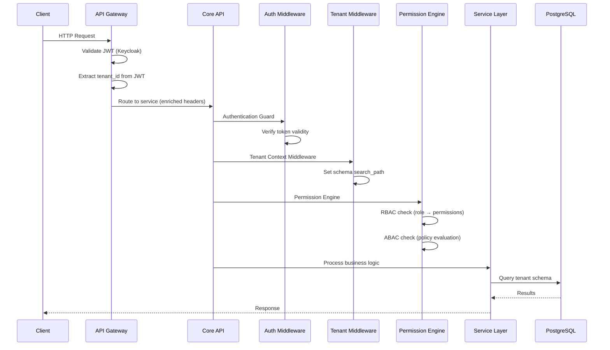
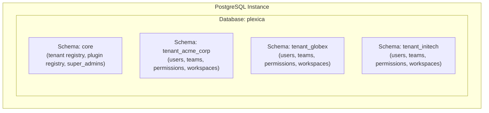
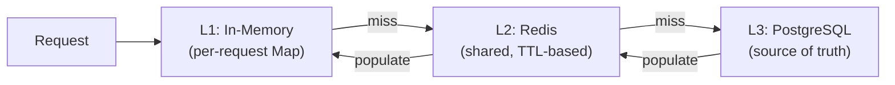
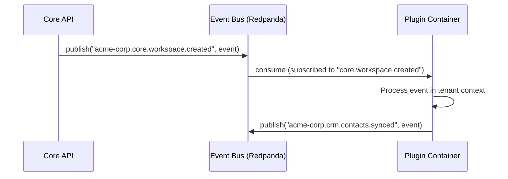

# System Architecture

**Version**: 1.0
**Last Updated**: February 13, 2026
**Status**: Active
**Owner**: Architecture Team
**FORGE Track**: Feature

---

## Overview

Plexica is a cloud-native multi-tenant SaaS platform built on a microservices architecture with a plugin-based extensibility model. The system is designed to scale horizontally and supports deployment on both Kubernetes and Docker Compose environments.

This document describes the overall system architecture, layer design, data flow patterns, and infrastructure components that compose the Plexica platform.

---

## Architectural Principles

| Principle                     | Description                                                       |
| ----------------------------- | ----------------------------------------------------------------- |
| **Separation of Concerns**    | Each plugin is an autonomous service with well-defined boundaries |
| **Multi-Tenancy by Design**   | Data isolation at database schema level (schema-per-tenant)       |
| **Event-Driven Architecture** | Asynchronous communication via Redpanda message broker            |
| **API-First**                 | All features exposed via versioned REST APIs                      |
| **Stateless Services**        | All services are stateless to facilitate horizontal scaling       |
| **Container-Based**           | Each component runs in a dedicated container                      |

---

## System Components

### High-Level Component Diagram



### Component Responsibilities

| Component             | Responsibilities                                                                             |
| --------------------- | -------------------------------------------------------------------------------------------- |
| **API Gateway**       | JWT validation, tenant routing, rate limiting, request transformation, CORS                  |
| **Core API Service**  | Tenant management, user management, permission engine, plugin orchestration, shared services |
| **Plugin Containers** | Business domain logic, isolated per plugin, communicate via events and REST                  |
| **PostgreSQL**        | Persistent storage with schema-per-tenant isolation, ACID compliance                         |
| **Redis**             | Session storage, caching with tenant-prefixed keys, rate limiting                            |
| **Redpanda**          | Event bus for async plugin-to-core and plugin-to-plugin communication                        |
| **Keycloak**          | Authentication, identity management, realm-per-tenant SSO                                    |
| **MinIO/S3**          | Object storage with bucket-per-tenant isolation for plugin assets                            |

---

## Technology Stack

### Backend

| Component       | Technology | Version | Rationale                                    |
| --------------- | ---------- | ------- | -------------------------------------------- |
| Runtime         | Node.js    | ≥20.0.0 | Modern LTS with native ESM support           |
| Language        | TypeScript | ^5.9    | Type safety and developer productivity       |
| Framework       | Fastify    | ^5.7    | High performance, native plugin architecture |
| ORM             | Prisma     | ^6.8    | Type-safe queries, migration management      |
| Validation      | Zod        | 3.x     | Runtime type validation                      |
| Testing         | Vitest     | ^4.0    | Fast, Jest-compatible, native ESM support    |
| Package Manager | pnpm       | ≥8.0    | Efficient monorepo management                |

### Database and Storage

| Component      | Technology      | Version | Configuration                          |
| -------------- | --------------- | ------- | -------------------------------------- |
| Database       | PostgreSQL      | 15+     | Multi-schema per tenant                |
| Cache          | Redis / ioredis | ^5.9    | Cluster mode, persistence RDB+AOF      |
| Message Broker | Redpanda        | Latest  | 3 broker minimum, replication factor 3 |
| Object Storage | MinIO / S3      | ^8.0    | Bucket per tenant                      |
| Search         | Elasticsearch   | 8.x     | Index per tenant                       |

### Infrastructure

| Component         | Technology | Version | Notes                     |
| ----------------- | ---------- | ------- | ------------------------- |
| Container Runtime | Docker     | 24+     | BuildKit enabled          |
| Orchestration     | Kubernetes | 1.28+   | Or Docker Compose for dev |
| API Gateway       | Kong       | 3.4+    | Or Traefik 2.10+          |
| Service Mesh      | Istio      | 1.20+   | Optional, for production  |
| Identity Provider | Keycloak   | 26+     | Realm per tenant          |

### Frontend

| Component         | Technology                       | Version | Rationale                                    |
| ----------------- | -------------------------------- | ------- | -------------------------------------------- |
| Framework         | React                            | ^19.2   | Component model, ecosystem maturity          |
| Build Tool        | Vite                             | Latest  | Fast dev server, optimized production builds |
| Routing           | TanStack Router                  | Latest  | Type-safe routing with data loading          |
| State Management  | Zustand                          | 4.x     | Simplicity, performance                      |
| Module Federation | @originjs/vite-plugin-federation | Latest  | Dynamic plugin frontend loading              |
| i18n              | i18next                          | 23.x    | Namespace support, lazy loading              |

---

## Layer Architecture

The Core API follows a strict layered architecture with clear separation of concerns:



### Layer Rules

| Rule                              | Description                                                | Constitution Reference |
| --------------------------------- | ---------------------------------------------------------- | ---------------------- |
| **No direct DB from controllers** | Controllers delegate to services; services to repositories | Article 3.3            |
| **Parameterized queries only**    | All queries must use parameterized inputs                  | Article 5.3            |
| **Tenant context required**       | Tenant context middleware enforces row-level security      | Article 3.3            |
| **Service layer validation**      | Business logic validation in service layer                 | Article 5.3            |

### Project Structure

```
apps/core-api/src/
├── modules/                    # Feature modules
│   ├── auth/                   # Authentication module
│   │   ├── auth.controller.ts
│   │   ├── auth.service.ts
│   │   └── dto/
│   ├── tenant/                 # Tenant management
│   │   ├── tenant.controller.ts
│   │   ├── tenant.service.ts
│   │   └── dto/
│   ├── workspace/              # Workspace management
│   │   ├── workspace.controller.ts
│   │   ├── workspace.service.ts
│   │   └── dto/
│   └── plugin/                 # Plugin orchestration
│       ├── plugin.controller.ts
│       ├── plugin.service.ts
│       └── dto/
├── services/                   # Shared services
├── middleware/                  # Request middleware
├── lib/                        # Utilities and helpers
└── index.ts                    # Entry point
```

---

## Request Flow

### Standard Request Processing



### Request Flow Steps

1. **HTTP request** arrives at the API Gateway
2. **Gateway validates JWT** (issued by Keycloak)
3. **Gateway extracts `tenant_id`** from JWT and routes to correct service
4. **Core/Plugin receives request** with enriched tenant context
5. **Permission Engine evaluates authorization** (RBAC + ABAC)
6. **Service processes request** with access only to tenant data

---

## Multi-Tenancy Architecture

### Isolation Model

Plexica implements a **schema-per-tenant** isolation model on PostgreSQL:



### Isolation Strategy by Component

| Component      | Isolation Mechanism                                  | Constitution Reference |
| -------------- | ---------------------------------------------------- | ---------------------- |
| **PostgreSQL** | Schema-per-tenant (e.g., `tenant_acme_corp`)         | Article 1.2            |
| **Redis**      | Tenant-prefixed keys (e.g., `tenant:acme:session:*`) | Article 1.2            |
| **Keycloak**   | Realm-per-tenant (e.g., `tenant-acme-corp`)          | Article 5.1            |
| **MinIO/S3**   | Bucket-per-tenant (e.g., `tenant-acme-corp`)         | Article 1.2            |
| **Redpanda**   | Topic naming: `{tenant_slug}.{event_type}`           | Article 1.2            |
| **Workspaces** | Logical isolation (filtered by `workspace_id`)       | —                      |

### Tenant Context Management

Tenant context is propagated using Node.js `AsyncLocalStorage` to ensure every database query is scoped to the correct tenant schema:

```typescript
// Simplified tenant context flow
interface TenantContext {
  tenantId: string;
  tenantSlug: string;
  schema: string; // e.g., "tenant_acme_corp"
  traceId: string;
}

// Middleware sets context on every request
// Prisma client automatically uses SET search_path TO "{schema}", public
```

---

## Caching Strategy

### Redis Architecture

Redis uses tenant-prefixed keys for complete cache isolation:

| Resource             | Key Pattern                              | TTL    |
| -------------------- | ---------------------------------------- | ------ |
| Tenant config        | `tenant:{slug}:config`                   | 5 min  |
| User session         | `tenant:{slug}:session:{userId}`         | 24 hr  |
| Permissions          | `tenant:{slug}:permissions:{userId}`     | 5 min  |
| Plugin config        | `tenant:{slug}:plugin:{pluginId}:config` | 10 min |
| Workspace membership | `workspace:{id}:member:{userId}`         | 5 min  |
| Rate limit counter   | `rate_limit:{tenantId}:{userId}:{route}` | 1 min  |

### Multi-Level Caching



---

## Event System

### Redpanda (Kafka-compatible) Event Bus

Events are the primary mechanism for asynchronous communication between the core platform and plugins.

#### Topic Naming Convention

```
{tenant_slug}.{event_type}

Examples:
  acme-corp.core.tenant.created
  acme-corp.core.workspace.member.added
  acme-corp.crm.contact.created
  global.core.plugin.installed
```

#### Event Flow



#### Dead Letter Queue

Failed event processing is handled with a dead letter queue (`dead-letter-queue` topic) that captures the original topic, partition, offset, error message, and payload for investigation.

---

## API Gateway Configuration

### Supported Gateways

Plexica supports both **Kong** and **Traefik** as API gateway options:

| Feature                | Kong                             | Traefik                       |
| ---------------------- | -------------------------------- | ----------------------------- |
| JWT validation         | Built-in plugin                  | Plugin-based                  |
| Rate limiting          | Redis-backed plugin              | Built-in middleware           |
| Request transformation | Plugin (add tenant/user headers) | Middleware (template headers) |
| Service discovery      | Built-in                         | Docker/K8s labels             |
| Configuration          | Declarative YAML                 | Dynamic from Docker/K8s       |

### Gateway Responsibilities

1. **JWT Validation**: Verify tokens against Keycloak JWKS endpoint
2. **Tenant Routing**: Extract `tenant_id` from JWT, add as `X-Tenant-ID` header
3. **User Context**: Extract `sub` from JWT, add as `X-User-ID` header
4. **Rate Limiting**: Per-tenant, per-user rate limiting (100 req/min default, 1000 for premium)
5. **Correlation ID**: Generate `X-Trace-ID` for distributed tracing
6. **Path Routing**: Route `/api/core/*` to Core API, `/api/plugins/{name}/*` to plugin containers

---

## Monitoring & Observability

### Logging

- **Format**: Structured JSON logging (Pino/Winston)
- **Required Fields**: `timestamp`, `level`, `message`, `requestId`, `userId`, `tenantId`
- **Tenant Enrichment**: Logger automatically enriches logs with tenant context from `AsyncLocalStorage`
- **Compliance**: Never log PII, passwords, tokens, or API keys (Constitution Article 5.2)

### Metrics (Prometheus)

| Metric                          | Type      | Labels                           |
| ------------------------------- | --------- | -------------------------------- |
| `http_requests_total`           | Counter   | method, route, status, tenant_id |
| `http_request_duration_seconds` | Histogram | method, route, status            |
| `db_query_duration_seconds`     | Histogram | operation, table                 |
| `events_published_total`        | Counter   | event_type, tenant_id            |
| `active_tenants`                | Gauge     | —                                |
| `active_plugins`                | Gauge     | —                                |

### Distributed Tracing (OpenTelemetry)

- **Provider**: NodeTracerProvider with Jaeger exporter
- **Trace propagation**: Via `X-Trace-ID` header across HTTP, message queue, and internal calls
- **Tenant attributes**: Every span includes `tenant.id`, `tenant.slug`, `user.id`

### Health Checks

| Endpoint      | Purpose                                        |
| ------------- | ---------------------------------------------- |
| `GET /health` | Full health check (DB, Redis, Kafka, Keycloak) |
| `GET /ready`  | Readiness probe (DB connectivity only)         |

---

## Performance Targets

| Metric                    | Target       | Constitution Reference |
| ------------------------- | ------------ | ---------------------- |
| API Response Time (P95)   | < 200ms      | Article 4.3            |
| Database Query Time (P95) | < 50ms       | Article 4.3            |
| Page Load Time (3G)       | < 2 seconds  | Article 4.3            |
| Tenant Provisioning Time  | < 30 seconds | —                      |
| Plugin Install Time       | < 60 seconds | —                      |
| Availability              | 99.9%        | —                      |
| Error Rate                | < 0.1%       | —                      |

---

## Current Architecture State

### Modular Monolith → Microservices Migration

Per the decision log, Plexica is currently implemented as a **modular monolith** with clear module boundaries, following a phased migration strategy:

| Phase                 | Timeline | State                                           |
| --------------------- | -------- | ----------------------------------------------- |
| **Phase 1** (Current) | Q1 2026  | Modular monolith with plugin system             |
| **Phase 2**           | Q2 2026  | Extract plugins as independent microservices    |
| **Phase 3**           | Q3 2026  | Core platform service decomposition (if needed) |

The plugin system already supports both **embedded plugins** (loaded as modules within core-api) and **remote plugins** (deployed as separate containers), making the migration path incremental.

---

## Related Documents

- **Constitution**: [`.forge/constitution.md`](../constitution.md) — Articles 1.2, 3.1–3.4, 4.3, 5.1–5.3
- **ADR-001**: [Monorepo Strategy](../knowledge/adr/adr-001-monorepo-strategy.md) — Turborepo + pnpm
- **ADR-002**: [Database Multi-Tenancy](../knowledge/adr/adr-002-database-multi-tenancy.md) — Schema-per-tenant
- **ADR-005**: [Event System](../knowledge/adr/adr-005-event-system-redpanda.md) — Redpanda choice
- **ADR-006**: [API Framework](../knowledge/adr/adr-006-fastify-framework.md) — Fastify selection
- **ADR-007**: [ORM Choice](../knowledge/adr/adr-007-prisma-orm.md) — Prisma ORM
- **Deployment Architecture**: [deployment-architecture.md](./deployment-architecture.md)
- **Security Architecture**: [security-architecture.md](./security-architecture.md)
- **Product Brief**: [`.forge/product/product-brief.md`](../product/product-brief.md)
- **Source Specs**: `specs/FUNCTIONAL_SPECIFICATIONS.md` (Section 2), `specs/TECHNICAL_SPECIFICATIONS.md` (Sections 1–5, 9, 11)

---

_Converted to FORGE format from `specs/FUNCTIONAL_SPECIFICATIONS.md` (Section 2) and `specs/TECHNICAL_SPECIFICATIONS.md` (Sections 1–5, 9, 11)._
