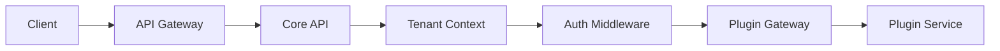

# Gap Analysis: FORGE Specs vs Implementation

**Date**: February 16, 2026  
**Methodology**: FORGE gap analysis with explore agent  
**Analyzed**: 48 key files + 8 FORGE specs + 11 ADRs  
**Status**: Complete

---

## Executive Summary

Analysis of **8 FORGE specs** (`.forge/specs/001-008`) compared with:

- **Existing documentation** (`docs/`, `specs/`)
- **Implemented code** (`apps/core-api`, `apps/web`, `packages/`)
- **Database schema** (`packages/database/prisma/schema.prisma`)

### Overall Status: **75% Complete**

| Spec | Feature                   | Completion | Critical Status              |
| ---- | ------------------------- | ---------- | ---------------------------- |
| 001  | Multi-Tenancy             | 95% ✅     | Good - automation gaps       |
| 002  | Authentication            | 80% ✅     | Good - user sync missing     |
| 003  | Authorization (RBAC+ABAC) | 60% ⚠️     | **ABAC completely absent**   |
| 004  | Plugin System             | 85% ✅     | Good - orchestration gaps    |
| 005  | Frontend Architecture     | 70% ✅     | Fair - widget system missing |
| 006  | i18n                      | 100% ✅    | **Complete** 🎉              |
| 007  | Core Services             | 0% ❌      | **All 4 services missing**   |
| 008  | Admin Interfaces          | 75% ✅     | Fair - role editor missing   |

---

## 🔴 Critical Gaps (Highest Priority)

### 1. **Spec 007 - Core Services** ❌ COMPLETELY ABSENT

**Missing Services:**

- ❌ **Storage Service** (upload/download files, signed URLs)
- ❌ **Notification Service** (email, push, in-app notifications)
- ❌ **Job Queue Service** (async tasks, cron scheduling)
- ❌ **Search Service** (full-text search with tenant isolation)

**Impact:** Plugins **cannot use** essential infrastructure services. This is a **critical blocker** for the plugin ecosystem.

**Partial Code Found:**

```
apps/core-api/src/lib/minio-client.ts          # MinIO client exists but not exposed as shared service
packages/event-bus/                             # Event bus exists but no job queue
```

**Required Actions:**

1. ✅ Create `/apps/core-api/src/modules/core-services/` with 4 services
2. ✅ Implement TypeScript interfaces per spec (FR-001 to FR-014)
3. ✅ Expose services via plugin SDK
4. ✅ Document API in `docs/CORE_SERVICES.md`

**Spec Reference:** `.forge/specs/007-core-services/spec.md`

---

### 2. **Spec 003 - ABAC System** ❌ ABSENT

**Implemented:**

- ✅ RBAC complete (PermissionService, role-based permissions)
- ✅ Custom roles per tenant

**Missing (Spec requires hybrid RBAC+ABAC):**

- ❌ Policy engine for attribute-based evaluation
- ❌ Policy storage (no `policies` table in database)
- ❌ Attribute-based conditions (`user.team == resource.owner`)
- ❌ Authorization flow: RBAC → ABAC → Decision (Spec FR-010)
- ❌ Plugin permission auto-registration (Spec FR-011)
- ❌ Wildcard permissions (`crm:deals:*`)

**Impact:** Cannot implement fine-grained authorization like:

> "Sales team members can only view their own deals"

**Required Actions:**

1. ✅ Extend database with `policies` table
2. ✅ Create `PolicyEngine` in `permission.service.ts`
3. ✅ Implement attribute evaluation (US-002 from Spec 003)
4. ✅ Update `docs/AUTHORIZATION.md` (currently missing)

**Spec Reference:** `.forge/specs/003-authorization/spec.md`

**Constitution Violation:** Article 1.2.1 requires RBAC+ABAC hybrid model

---

### 3. **Spec 002 - User Sync from Keycloak** ⚠️ ABSENT

**Implemented:**

- ✅ JWT validation middleware
- ✅ KeycloakService for realm management
- ✅ `User` model in database

**Missing (Spec US-003):**

- ❌ Event consumer for Keycloak → Plexica synchronization
- ❌ Webhook or Redpanda listener for user create/update/delete
- ❌ Sync within 5 seconds (P95) as required by spec

**Impact:** User data (email, display name, avatar) is **out-of-sync** between Keycloak and internal database.

**Required Actions:**

1. ✅ Implement `KeycloakEventConsumer` in `apps/core-api/src/modules/auth/`
2. ✅ Configure Keycloak webhook → `/api/v1/auth/sync`
3. ✅ Document in `docs/AUTHENTICATION.md`

**Spec Reference:** `.forge/specs/002-authentication/spec.md` (US-003, FR-007)

---

### 4. **Spec 001 - Provisioning Automation** ⚠️ PARTIAL

**Implemented:**

- ✅ Database schema for tenant
- ✅ TenantService with CRUD
- ✅ Lifecycle states (PROVISIONING, ACTIVE, SUSPENDED, etc.)

**Missing (Spec FR-002, FR-003, FR-006):**

- ❌ Auto-create Keycloak realm during provisioning
- ❌ Auto-create MinIO bucket (`tenant-{slug}`)
- ❌ Automatic rollback on partial failure
- ❌ PENDING_DELETION → DELETED transition with grace period

**Required Actions:**

1. ✅ Extend `TenantService.createTenant()` with full provisioning
2. ✅ Implement rollback transaction on error
3. ✅ Add cron job for PENDING_DELETION cleanup

**Spec Reference:** `.forge/specs/001-multi-tenancy/spec.md` (US-001, FR-011)

---

## 🟡 Medium Gaps (High Priority)

### 5. **Frontend Widget System** (Spec 005, US-004)

**Missing:**

- Cross-plugin widget embedding
- `@plexica/ui` interface for remote widgets

**Action:** Implement `WidgetRegistry` in `apps/web/src/lib/widget-loader.ts`

**Spec Reference:** `.forge/specs/005-frontend-architecture/spec.md` (US-004, FR-011)

---

### 6. **Admin UI - Role Editor** (Spec 008, US-004)

**Missing:**

- UI for creating/editing custom roles
- Permission picker grouped by plugin

**Action:** Create `apps/web/src/routes/settings/roles.tsx`

**Spec Reference:** `.forge/specs/008-admin-interfaces/spec.md` (US-004, FR-004)

---

### 7. **Plugin Container Orchestration** (Spec 004)

**Missing:**

- Auto-deploy plugin containers on Docker/K8s
- Health checks (`/health`, `/ready`) in gateway

**Action:** Document manual deployment in `docs/PLUGIN_DEPLOYMENT.md`

**Spec Reference:** `.forge/specs/004-plugin-system/spec.md` (US-002, FR-017)

---

## 📊 Detailed Status by Spec

### Spec 001: Multi-Tenancy ✅ 95% Complete

**Fully Implemented:**

- ✅ Database schema: `Tenant` model with slug, status, settings, theme, translation_overrides
- ✅ TenantService with CRUD operations (`apps/core-api/src/services/tenant.service.ts`)
- ✅ Tenant lifecycle states (PROVISIONING, ACTIVE, SUSPENDED, PENDING_DELETION, DELETED)
- ✅ Tenant context middleware (`apps/core-api/src/middleware/tenant-context.ts`)
- ✅ Per-tenant schema isolation pattern in Prisma
- ✅ API routes: `/api/v1/admin/tenants` (all CRUD endpoints)

**Partial/Missing:**

- ⚠️ Keycloak realm provisioning (KeycloakService exists but realm creation not verified)
- ⚠️ MinIO bucket provisioning (MinIOClientService exists but auto-provisioning unclear)
- ⚠️ Rollback on provisioning failure (FR-006 not fully implemented)
- ❌ Tenant deletion grace period logic (PENDING_DELETION → DELETED transition)

**Files:**

```
apps/core-api/src/services/tenant.service.ts     # Main service (420 lines)
apps/core-api/src/middleware/tenant-context.ts   # Context middleware
apps/core-api/src/routes/tenant.ts               # API routes
packages/database/prisma/schema.prisma           # Tenant model (lines 28-47)
```

**Constitution Compliance:** Article 1.2.2 (Multi-Tenancy Isolation) - 95% compliant

---

### Spec 002: Authentication ✅ 80% Complete

**Fully Implemented:**

- ✅ JWT-based authentication middleware (`authMiddleware`, `optionalAuthMiddleware`)
- ✅ Token validation with tenant context
- ✅ KeycloakService for realm interaction (`apps/core-api/src/services/keycloak.service.ts`)
- ✅ JWT payload includes tenant context (`tenantSlug`, `sub`, `roles`)
- ✅ SuperAdmin model in database
- ✅ Auth routes (`/api/v1/auth`)

**Partial/Missing:**

- ⚠️ User sync from Keycloak to internal DB (US-003: No event consumer found)
- ⚠️ Realm provisioning automation (FR-002: partial)
- ❌ SUSPENDED tenant authentication blocking (FR-012)
- ❌ Session token 24h expiry enforcement (NFR mentioned but not verified)
- ❌ Master realm Super Admin authentication flow

**Files:**

```
apps/core-api/src/middleware/auth.ts             # JWT validation (380 lines)
apps/core-api/src/services/keycloak.service.ts   # Keycloak integration (290 lines)
apps/core-api/src/routes/auth.ts                 # Auth endpoints
packages/database/prisma/schema.prisma           # User, SuperAdmin models
```

**Constitution Compliance:** Article 5.1 (Authentication & Authorization) - 80% compliant

---

### Spec 003: Authorization ⚠️ 60% Complete (CRITICAL GAP)

**Fully Implemented:**

- ✅ PermissionService with RBAC logic (410 lines)
- ✅ Role-based permissions (getUserPermissions, hasPermission, hasAllPermissions)
- ✅ Custom role creation (createRole, updateRolePermissions)
- ✅ Permission format: `resource:action` (e.g., `users:read`)
- ✅ Role middleware (`requireRole`, `requireTenantAccess`)

**Missing (CRITICAL):**

- ❌ **ABAC (Attribute-Based Access Control)** - Not implemented at all
  - No policy engine
  - No policy evaluation flow (RBAC → ABAC → Decision)
  - No policy storage (no `policies` table in schema)
  - No attribute-based conditions
- ❌ Plugin permission registration system
- ❌ Wildcard permissions (e.g., `crm:deals:*`)
- ❌ Team role inheritance
- ❌ System role immutability enforcement

**Files:**

```
apps/core-api/src/services/permission.service.ts # RBAC only (410 lines)
apps/core-api/src/middleware/auth.ts             # requireRole middleware
```

**Missing Files:**

```
apps/core-api/src/services/policy-engine.service.ts  # ABAC policy engine
packages/database/prisma/schema.prisma               # No 'policies' table
```

**Status:** RBAC only; ABAC completely missing (Spec 003 requires hybrid RBAC+ABAC)

**Constitution Violation:** Article 1.2 states "hybrid RBAC + ABAC" as non-negotiable principle

---

### Spec 004: Plugin System ✅ 85% Complete

**Fully Implemented:**

- ✅ PluginRegistryService & PluginLifecycleService (900+ lines)
- ✅ Plugin manifest schema with translations, permissions, events, dependencies
- ✅ Plugin lifecycle states (DRAFT, PENDING_REVIEW, PUBLISHED, DEPRECATED, REJECTED)
- ✅ Service registry for plugin-to-plugin communication (ServiceRegistryService)
- ✅ Dependency resolution (DependencyResolutionService with semver)
- ✅ Shared data service (SharedDataService for cross-plugin data)
- ✅ Plugin API gateway (`plugin-gateway.ts`, `plugin-api-gateway.service.ts`)
- ✅ Plugin routes: `/api/v1/plugins`, `/api/v1/admin/plugins`
- ✅ TenantPlugin model for per-tenant plugin enablement

**Partial:**

- ⚠️ Plugin container deployment (schema supports it, but no Docker/K8s orchestration code)
- ⚠️ Plugin frontend Module Federation remotes (config exists, but dynamic loading needs verification)
- ⚠️ Plugin health checks (`/health`, `/ready` endpoints not in gateway)

**Missing:**

- ❌ Plugin resource limits (CPU/memory enforcement - FR-017)
- ❌ Hot-swap during updates (NFR-008)
- ❌ Plugin SDK decorators (FR-016 - SDK exists but limited)

**Files:**

```
apps/core-api/src/services/plugin.service.ts            # PluginRegistryService (950 lines)
apps/core-api/src/services/service-registry.service.ts  # Service discovery (340 lines)
apps/core-api/src/services/dependency-resolution.service.ts # Dependency resolver
apps/core-api/src/services/shared-data.service.ts       # Cross-plugin data
apps/core-api/src/routes/plugin.ts                      # Plugin routes
packages/database/prisma/schema.prisma                  # Plugin models (lines 59-103)
```

**Constitution Compliance:** Article 1.2.4 (Plugin System Integrity) - 85% compliant

---

### Spec 005: Frontend Architecture ✅ 70% Complete

**Fully Implemented:**

- ✅ React 19 + Vite + TanStack Router
- ✅ Module Federation configured (`@originjs/vite-plugin-federation`)
- ✅ Shared dependencies (react, react-dom, @plexica/ui, etc.)
- ✅ Frontend contexts: AuthProvider, ThemeContext, PluginContext, WorkspaceContext, IntlContext
- ✅ Route structure with lazy loading
- ✅ apps/web (tenant app) and apps/super-admin (admin panel)

**Partial:**

- ⚠️ Tenant theming system (ThemeContext exists, but theme application needs verification)
- ⚠️ Reserved routes enforcement (FR-008)
- ⚠️ Error boundaries around remote module loading (FR-005)

**Missing:**

- ❌ Widget system (US-004: cross-plugin widget embedding)
- ❌ Silent token refresh (US-005)
- ❌ Plugin route prefix enforcement (`/{pluginId}/*`)

**Files:**

```
apps/web/src/                                    # Main tenant app
apps/super-admin/src/                            # Admin panel
apps/web/vite.config.ts                          # Module Federation config
apps/web/src/lib/plugin-loader.ts                # Plugin loader service
apps/web/src/components/contexts/                # Context providers
```

---

### Spec 006: i18n ✅ 100% Complete ⭐

**Fully Implemented:**

- ✅ @plexica/i18n package with FormatJS (115 tests, 94.9% coverage)
- ✅ Backend TranslationService with Redis caching
- ✅ 4 API endpoints: GET translations, list locales, GET/PUT overrides
- ✅ Plugin manifest translation integration
- ✅ Frontend IntlContext + useTranslations hook
- ✅ LanguageSelector component (15 tests, 9 Storybook stories)
- ✅ Translation override admin UI (600+ lines)
- ✅ 218 backend tests + 45 frontend tests (263 total)
- ✅ Developer documentation (928 lines)

**Files:**

```
packages/i18n/                                   # Shared i18n package (115 tests)
apps/core-api/src/modules/i18n/                  # Backend i18n module
apps/web/src/components/contexts/IntlContext.tsx # Frontend integration
apps/web/src/routes/admin/translations.tsx       # Admin UI
packages/i18n/docs/I18N_USAGE.md                 # Developer guide (928 lines)
```

**Status:** Production-ready, no gaps

**Constitution Compliance:** 100% compliant

---

### Spec 007: Core Services ❌ 0% Complete (CRITICAL GAP)

**NOT IMPLEMENTED:**

- ❌ **Storage Service** - MinIOClientService exists but not exposed as shared service
- ❌ **Notification Service** - No email, push, or in-app notification system
- ❌ **Job Queue Service** - No async job queue or scheduler
- ❌ **Search Service** - No full-text search implementation

**Partial Code Found:**

```
apps/core-api/src/lib/minio-client.ts            # MinIO client (not a service)
packages/event-bus/                               # Event bus (not job queue)
```

**Missing Files:**

```
apps/core-api/src/modules/core-services/storage.service.ts
apps/core-api/src/modules/core-services/notification.service.ts
apps/core-api/src/modules/core-services/job-queue.service.ts
apps/core-api/src/modules/core-services/search.service.ts
```

**Impact:** Plugins cannot use these essential services (all 4 services missing)

**Constitution Violation:** Article 3.1 (System Architecture) requires "core services layer"

---

### Spec 008: Admin Interfaces ✅ 75% Complete

**Fully Implemented:**

- ✅ Super Admin app (`apps/super-admin`) with routes: analytics, tenants, plugins
- ✅ Tenant Admin UI in `apps/web` with routes: settings, members, workspace management
- ✅ AdminService for cross-tenant user management
- ✅ Translation override editor (admin UI)

**Partial:**

- ⚠️ Plugin management UI (exists but needs verification for install/update/config)
- ⚠️ Role editor UI (permission assignment interface not found)
- ⚠️ Team management UI (basic structure exists, needs feature completion)

**Missing:**

- ❌ Tenant provisioning progress indicator (US-001)
- ❌ Tenant detail modal with infrastructure info (US-001)
- ❌ Plugin installation progress UI (US-002)
- ❌ Audit log viewer (FR-009)

**Files:**

```
apps/super-admin/src/routes/                     # Super Admin routes
apps/web/src/routes/settings/                    # Tenant Admin routes
apps/core-api/src/services/admin.service.ts      # Admin service
```

---

## 📝 Documentation Changes Required

### A. Documentation to **CREATE** (missing in `docs/`)

| File                        | Content                                                   | Spec Ref |
| --------------------------- | --------------------------------------------------------- | -------- |
| `docs/AUTHORIZATION.md`     | RBAC+ABAC system, policy engine, custom roles             | 003      |
| `docs/CORE_SERVICES.md`     | Storage, Notification, Job Queue, Search API              | 007      |
| `docs/PLUGIN_DEPLOYMENT.md` | Plugin container deployment, health checks, orchestration | 004      |
| `docs/PROVISIONING.md`      | Tenant provisioning flow, realm/bucket automation         | 001      |

**Template for AUTHORIZATION.md:**

```markdown
# Authorization System (RBAC + ABAC)

**Status**: ⚠️ Partially Implemented (RBAC only)

## Current Implementation

- ✅ RBAC fully implemented
- ✅ Custom roles per tenant
- ❌ ABAC policy engine (not implemented)

## Planned Implementation

See `.forge/specs/003-authorization/spec.md` for full ABAC specification.

## RBAC Implementation

### Permission Format

Permissions use the format `resource:action`:

- `users:read` - Read user data
- `users:write` - Create/update users
- `plugins:install` - Install plugins

### System Roles

- `super_admin` - Platform-wide access
- `tenant_admin` - Tenant-wide access
- `user` - Basic user access

### Custom Roles

Tenant admins can create custom roles with specific permission sets.

### API Reference

See `apps/core-api/src/services/permission.service.ts`
```

---

### B. Documentation to **UPDATE**

#### 1. **`docs/ARCHITECTURE.md`** ⚠️ Incomplete

**Current:** Describes only frontend (React, Module Federation, routing)

**Missing:**

- Backend architecture (Fastify, microservices, service registry)
- ABAC policy engine
- Core Services (4 services)
- Mermaid architecture diagrams

**Action:** Integrate content from `.forge/architecture/system-architecture.md`

**Add Section:**

````markdown
## Backend Architecture

### Microservices Design

Plexica uses a microservices architecture where the core platform and plugins
can be deployed as independent services with well-defined API contracts.

**Current State:** Modular monolith with clear module boundaries
**Target State:** Independent microservices with service mesh

### Service Components

1. **Core API** (`apps/core-api`)
   - Fastify-based REST API
   - Tenant management
   - Authentication/Authorization
   - Plugin orchestration

2. **Plugin Services** (individual containers)
   - Isolated plugin execution
   - Service discovery via registry
   - Event-driven communication via Redpanda

3. **Core Services** (planned)
   - Storage Service (MinIO/S3)
   - Notification Service (email/push)
   - Job Queue Service (BullMQ)
   - Search Service (Elasticsearch)

### Request Flow


````

````

---

#### 2. **`docs/PLUGIN_DEVELOPMENT.md`** ⚠️ Partial

**Current:** Basic plugin development guide (334 lines)

**Missing:**
- How to use Core Services (Storage, Notification, Job Queue, Search)
- Plugin permission registration
- ABAC policy contribution
- Frontend widget system

**Action:** Add section "Using Core Services" with code examples

**Add Section:**
```markdown
## Using Core Services

### Storage Service

Upload and download files with automatic tenant isolation:

```typescript
import { core } from '@plexica/sdk';

// Upload file
const url = await core.storage.upload({
  file: fileBuffer,
  path: 'avatars/user-123.png',
  contentType: 'image/png'
});

// Download file
const file = await core.storage.download('avatars/user-123.png');

// Get signed URL (1 hour expiry)
const signedUrl = await core.storage.getSignedUrl('avatars/user-123.png', 3600);
````

### Notification Service

Send notifications via email, push, or in-app:

```typescript
// Email notification
await core.notifications.email({
  to: 'user@example.com',
  template: 'deal-won',
  data: { dealName: 'Acme Corp', value: '$50k' }
});

// In-app notification
await core.notifications.inApp({
  userId: 'user-123',
  title: 'Deal Won!',
  message: 'You closed Acme Corp for $50k',
  type: 'success'
});

// Bulk notifications (async)
await core.notifications.sendBulk([
  { type: 'email', to: 'user1@example.com', ... },
  { type: 'inApp', userId: 'user2', ... }
]);
```

### Job Queue Service

Enqueue async jobs and schedule recurring tasks:

```typescript
// Enqueue background job
const jobId = await core.jobs.enqueue({
  name: 'crm.export-contacts',
  data: { format: 'csv', filters: {...} }
});

// Schedule recurring job (daily at midnight)
await core.jobs.schedule({
  name: 'crm.daily-report',
  cron: '0 0 * * *',
  data: { recipients: ['admin@acme-corp.com'] }
});

// Check job status
const status = await core.jobs.getStatus(jobId);
// { status: 'completed', result: { exportUrl: '...' } }
```

### Search Service

Index and search documents with tenant isolation:

```typescript
// Index document
await core.search.index({
  type: 'crm:contact',
  id: 'contact-123',
  data: {
    firstName: 'John',
    lastName: 'Doe',
    email: 'john@example.com',
    company: 'Acme Corp',
  },
});

// Search documents
const results = await core.search.search({
  query: 'john acme',
  type: 'crm:contact',
  limit: 20,
});

// Delete document
await core.search.delete({ type: 'crm:contact', id: 'contact-123' });

// Reindex all documents of a type
await core.search.reindex('crm:contact');
```

**Note:** Core Services are currently **not implemented**. This API is planned
for Phase 2. See `.forge/specs/007-core-services/` for full specification.

````

---

#### 3. **`specs/FUNCTIONAL_SPECIFICATIONS.md`** ⚠️ Divergent

**Divergences with FORGE specs:**

| Section                  | `specs/FUNCTIONAL_SPECIFICATIONS.md` | FORGE Specs          | Gap                              |
|--------------------------|--------------------------------------|----------------------|----------------------------------|
| **9. Translations**      | Namespace-based, tenant override ✅  | Spec 006 ✅          | Aligned                          |
| **5. Authorization**     | RBAC+ABAC hybrid ✅                  | Spec 003 ⚠️          | **Spec says ABAC, code no**      |
| **10. Core Services**    | Storage, Notification, Job, Search ✅| Spec 007 ❌          | **Doc says exists, code no**     |
| **7.4 Plugin Comms**     | 3 methods (Event, REST, Shared Data)| Spec 004 ✅          | Aligned                          |

**Action:** Add implementation status tags to each section

**Update Section 5 (Authorization):**
```markdown
## 5. Authorization System (RBAC + ABAC)

> ⚠️ **Implementation Status**: Currently only RBAC is implemented.
> ABAC policy engine is planned for Phase 2 (see `.forge/specs/003-authorization/`).

### 5.1 Hybrid Model ⚠️ PARTIAL

Plexica is designed to use a **hybrid RBAC + ABAC** authorization model.

**Currently Implemented:**
- ✅ RBAC (Role-Based Access Control) - fully functional
- ✅ Custom roles per tenant
- ✅ Permission format: `resource:action`

**Not Yet Implemented:**
- ❌ ABAC (Attribute-Based Access Control)
- ❌ Policy engine for fine-grained authorization
- ❌ Attribute-based conditions

For current RBAC implementation, see `apps/core-api/src/services/permission.service.ts`.
For planned ABAC specification, see `.forge/specs/003-authorization/spec.md`.
````

**Update Section 10 (Core Services):**

```markdown
## 10. Core Services

> ⚠️ **Implementation Status**: Core Services are **not yet implemented**.
> Specification available in `.forge/specs/007-core-services/`.

### Planned Services

Plexica will provide four core services available to all plugins:

1. **Storage Service** - File upload/download with MinIO/S3
2. **Notification Service** - Email, push, in-app notifications
3. **Job Queue Service** - Async tasks and scheduled jobs
4. **Search Service** - Full-text search with tenant isolation

These services are planned for Phase 2 implementation. See specification for
detailed API design: `.forge/specs/007-core-services/spec.md`

**Current Workaround:**

- MinIO client available at `apps/core-api/src/lib/minio-client.ts`
- Event bus available via `packages/event-bus/`
- Plugins must implement their own notification and search logic
```

---

#### 4. **`specs/TECHNICAL_SPECIFICATIONS.md`** ⚠️ Needs Verification

**Action:** Verify "Technology Stack" matches `.forge/constitution.md` Article 2.1

Add disclaimer at top:

```markdown
# Plexica - Technical Specifications

**Last Updated**: February 16, 2026  
**Status**: In Progress  
**Implementation Status**: See [Gap Analysis](./.forge/knowledge/gap-analysis-2026-02-16.md)

> ⚠️ **Note**: This document describes the target architecture. For current
> implementation status, refer to the Gap Analysis document.
```

---

### C. Documentation **CORRECT** ✅

| File                               | Status      | Notes                                     |
| ---------------------------------- | ----------- | ----------------------------------------- |
| `docs/TESTING.md`                  | ✅ Current  | Reflects 2,118 tests                      |
| `docs/QUICKSTART.md`               | ✅ Correct  | Commands functional                       |
| `docs/testing/BACKEND_TESTING.md`  | ✅ Detailed | 1,855 backend tests documented            |
| `packages/i18n/docs/I18N_USAGE.md` | ✅ Complete | i18n usage guide (928 lines)              |
| `AGENTS.md`                        | ✅ Accurate | Test commands, naming conventions correct |

---

## 🎯 Priority Recommendations

### Suggested Sprint: "Core Services + ABAC Implementation"

#### **Milestone 1: Core Services (Spec 007)** - 2 weeks

- [ ] Implement Storage Service (MinIO wrapper)
  - Files: `apps/core-api/src/modules/core-services/storage.service.ts`
  - Routes: `/api/v1/storage/upload`, `/api/v1/storage/download`
  - Tests: 50+ tests (upload, download, signed URLs, tenant isolation)

- [ ] Implement Notification Service (email + in-app)
  - Files: `apps/core-api/src/modules/core-services/notification.service.ts`
  - Integration: Nodemailer for email, WebSocket for in-app
  - Tests: 40+ tests (email send, in-app delivery, template rendering)

- [ ] Implement Job Queue Service (BullMQ or Redpanda)
  - Files: `apps/core-api/src/modules/core-services/job-queue.service.ts`
  - Features: Async jobs, scheduled tasks, retry logic
  - Tests: 45+ tests (enqueue, schedule, status, retry)

- [ ] Implement Search Service (Elasticsearch or MeiliSearch)
  - Files: `apps/core-api/src/modules/core-services/search.service.ts`
  - Features: Full-text search, tenant isolation, type filtering
  - Tests: 35+ tests (index, search, delete, reindex)

- [ ] Create `docs/CORE_SERVICES.md` with API documentation

- [ ] Update `docs/PLUGIN_DEVELOPMENT.md` with service usage examples

**Estimated Effort:** 80 hours (2 engineers × 1 week)

---

#### **Milestone 2: ABAC System (Spec 003)** - 1 week

- [ ] Database schema: Add `policies` table
  - Migration: `packages/database/prisma/migrations/add-policies-table`
  - Fields: id, name, source, effect, conditions, actions, resources

- [ ] Implement PolicyEngine in PermissionService
  - Files: `apps/core-api/src/services/permission.service.ts` (extend)
  - New methods: `evaluatePolicy()`, `evaluateAllPolicies()`, `createPolicy()`
  - Tests: 60+ tests (policy evaluation, attribute matching, DENY override)

- [ ] Authorization flow: RBAC → ABAC → Decision
  - Modify: `apps/core-api/src/middleware/auth.ts`
  - Flow: Check RBAC → If inconclusive, evaluate ABAC → Return decision
  - Tests: 30+ tests (flow integration, performance)

- [ ] Plugin permission auto-registration
  - Modify: `apps/core-api/src/services/plugin.service.ts`
  - On plugin enable: Register permissions from manifest
  - Tests: 25+ tests (registration, deregistration, conflict handling)

- [ ] Create `docs/AUTHORIZATION.md` with policy examples

**Estimated Effort:** 40 hours (1 engineer × 1 week)

---

#### **Milestone 3: User Sync (Spec 002)** - 3 days

- [ ] Implement KeycloakEventConsumer
  - Files: `apps/core-api/src/modules/auth/keycloak-event-consumer.ts`
  - Events: user.created, user.updated, user.deleted
  - Integration: Webhook or Redpanda listener
  - Tests: 35+ tests (sync events, error handling, idempotency)

- [ ] Configure Keycloak webhook → `/api/v1/auth/sync`
  - Route: `apps/core-api/src/routes/auth.ts`
  - Validation: HMAC signature verification
  - Tests: 20+ tests (webhook validation, event processing)

- [ ] Document in `docs/AUTHENTICATION.md`

**Estimated Effort:** 24 hours (1 engineer × 3 days)

---

### Total Effort Estimate: **144 hours (3 weeks)**

---

## 📊 Alignment Metrics

### Spec vs Implementation

```
Spec 001 (Multi-Tenancy):      ████████████████████░ 95%
Spec 002 (Authentication):     ████████████████░░░░░ 80%
Spec 003 (Authorization):      ████████████░░░░░░░░░ 60% ⚠️
Spec 004 (Plugin System):      █████████████████░░░░ 85%
Spec 005 (Frontend Arch):      ██████████████░░░░░░░ 70%
Spec 006 (i18n):               █████████████████████ 100% ✅
Spec 007 (Core Services):      ░░░░░░░░░░░░░░░░░░░░░  0% ❌
Spec 008 (Admin Interfaces):  ███████████████░░░░░░ 75%
────────────────────────────────────────────────────
Overall:                       ███████████████░░░░░░ 75%
```

### Documentation vs Code

```
docs/ARCHITECTURE.md:          ████████░░░░ 40% (frontend only)
docs/PLUGIN_DEVELOPMENT.md:    ████████████ 60% (missing core services)
specs/FUNCTIONAL_SPEC.md:      ██████████░░ 50% (divergences ABAC/Core Services)
docs/TESTING.md:               ████████████ 100% ✅
README.md:                     ████████████ 100% ✅
```

---

## ✅ Immediate Actions (Do Now)

### 1. **Create 4 Missing Documentation Files**

```bash
# Create files with base template
touch docs/AUTHORIZATION.md
touch docs/CORE_SERVICES.md
touch docs/PLUGIN_DEPLOYMENT.md
touch docs/PROVISIONING.md
```

### 2. **Add Implementation Status Disclaimers**

**In `specs/FUNCTIONAL_SPECIFICATIONS.md`:**

Line 99: Add after "## 5. Authorization System (RBAC + ABAC)"

```markdown
> ⚠️ **Implementation Status**: Currently only RBAC is implemented.
> ABAC policy engine is planned for Phase 2 (see `.forge/specs/003-authorization/`).
```

Line 650: Add after "## 10. Core Services"

```markdown
> ⚠️ **Implementation Status**: Core Services are **not yet implemented**.
> Specification available in `.forge/specs/007-core-services/`.
```

### 3. **Create README in .forge/specs/**

Create file: `.forge/specs/README.md`

```markdown
# FORGE Specifications

This directory contains the official FORGE specifications for Plexica.

## Implementation Status

| Spec | Feature               | Status             | Implementation Location                              |
| ---- | --------------------- | ------------------ | ---------------------------------------------------- |
| 001  | Multi-Tenancy         | ✅ 95% Complete    | `apps/core-api/src/services/tenant.service.ts`       |
| 002  | Authentication        | ✅ 80% Complete    | `apps/core-api/src/middleware/auth.ts`               |
| 003  | Authorization         | ⚠️ 60% (RBAC only) | `apps/core-api/src/services/permission.service.ts`   |
| 004  | Plugin System         | ✅ 85% Complete    | `apps/core-api/src/services/plugin.service.ts`       |
| 005  | Frontend Architecture | ✅ 70% Complete    | `apps/web/`                                          |
| 006  | i18n                  | ✅ 100% Complete   | `packages/i18n/`, `apps/core-api/src/modules/i18n/`  |
| 007  | Core Services         | ❌ Not Implemented | -                                                    |
| 008  | Admin Interfaces      | ✅ 75% Complete    | `apps/super-admin/`, `apps/web/src/routes/settings/` |

## Critical Gaps

1. **Spec 007 - Core Services**: All 4 services missing (Storage, Notification, Job Queue, Search)
2. **Spec 003 - ABAC**: Policy engine not implemented (only RBAC exists)
3. **Spec 002 - User Sync**: Keycloak event consumer missing

## Gaps & Roadmap

See [`.forge/knowledge/gap-analysis-2026-02-16.md`](../.forge/knowledge/gap-analysis-2026-02-16.md)
for detailed gap analysis and implementation roadmap.
```

---

## 📌 Conclusions

### Strengths ✅

1. **i18n system fully implemented** (100%, production-ready)
2. **Multi-tenancy and plugin system solid** (85-95%)
3. **Test coverage improving** (2,118 tests, 63% → target 80%)
4. **FORGE methodology well-structured** (clear specs, documented ADRs)

### Critical Issues 🔴

1. **Core Services completely absent** (Storage, Notification, Job Queue, Search)
2. **ABAC not implemented** (only RBAC, specs require hybrid)
3. **User sync from Keycloak missing** (data out-of-sync)
4. **Documentation divergent** (docs say "implemented", code says "no")

### Priorities ⚡

1. **P0:** Implement Core Services (Spec 007) - blocks plugin ecosystem
2. **P0:** Implement ABAC (Spec 003) - constitutional requirement
3. **P1:** User sync (Spec 002) - data quality
4. **P2:** Update documentation to reflect actual state

---

**Report Generated:** February 16, 2026  
**Methodology:** FORGE gap analysis with explore agent  
**Codebase Analyzed:** 48 key files + 8 FORGE specs + 11 ADRs  
**Next Review:** After Milestone 1 completion (Core Services)
