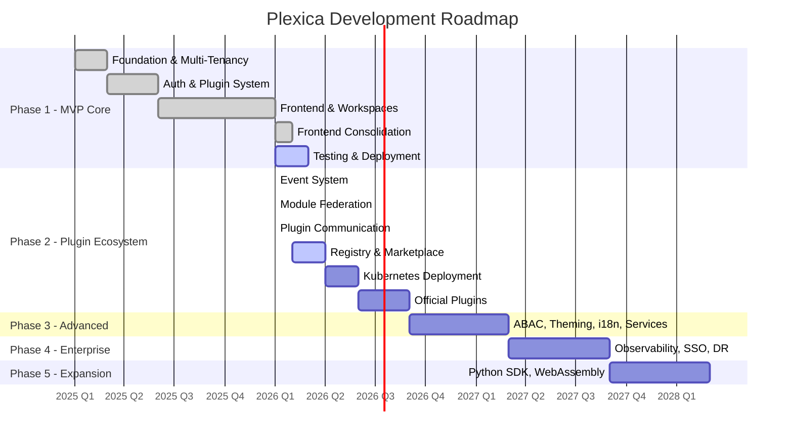
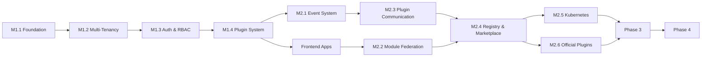

# Plexica Roadmap

> Strategic roadmap with phase planning, milestone tracking, and success metrics.

**Version**: 1.0  
**Last Updated**: February 13, 2026  
**Status**: Active  
**Owner**: Engineering Team  
**FORGE Track**: Product  
**Current Version**: 0.9.0 (Alpha)

---

## Timeline Overview

## Current Status

| Phase                          | Status        | Completion | Key Deliverables                                   |
| ------------------------------ | ------------- | ---------- | -------------------------------------------------- |
| **Phase 1 — MVP Core**         | Near Complete | 97.5%      | Multi-tenancy, auth, plugins, workspaces, frontend |
| **Phase 2 — Plugin Ecosystem** | In Progress   | 67%        | Events, Module Federation, plugin communication    |
| Phase 3 — Advanced Features    | Not Started   | 0%         | ABAC, theming, i18n, core services                 |
| Phase 4 — Enterprise           | Not Started   | 0%         | Observability, SSO, disaster recovery              |
| Phase 5 — Ecosystem Expansion  | Future        | 0%         | Python SDK, WebAssembly plugins                    |

---

## Phase 1 — MVP Core (97.5% Complete)

**Objective**: Functional platform with multi-tenancy and base plugin system

### Completed Milestones

| Milestone | Description                                                  | Completed       | Duration    |
| --------- | ------------------------------------------------------------ | --------------- | ----------- |
| M1.1      | Foundation (monorepo, infra, CI/CD)                          | Jan 13, 2026    | 4 weeks     |
| M1.2      | Multi-Tenancy Core (schema-per-tenant, provisioning)         | Jan 13, 2026    | 4 weeks     |
| M1.3      | Authentication & Authorization (Keycloak, RBAC)              | Jan 13, 2026    | 4 weeks     |
| M1.4      | Plugin System Base (SDK, registry, lifecycle)                | Jan 13, 2026    | 4 weeks     |
| M2.1      | Frontend Tenant App (web, auth, plugins, routing)            | Jan 13-14, 2026 | 4 weeks     |
| M2.2      | Super Admin Frontend (tenant/plugin management)              | Jan 14, 2026    | 4 weeks     |
| M2.4      | Workspaces (CRUD, roles, switching, guards)                  | Jan 15, 2026    | 9.5h actual |
| FC        | Frontend Consolidation (SDK, design system, API client, E2E) | Feb 11, 2026    | ~3 weeks    |

### In Progress

| Milestone | Description          | Status | Blockers                                               |
| --------- | -------------------- | ------ | ------------------------------------------------------ |
| M2.3      | Testing & Deployment | 50%    | Coverage at 63% (target 80%), load testing not started |

### Remaining Work (M2.3)

- Unit tests for auth services and middleware
- Integration tests for all API endpoints
- E2E tests with Playwright (backend scenarios)
- Load testing (k6/Artillery, 100 req/s target)
- Security audit (auth flow, input validation, rate limiting)
- API documentation completion
- Demo deployment

### Success Metrics

| Metric                    | Target  | Current |
| ------------------------- | ------- | ------- |
| Tenant provisioning       | < 30s   | ✅ Met  |
| API response time P95     | < 500ms | ✅ Met  |
| Working internal plugins  | 3+      | ✅ Met  |
| Docker Compose deployment | Working | ✅ Met  |
| Test coverage             | ≥ 80%   | ⏳ 63%  |

---

## Phase 2 — Plugin Ecosystem (67% Complete)

**Objective**: Complete plugin ecosystem with event-driven communication  
**Team**: 5-7 developers  
**Estimated Cost**: ~$435,000

### Completed Milestones

| Milestone | Description                                                       | Completed    | Efficiency             |
| --------- | ----------------------------------------------------------------- | ------------ | ---------------------- |
| M2.1      | Event System (Redpanda, EventBus, DLQ, SDK)                       | Jan 23, 2026 | 87% (20h vs 160h est.) |
| M2.2      | Module Federation (Vite, CDN, dynamic routing)                    | Jan 22, 2026 | 93% (12h vs 160h est.) |
| M2.3      | Plugin Communication (service registry, API gateway, shared data) | Jan 23, 2026 | 87% (20h vs 160h est.) |

### In Progress

| Milestone | Description                   | Status | Target  |
| --------- | ----------------------------- | ------ | ------- |
| M2.4      | Plugin Registry & Marketplace | 20%    | Q2 2026 |

### Not Started

| Milestone | Description                                | Priority | Target     |
| --------- | ------------------------------------------ | -------- | ---------- |
| M2.5      | Kubernetes Deployment (Helm, operator, HA) | Critical | Q2-Q3 2026 |
| M2.6      | Official Plugins (CRM, Billing, Analytics) | High     | Q3 2026    |

### Success Metrics

| Metric                       | Target     | Current          |
| ---------------------------- | ---------- | ---------------- |
| Plugins in registry          | 10+        | ⏳ In progress   |
| Plugin install time          | < 60s      | ✅ Design target |
| Event delivery P95           | < 100ms    | ✅ Met           |
| K8s deploy ready             | Production | ⏳ Not started   |
| Zero-downtime plugin updates | Working    | ⏳ Not started   |

---

## Phase 3 — Advanced Features (Not Started)

**Objective**: Advanced features for enterprise use  
**Target**: Q4 2026 – Q1 2027

| Milestone | Description                                                              | Dependencies     |
| --------- | ------------------------------------------------------------------------ | ---------------- |
| M3.1      | ABAC Policy Engine (DSL, evaluation, UI)                                 | Phase 2 complete |
| M3.2      | Advanced Theming (white-label, custom CSS, preview)                      | M2.2 complete    |
| M3.3      | Complete i18n System (namespaces, dynamic loading, per-tenant overrides) | M2.2 complete    |
| M3.4      | Core Services (storage, notifications, job queue, search)                | Phase 2 complete |
| M3.5      | Resource Limits (quotas, usage tracking, rate limiting)                  | M3.4             |

---

## Phase 4 — Enterprise (Not Started)

**Objective**: Enterprise features and self-service  
**Target**: Q2-Q3 2027

| Milestone | Description                                                                 |
| --------- | --------------------------------------------------------------------------- |
| M4.1      | Observability (OpenTelemetry, Prometheus, Grafana, alerting)                |
| M4.2      | Self-Service Tenant Provisioning (signup, verification, onboarding, trials) |
| M4.3      | Per-Tenant SSO (SAML, OIDC, custom IdP)                                     |
| M4.4      | Advanced Analytics (usage, custom reports, data export)                     |
| M4.5      | Disaster Recovery (automated backup, PITR, geo-replication, failover)       |

---

## Phase 5 — Ecosystem Expansion (Future)

**Objective**: Language and technology support expansion  
**Target**: Q4 2027+

- Plugin SDK Python (if demand warrants — see ADR-003)
- Support for Go, Rust plugin languages
- WebAssembly for plugin isolation
- Edge computing support
- Mobile SDK (React Native)

---

## Dependencies & Critical Path

## Versioning

| Version   | Phase               | Description                 |
| --------- | ------------------- | --------------------------- |
| Pre-Alpha | Phase 1 in progress | Current state               |
| Alpha     | Phase 1 completed   | MVP feature-complete        |
| Beta      | Phase 2 completed   | Plugin ecosystem ready      |
| v1.0      | Phase 3 completed   | Enterprise features         |
| v2.0      | Phase 4 completed   | Production-grade enterprise |

## Resources

### Phase 1 (MVP) — Minimum Team

- 2x Backend Developer (Core API, Plugin System)
- 1x Frontend Developer (React, Module Federation)
- 1x DevOps/Infrastructure
- 1x Product Manager/Tech Lead

### Phase 2-4 — Scaled Team

- +1 Backend Developer (Plugin ecosystem)
- +1 Frontend Developer (Advanced UI)
- +1 QA Engineer
- +1 Technical Writer

---

## Cross-References

| Document                  | Path                                            |
| ------------------------- | ----------------------------------------------- |
| Product Brief             | `.forge/product/product-brief.md`               |
| Constitution              | `.forge/constitution.md`                        |
| ADR Index                 | `.forge/knowledge/adr/README.md`                |
| Roadmap (source)          | `planning/ROADMAP.md`                           |
| Functional Specs (source) | `specs/FUNCTIONAL_SPECIFICATIONS.md` Section 16 |
| Project Status (source)   | `planning/PROJECT_STATUS.md`                    |

---

_Derived from `planning/ROADMAP.md` and `specs/FUNCTIONAL_SPECIFICATIONS.md` Section 16._
