# Spec: 009 - Workspace Management

> Feature specification for the Workspace Management system.
> This is a **BROWNFIELD** specification documenting 85% existing implementation
> and specifying the remaining 15% gaps for completion.
> Created by the `forge-pm` agent via `/forge-specify`.

| Field          | Value                      |
| -------------- | -------------------------- |
| Status         | Approved                   |
| Author         | forge-pm                   |
| Date           | 2026-02-16                 |
| Track          | Feature                    |
| Spec ID        | 009                        |
| Implementation | 85% Complete (Brownfield)  |
| Priority       | HIGH                       |
| Epic           | E02 - Workspace Management |
| Dependencies   | Spec 001, 002, 003, 007    |
| Dependents     | Spec 004, 008              |

---

## Table of Contents

1. [Overview](#1-overview)
2. [Problem Statement](#2-problem-statement)
3. [User Stories & Acceptance Criteria](#3-user-stories--acceptance-criteria)
4. [Functional Requirements](#4-functional-requirements)
5. [Data Model](#5-data-model)
6. [API Specification](#6-api-specification)
7. [Security Requirements](#7-security-requirements)
8. [Non-Functional Requirements](#8-non-functional-requirements)
9. [Technical Design](#9-technical-design)
10. [Testing Strategy](#10-testing-strategy)
11. [Implementation Status](#11-implementation-status)
12. [Edge Cases & Error Scenarios](#12-edge-cases--error-scenarios)
13. [UX/UI Notes](#13-uxui-notes)
14. [Out of Scope](#14-out-of-scope)
15. [Open Questions](#15-open-questions)
16. [Implementation Scope](#16-implementation-scope)
17. [Constitution Compliance](#17-constitution-compliance)
18. [Future Enhancements](#18-future-enhancements)
19. [Cross-References](#19-cross-references)
20. [Appendices](#20-appendices)

---

## 1. Overview

### 1.1 Purpose

Workspace Management is a core feature of the Plexica multi-tenant SaaS platform
that enables organizations (tenants) to create isolated organizational units
within their tenant boundary. Workspaces provide logical separation for teams,
projects, and resources, allowing fine-grained access control and resource
organization without requiring separate tenant provisioning.

### 1.2 Scope

This specification covers:

- **Workspace lifecycle**: Create, read, update, delete workspaces
- **Member management**: Add, remove, update roles for workspace members
- **Team operations**: List and manage teams within workspaces
- **Access control**: Role-based access control (ADMIN, MEMBER, VIEWER)
- **Tenant isolation**: Complete data isolation at the database schema level
- **Frontend integration**: React context, workspace switcher, API client
- **Event publishing**: Domain events for workspace lifecycle changes (GAP)
- **Caching**: Redis-based membership caching (GAP)
- **Cross-workspace resource sharing**: Resource linking across workspaces (GAP)
- **Settings configuration**: Typed workspace settings management (GAP)

### 1.3 Current State

| Category            | Status                | Coverage |
| ------------------- | --------------------- | -------- |
| Database Schema     | ✅ IMPLEMENTED        | 100%     |
| Backend Service     | ✅ MOSTLY IMPLEMENTED | 85%      |
| API Routes          | ✅ IMPLEMENTED        | 100%     |
| Guards & DTOs       | ✅ IMPLEMENTED        | 100%     |
| Frontend Components | ✅ IMPLEMENTED        | 90%      |
| Event Publishing    | 🔴 GAP                | 0%       |
| Redis Caching       | 🔴 GAP                | 0%       |
| Resource Sharing    | 🔴 GAP                | 0%       |
| Settings Management | 🟡 PARTIAL            | 30%      |
| Test Coverage       | ⚠️ BELOW TARGET       | 65%      |

### 1.4 Implementation Files

| Component         | Path                                                                      | Lines | Status     |
| ----------------- | ------------------------------------------------------------------------- | ----- | ---------- |
| Service           | `apps/core-api/src/modules/workspace/workspace.service.ts`                | 1,417 | ✅ Active  |
| Routes            | `apps/core-api/src/routes/workspace.ts`                                   | 1,037 | ✅ Active  |
| Create DTO        | `apps/core-api/src/modules/workspace/dto/create-workspace.dto.ts`         | 69    | ✅ Active  |
| Update DTO        | `apps/core-api/src/modules/workspace/dto/update-workspace.dto.ts`         | 63    | ✅ Active  |
| Add Member DTO    | `apps/core-api/src/modules/workspace/dto/add-member.dto.ts`               | 55    | ✅ Active  |
| Update Role DTO   | `apps/core-api/src/modules/workspace/dto/update-member-role.dto.ts`       | 44    | ✅ Active  |
| DTO Index         | `apps/core-api/src/modules/workspace/dto/index.ts`                        | 9     | ✅ Active  |
| Workspace Guard   | `apps/core-api/src/modules/workspace/guards/workspace.guard.ts`           | 98    | ✅ Active  |
| Role Guard        | `apps/core-api/src/modules/workspace/guards/workspace-role.guard.ts`      | 65    | ✅ Active  |
| Repository Base   | `apps/core-api/src/modules/workspace/guards/workspace.repository.base.ts` | 164   | ✅ Active  |
| Guards Index      | `apps/core-api/src/modules/workspace/guards/index.ts`                     | 8     | ✅ Active  |
| Prisma Schema     | `packages/database/prisma/schema.prisma` (lines 298-401)                  | 104   | ✅ Active  |
| WorkspaceContext  | `apps/web/src/contexts/WorkspaceContext.tsx`                              | ~150  | ✅ Active  |
| WorkspaceSwitcher | `apps/web/src/components/WorkspaceSwitcher.tsx`                           | ~200  | ✅ Active  |
| Settings Page     | `apps/web/src/routes/workspace-settings.tsx`                              | ~100  | 🟡 Partial |

### 1.5 Dependencies


| Dependency          | Type       | Impact                                                 |
| ------------------- | ---------- | ------------------------------------------------------ |
| Spec 001 (Tenancy)  | Upstream   | Schema-per-tenant isolation, tenant context middleware |
| Spec 002 (Auth)     | Upstream   | User authentication, JWT tokens, user identity         |
| Spec 003 (AuthZ)    | Upstream   | RBAC framework, role definitions                       |
| Spec 007 (Services) | Upstream   | EventBus (Gap 1), Redis cache (Gap 2)                  |
| Spec 004 (Plugins)  | Downstream | Workspace-aware plugins need workspace events          |
| Spec 008 (Admin)    | Downstream | Admin UI for workspace management                      |

---

## 2. Problem Statement

### 2.1 Business Problem

Multi-tenant SaaS organizations need to organize their internal teams,
projects, and resources without creating separate tenants for each department.
Workspaces provide a hierarchical organizational layer within a tenant that
enables:

1. **Team organization**: Different departments or projects can have dedicated
   workspaces with their own members and permissions.
2. **Resource isolation**: Resources (documents, plugins, data) can be scoped
   to specific workspaces to prevent unintended cross-department access.
3. **Access control**: Fine-grained role-based permissions (ADMIN, MEMBER,
   VIEWER) enable precise control over who can do what within each workspace.
4. **Scalability**: Large organizations can create 100+ workspaces without
   provisioning new tenants.

### 2.2 Why Now

The workspace system is 85% implemented but lacks:

1. **Event publishing** (Gap 1): The plugin ecosystem (Spec 004) cannot react
   to workspace changes. This blocks plugin integration features that depend
   on workspace lifecycle events. 8 TODO comments in production code.
2. **Performance optimization** (Gap 2): Membership queries hit the database
   on every request, making them ~10x slower than target (100ms vs 10ms).
   Redis caching would bring queries within SLA. 4 TODO comments.
3. **Feature completeness** (Gap 3-4): WorkspaceResource model exists but has
   no service logic. Settings field exists but has no typed validation or UI.
4. **Quality assurance** (Gap 5): Test coverage at 65% violates the
   Constitution Art. 4.1 requirement of 85% for core modules.

### 2.3 Assumptions

- Multi-tenancy (Spec 001) is fully operational with schema-per-tenant isolation
- Authentication (Spec 002) provides valid user identity on all requests
- Authorization (Spec 003) RBAC framework is available for role checking
- EventBus service (Spec 007) is available for event publishing integration
- Redis service (Spec 007) is available for caching integration

---

## 3. User Stories & Acceptance Criteria

### 3.1 Core Workspace Management (✅ IMPLEMENTED)

#### US-001: Create Workspace

**As a** tenant admin,
**I want** to create workspaces,
**so that** I can organize teams by department or project.

**Status**: ✅ IMPLEMENTED

**Acceptance Criteria:**

| #   | Given                                     | When                                              | Then                                                             | Status |
| --- | ----------------------------------------- | ------------------------------------------------- | ---------------------------------------------------------------- | ------ |
| AC1 | User is authenticated with tenant context | User submits POST /api/workspaces with valid data | Workspace is created with 201 status                             | ✅     |
| AC2 | User creates a workspace                  | Workspace is persisted to database                | Creator is automatically added as ADMIN member                   | ✅     |
| AC3 | Workspace with same slug exists in tenant | User submits POST /api/workspaces with same slug  | 409 Conflict is returned with descriptive message                | ✅     |
| AC4 | Slug contains invalid characters          | User submits POST /api/workspaces                 | 400 Bad Request with validation errors                           | ✅     |
| AC5 | Name is shorter than 2 characters         | User submits POST /api/workspaces                 | 400 Bad Request with "name must be between 2 and 100 characters" | ✅     |
| AC6 | User is not authenticated                 | User submits POST /api/workspaces                 | 401 Unauthorized is returned                                     | ✅     |
| AC7 | Workspace is created successfully         | Response is returned                              | Response includes id, slug, name, members, \_count               | ✅     |
| AC8 | Workspace is created successfully         | Event system is available                         | `core.workspace.created` event is published                      | 🔴     |

**Validation Rules** (from `CreateWorkspaceSchema`):

| Field       | Type   | Required | Constraints                                     |
| ----------- | ------ | -------- | ----------------------------------------------- |
| slug        | string | Yes      | 2-50 chars, `/^[a-z0-9-]+$/`, unique per tenant |
| name        | string | Yes      | 2-100 chars                                     |
| description | string | No       | max 500 chars                                   |
| settings    | object | No       | JSON key-value pairs                            |

---

#### US-002: Invite Members with Roles

**As a** workspace admin,
**I want** to invite members with specific roles,
**so that** I can control access to the workspace.

**Status**: ✅ IMPLEMENTED

**Acceptance Criteria:**

| #   | Given                              | When                                                      | Then                                                    | Status |
| --- | ---------------------------------- | --------------------------------------------------------- | ------------------------------------------------------- | ------ |
| AC1 | User is workspace ADMIN            | User submits POST /api/workspaces/:id/members with userId | Member is added with specified role (default: MEMBER)   | ✅     |
| AC2 | User is workspace MEMBER or VIEWER | User submits POST /api/workspaces/:id/members             | 403 Forbidden is returned                               | ✅     |
| AC3 | Target user is already a member    | User submits POST /api/workspaces/:id/members             | 409 Conflict "User is already a member"                 | ✅     |
| AC4 | Target userId does not exist       | User submits POST /api/workspaces/:id/members             | 404 Not Found "User not found"                          | ✅     |
| AC5 | Member is added successfully       | Response is returned                                      | Response includes userId, role, invitedBy, user profile | ✅     |
| AC6 | Member is added successfully       | User sync occurs                                          | User profile is synced to tenant schema                 | ✅     |
| AC7 | Member is added successfully       | Event system is available                                 | `core.workspace.member.added` event is published        | 🔴     |
| AC8 | Member is added successfully       | Cache is available                                        | Membership cache is invalidated                         | 🔴     |

**Validation Rules** (from `AddMemberSchema`):

| Field  | Type   | Required | Constraints       |
| ------ | ------ | -------- | ----------------- | -------- | -------------------------- |
| userId | string | Yes      | Valid UUID format |
| role   | enum   | No       | `ADMIN`           | `MEMBER` | `VIEWER` (default: MEMBER) |

---

#### US-003: Switch Between Workspaces

**As a** workspace member,
**I want** to switch between my workspaces,
**so that** I can work across departments without friction.

**Status**: ✅ IMPLEMENTED

**Acceptance Criteria:**

| #   | Given                                 | When                          | Then                                                   | Status |
| --- | ------------------------------------- | ----------------------------- | ------------------------------------------------------ | ------ |
| AC1 | User is member of multiple workspaces | User opens workspace switcher | All workspaces are listed with names and member counts | ✅     |
| AC2 | User selects a different workspace    | Workspace context changes     | All subsequent API calls use new X-Workspace-ID header | ✅     |
| AC3 | User switches workspace               | React context updates         | WorkspaceContext re-fetches workspace data             | ✅     |
| AC4 | User has only one workspace           | User opens workspace switcher | Current workspace is shown, switcher is still usable   | ✅     |
| AC5 | Workspace list loads                  | Frontend renders              | Load time < 200ms (P95)                                | ✅     |

---

#### US-004: Remove Members

**As a** workspace admin,
**I want** to remove members from my workspace,
**so that** I can revoke access when needed.

**Status**: ✅ IMPLEMENTED

**Acceptance Criteria:**

| #   | Given                           | When                                                    | Then                                               | Status |
| --- | ------------------------------- | ------------------------------------------------------- | -------------------------------------------------- | ------ |
| AC1 | User is workspace ADMIN         | User submits DELETE /api/workspaces/:id/members/:userId | Member is removed with 204 status                  | ✅     |
| AC2 | Target member is the last ADMIN | User submits DELETE /api/workspaces/:id/members/:userId | 400 "Cannot remove the last admin"                 | ✅     |
| AC3 | Member is not found             | User submits DELETE /api/workspaces/:id/members/:userId | 404 "Member not found"                             | ✅     |
| AC4 | Member is removed               | Cleanup occurs                                          | Team memberships within workspace are also removed | ✅     |
| AC5 | Member is removed               | Event system is available                               | `core.workspace.member.removed` event is published | 🔴     |
| AC6 | Member is removed               | Cache is available                                      | Membership cache key is deleted                    | 🔴     |

---

#### US-005: Delete Workspace

**As a** workspace owner (admin),
**I want** to delete workspaces,
**so that** I can clean up unused projects.

**Status**: ✅ IMPLEMENTED

**Acceptance Criteria:**

| #   | Given                                    | When                                    | Then                                              | Status |
| --- | ---------------------------------------- | --------------------------------------- | ------------------------------------------------- | ------ |
| AC1 | User is workspace ADMIN                  | User submits DELETE /api/workspaces/:id | Workspace is deleted with 204 status              | ✅     |
| AC2 | Workspace has existing teams             | User submits DELETE /api/workspaces/:id | 400 "Cannot delete workspace with existing teams" | ✅     |
| AC3 | Workspace is deleted                     | Cascade runs                            | All workspace members are also deleted            | ✅     |
| AC4 | Workspace does not exist or wrong tenant | User submits DELETE /api/workspaces/:id | Error "Workspace not found or does not belong..." | ✅     |
| AC5 | Workspace is deleted                     | Event system is available               | `core.workspace.deleted` event is published       | 🔴     |

---

#### US-006: Update Member Roles

**As a** workspace admin,
**I want** to update member roles,
**so that** I can adjust permissions as team dynamics change.

**Status**: ✅ IMPLEMENTED

**Acceptance Criteria:**

| #   | Given                                       | When                                                             | Then                                                    | Status |
| --- | ------------------------------------------- | ---------------------------------------------------------------- | ------------------------------------------------------- | ------ |
| AC1 | User is workspace ADMIN                     | User submits PATCH /api/workspaces/:id/members/:userId with role | Member role is updated                                  | ✅     |
| AC2 | Target is last ADMIN, role is MEMBER/VIEWER | User submits PATCH to demote                                     | 400 "Cannot demote the last admin"                      | ✅     |
| AC3 | Invalid role provided                       | User submits PATCH with invalid role                             | 400 validation error                                    | ✅     |
| AC4 | Member not found                            | User submits PATCH for nonexistent member                        | 404 "Member not found"                                  | ✅     |
| AC5 | Role is updated                             | Event system is available                                        | `core.workspace.member.role_updated` event is published | 🔴     |
| AC6 | Role is updated                             | Cache is available                                               | Membership cache is invalidated                         | 🔴     |

---

### 3.2 Plugin Integration (🔴 GAP - Event Publishing)

#### US-007: Workspace Events for Plugins

**As a** plugin developer,
**I need** to receive workspace lifecycle events,
**so that** my plugin can react to workspace changes (e.g., provision
plugin-specific resources when a workspace is created).

**Status**: 🔴 NOT IMPLEMENTED (Gap 1)

**Acceptance Criteria:**

| #   | Given                                 | When                             | Then                                                            | Status |
| --- | ------------------------------------- | -------------------------------- | --------------------------------------------------------------- | ------ |
| AC1 | Plugin subscribes to workspace events | A workspace is created           | Plugin receives `core.workspace.created` event with workspaceId | 🔴     |
| AC2 | Plugin subscribes to workspace events | A workspace is updated           | Plugin receives `core.workspace.updated` event with changes     | 🔴     |
| AC3 | Plugin subscribes to workspace events | A workspace is deleted           | Plugin receives `core.workspace.deleted` event with workspaceId | 🔴     |
| AC4 | Plugin subscribes to member events    | A member is added to workspace   | Plugin receives `core.workspace.member.added` event             | 🔴     |
| AC5 | Plugin subscribes to member events    | A member's role is updated       | Plugin receives `core.workspace.member.role_updated` event      | 🔴     |
| AC6 | Plugin subscribes to member events    | A member is removed              | Plugin receives `core.workspace.member.removed` event           | 🔴     |
| AC7 | Event publishing fails                | Workspace operation succeeds     | Operation completes, event failure is logged (non-blocking)     | 🔴     |
| AC8 | Event includes metadata               | Any workspace event is published | Event includes tenantId, userId, timestamp, aggregateId         | 🔴     |
| AC9 | Plugin subscribes to team events      | A team is created in workspace   | Plugin receives `core.workspace.team.created` event             | 🔴     |

**Event Schema** (per Constitution Art. 3.1 and ADR-005):

```typescript
interface WorkspaceEvent {
  type: string; // e.g., 'core.workspace.created'
  aggregateId: string; // workspaceId
  tenantId: string; // tenant context
  userId: string; // user who triggered the action
  timestamp: string; // ISO 8601
  data: Record<string, unknown>; // event-specific payload
}
```

**Required Event Types:**

| Event Type                           | Trigger                  | Payload Data                                    |
| ------------------------------------ | ------------------------ | ----------------------------------------------- |
| `core.workspace.created`             | After workspace creation | `{ workspaceId, slug, name, creatorId }`        |
| `core.workspace.updated`             | After workspace update   | `{ workspaceId, changes: { field: newValue } }` |
| `core.workspace.deleted`             | After workspace deletion | `{ workspaceId }`                               |
| `core.workspace.member.added`        | After member addition    | `{ workspaceId, userId, role, invitedBy }`      |
| `core.workspace.member.role_updated` | After role change        | `{ workspaceId, userId, oldRole, newRole }`     |
| `core.workspace.member.removed`      | After member removal     | `{ workspaceId, userId }`                       |
| `core.workspace.team.created`        | After team creation      | `{ workspaceId, teamId, name, ownerId }`        |

---

### 3.3 Performance (🔴 GAP - Caching)

#### US-008: Fast Workspace Switching

**As a** user,
**I want** fast workspace switching (< 200ms),
**so that** my workflow is not interrupted.

**Status**: 🟡 PARTIALLY IMPLEMENTED (frontend fast, backend needs caching)

**Acceptance Criteria:**

| #   | Given                             | When                     | Then                                          | Status |
| --- | --------------------------------- | ------------------------ | --------------------------------------------- | ------ |
| AC1 | User switches workspace in UI     | Frontend context updates | UI renders new workspace within 200ms         | ✅     |
| AC2 | Workspace guard checks membership | Guard queries membership | Membership query completes within 100ms (P95) | 🔴     |
| AC3 | Membership is cached in Redis     | Guard queries membership | Cache hit returns within 10ms (P95)           | 🔴     |
| AC4 | Cache entry expires (5 min TTL)   | Guard queries membership | Database query runs, cache is repopulated     | 🔴     |
| AC5 | Member role is updated            | Cache invalidation fires | Cached entry is deleted, next query hits DB   | 🔴     |
| AC6 | Member is removed                 | Cache invalidation fires | Cached entry is deleted                       | 🔴     |

**Caching Strategy:**

```
Cache Key:    workspace:{workspaceId}:member:{userId}
Cache Value:  JSON { workspaceId, userId, role, invitedBy, joinedAt }
TTL:          300 seconds (5 minutes)
Invalidation: On member add, role update, member remove
```

---

### 3.4 Cross-Workspace Resource Sharing (🔴 GAP)

#### US-009: Share Resources Across Workspaces

**As a** workspace admin,
**I want** to share resources (e.g., plugins, templates, data sets) across
workspaces within my tenant,
**so that** teams can collaborate without duplicating resources.

**Status**: 🔴 NOT IMPLEMENTED (Gap 3 - model exists, no service logic)

**Acceptance Criteria:**

| #   | Given                                | When                                                   | Then                                                         | Status |
| --- | ------------------------------------ | ------------------------------------------------------ | ------------------------------------------------------------ | ------ |
| AC1 | User is ADMIN in source workspace    | User submits POST /api/workspaces/:id/resources/share  | Resource link is created                                     | 🔴     |
| AC2 | Resource is already shared           | User attempts to share same resource                   | 409 Conflict "Resource already shared"                       | 🔴     |
| AC3 | User is ADMIN in source workspace    | User submits GET /api/workspaces/:id/resources         | List of shared resources is returned                         | 🔴     |
| AC4 | User is ADMIN in source workspace    | User submits DELETE /api/workspaces/:id/resources/:rid | Resource sharing link is removed                             | 🔴     |
| AC5 | Resource is shared across workspaces | User in target workspace queries resources             | Shared resource is visible with correct permissions          | 🔴     |
| AC6 | Cross-workspace sharing is disabled  | User attempts to share                                 | 403 "Cross-workspace sharing is disabled for this workspace" | 🔴     |

---

### 3.5 Workspace Settings (🟡 PARTIAL GAP)

#### US-010: Configure Workspace Settings

**As a** workspace admin,
**I want** to configure workspace settings (default role, sharing policy),
**so that** the workspace behaves according to my team's needs.

**Status**: 🟡 PARTIALLY IMPLEMENTED (JSON field exists, no typed schema/UI)

**Acceptance Criteria:**

| #   | Given                              | When                                                 | Then                                             | Status |
| --- | ---------------------------------- | ---------------------------------------------------- | ------------------------------------------------ | ------ |
| AC1 | User is workspace ADMIN            | User submits PATCH /api/workspaces/:id with settings | Settings are validated and saved                 | 🟡     |
| AC2 | Settings contain invalid values    | User submits PATCH with bad settings                 | 400 with specific validation errors              | 🔴     |
| AC3 | User opens workspace settings page | Frontend renders settings form                       | Form shows current settings with edit capability | 🔴     |
| AC4 | Settings include defaultTeamRole   | New team member is added                             | Default role from settings is applied            | 🔴     |
| AC5 | Settings include sharing policy    | Admin attempts cross-workspace sharing               | Sharing policy is enforced                       | 🔴     |

**Settings Schema** (proposed):

```typescript
const WorkspaceSettingsSchema = z.object({
  /** Default role for new team members */
  defaultTeamRole: z.enum(['ADMIN', 'MEMBER']).default('MEMBER'),

  /** Whether cross-workspace resource sharing is allowed */
  allowCrossWorkspaceSharing: z.boolean().default(false),

  /** Maximum number of members allowed (0 = unlimited) */
  maxMembers: z.number().int().min(0).max(10000).default(0),

  /** Whether workspace is visible in tenant directory */
  isDiscoverable: z.boolean().default(true),

  /** Custom metadata for workspace */
  metadata: z.record(z.string(), z.unknown()).optional(),
});
```

---

### 3.6 Additional Implemented Stories

#### US-011: List Workspace Members

**As a** workspace member (any role),
**I want** to see all members of my workspace,
**so that** I know who I'm working with.

**Status**: ✅ IMPLEMENTED

**Acceptance Criteria:**

| #   | Given                               | When                                         | Then                                         | Status |
| --- | ----------------------------------- | -------------------------------------------- | -------------------------------------------- | ------ |
| AC1 | User is workspace member (any role) | User submits GET /api/workspaces/:id/members | List of members with profiles is returned    | ✅     |
| AC2 | Role filter is provided             | User submits GET with ?role=ADMIN            | Only members with matching role are returned | ✅     |
| AC3 | Pagination is provided              | User submits GET with ?limit=10&offset=0     | Paginated results with max 100 per page      | ✅     |
| AC4 | Workspace does not exist            | User submits GET /api/workspaces/:id/members | Error "Workspace not found"                  | ✅     |

---

#### US-012: Get Workspace Details

**As a** workspace member,
**I want** to view workspace details including settings, members, and teams,
**so that** I can understand the workspace composition.

**Status**: ✅ IMPLEMENTED

**Acceptance Criteria:**

| #   | Given                       | When                                 | Then                                                 | Status |
| --- | --------------------------- | ------------------------------------ | ---------------------------------------------------- | ------ |
| AC1 | User is workspace member    | User submits GET /api/workspaces/:id | Workspace details with members and teams returned    | ✅     |
| AC2 | Response includes counts    | User views workspace details         | Response includes \_count.members and \_count.teams  | ✅     |
| AC3 | Response includes user role | User views workspace details         | Response includes userRole from workspace membership | ✅     |
| AC4 | User is not a member        | User submits GET /api/workspaces/:id | 403 "You are not a member of this workspace"         | ✅     |

---

#### US-013: Update Workspace Details

**As a** workspace admin,
**I want** to update workspace name, description, and settings,
**so that** the workspace information stays current.

**Status**: ✅ IMPLEMENTED

**Acceptance Criteria:**

| #   | Given                      | When                                             | Then                                            | Status |
| --- | -------------------------- | ------------------------------------------------ | ----------------------------------------------- | ------ |
| AC1 | User is workspace ADMIN    | User submits PATCH /api/workspaces/:id with name | Name is updated, updatedAt is refreshed         | ✅     |
| AC2 | No fields provided in body | User submits PATCH /api/workspaces/:id with {}   | 400 "At least one field must be provided"       | ✅     |
| AC3 | User is MEMBER or VIEWER   | User submits PATCH /api/workspaces/:id           | 403 "Insufficient permissions. Required: ADMIN" | ✅     |
| AC4 | Workspace updated          | Event system available                           | `core.workspace.updated` event is published     | 🔴     |

---

#### US-014: List User Workspaces

**As a** user,
**I want** to see all workspaces I belong to,
**so that** I can navigate between them.

**Status**: ✅ IMPLEMENTED

**Acceptance Criteria:**

| #   | Given                                 | When                                            | Then                                        | Status |
| --- | ------------------------------------- | ----------------------------------------------- | ------------------------------------------- | ------ |
| AC1 | User is member of multiple workspaces | User submits GET /api/workspaces                | List of workspaces with memberRole returned | ✅     |
| AC2 | Pagination parameters provided        | User submits GET /api/workspaces?limit=10       | Paginated results (max 100 per page)        | ✅     |
| AC3 | Sort parameters provided              | User submits GET with sortBy=name&sortOrder=asc | Results sorted by specified field and order | ✅     |
| AC4 | Invalid sort field provided           | User submits GET with sortBy=invalid            | Error "Invalid sort field"                  | ✅     |

---

#### US-015: List Workspace Teams

**As a** workspace member,
**I want** to see all teams in my workspace,
**so that** I can find and join relevant teams.

**Status**: ✅ IMPLEMENTED

**Acceptance Criteria:**

| #   | Given                               | When                                       | Then                                                   | Status |
| --- | ----------------------------------- | ------------------------------------------ | ------------------------------------------------------ | ------ |
| AC1 | User is workspace member (any role) | User submits GET /api/workspaces/:id/teams | List of teams with owner and member count returned     | ✅     |
| AC2 | Workspace has no teams              | User submits GET /api/workspaces/:id/teams | Empty array is returned                                | ✅     |
| AC3 | Each team in response               | Response is parsed                         | Includes id, name, description, owner profile, \_count | ✅     |

---

#### US-016: Get Member Details

**As a** workspace member,
**I want** to view details of a specific member,
**so that** I can see their role and profile information.

**Status**: ✅ IMPLEMENTED

**Acceptance Criteria:**

| #   | Given                              | When                                                 | Then                                              | Status |
| --- | ---------------------------------- | ---------------------------------------------------- | ------------------------------------------------- | ------ |
| AC1 | User is workspace member           | User submits GET /api/workspaces/:id/members/:userId | Member details with user profile returned         | ✅     |
| AC2 | Target member does not exist       | User submits GET /api/workspaces/:id/members/:userId | 404 "Member not found"                            | ✅     |
| AC3 | Workspace does not exist in tenant | User submits GET for wrong workspace                 | Error "Workspace not found or does not belong..." | ✅     |

---

#### US-017: Create Team in Workspace

**As a** workspace admin or member,
**I want** to create teams within my workspace,
**so that** I can organize smaller groups within the workspace.

**Status**: ✅ IMPLEMENTED

**Acceptance Criteria:**

| #   | Given                             | When                                                  | Then                                          | Status |
| --- | --------------------------------- | ----------------------------------------------------- | --------------------------------------------- | ------ |
| AC1 | User is workspace ADMIN or MEMBER | User submits POST /api/workspaces/:id/teams with name | Team is created with creator as owner         | ✅     |
| AC2 | User is workspace VIEWER          | User submits POST /api/workspaces/:id/teams           | 403 "Insufficient permissions"                | ✅     |
| AC3 | Team created successfully         | Response is returned                                  | Includes id, name, workspaceId, owner profile | ✅     |

---

## 4. Functional Requirements

### 4.1 Implemented Requirements

| ID     | Requirement                                                                    | Priority | Story Ref | Status  |
| ------ | ------------------------------------------------------------------------------ | -------- | --------- | ------- |
| FR-001 | System shall create workspaces with unique slug per tenant                     | Must     | US-001    | ✅ Done |
| FR-002 | System shall automatically add creator as workspace ADMIN                      | Must     | US-001    | ✅ Done |
| FR-003 | System shall validate workspace slug format (lowercase, alphanumeric, hyphens) | Must     | US-001    | ✅ Done |
| FR-004 | System shall enforce slug uniqueness within a tenant                           | Must     | US-001    | ✅ Done |
| FR-005 | System shall add members to workspaces with specified roles                    | Must     | US-002    | ✅ Done |
| FR-006 | System shall default member role to MEMBER when not specified                  | Should   | US-002    | ✅ Done |
| FR-007 | System shall sync user profile to tenant schema on member addition             | Must     | US-002    | ✅ Done |
| FR-008 | System shall prevent duplicate workspace memberships                           | Must     | US-002    | ✅ Done |
| FR-009 | System shall list all workspaces where user is a member                        | Must     | US-003,14 | ✅ Done |
| FR-010 | System shall support workspace list pagination (max 100 per page)              | Must     | US-014    | ✅ Done |
| FR-011 | System shall support workspace list sorting (name, createdAt, joinedAt)        | Should   | US-014    | ✅ Done |
| FR-012 | System shall remove members from workspaces                                    | Must     | US-004    | ✅ Done |
| FR-013 | System shall prevent removing the last ADMIN from a workspace                  | Must     | US-004,06 | ✅ Done |
| FR-014 | System shall cascade-delete team memberships on member removal                 | Must     | US-004    | ✅ Done |
| FR-015 | System shall delete workspaces that have no teams                              | Must     | US-005    | ✅ Done |
| FR-016 | System shall prevent deletion of workspaces with existing teams                | Must     | US-005    | ✅ Done |
| FR-017 | System shall cascade-delete workspace members on workspace deletion            | Must     | US-005    | ✅ Done |
| FR-018 | System shall update member roles within a workspace                            | Must     | US-006    | ✅ Done |
| FR-019 | System shall prevent demoting the last ADMIN                                   | Must     | US-006    | ✅ Done |
| FR-020 | System shall retrieve workspace details with members, teams, and counts        | Must     | US-012    | ✅ Done |
| FR-021 | System shall include user's role in workspace detail response                  | Should   | US-012    | ✅ Done |
| FR-022 | System shall update workspace name, description, and settings                  | Must     | US-013    | ✅ Done |
| FR-023 | System shall require at least one field for workspace updates                  | Must     | US-013    | ✅ Done |
| FR-024 | System shall list workspace members with filtering by role                     | Must     | US-011    | ✅ Done |
| FR-025 | System shall list workspace members with pagination                            | Must     | US-011    | ✅ Done |
| FR-026 | System shall retrieve single member details with user profile                  | Should   | US-016    | ✅ Done |
| FR-027 | System shall list teams within a workspace with owner and member counts        | Must     | US-015    | ✅ Done |
| FR-028 | System shall create teams within workspaces (ADMIN/MEMBER only)                | Must     | US-017    | ✅ Done |
| FR-029 | System shall use transactions for all multi-step workspace operations          | Must     | All       | ✅ Done |
| FR-030 | System shall enforce tenant isolation on all workspace queries                 | Must     | All       | ✅ Done |

### 4.2 Gap Requirements (NOT IMPLEMENTED)

| ID     | Requirement                                                          | Priority | Story Ref | Status   |
| ------ | -------------------------------------------------------------------- | -------- | --------- | -------- |
| FR-031 | System shall publish events for workspace lifecycle changes          | Must     | US-007    | 🔴 Gap 1 |
| FR-032 | System shall publish events for membership changes                   | Must     | US-007    | 🔴 Gap 1 |
| FR-033 | Event publishing shall be non-blocking (failures logged, not thrown) | Must     | US-007    | 🔴 Gap 1 |
| FR-034 | System shall cache membership queries in Redis with 5-min TTL        | Should   | US-008    | 🔴 Gap 2 |
| FR-035 | System shall invalidate membership cache on membership changes       | Must     | US-008    | 🔴 Gap 2 |
| FR-036 | System shall support cross-workspace resource sharing                | Could    | US-009    | 🔴 Gap 3 |
| FR-037 | System shall enforce sharing policies from workspace settings        | Could    | US-009,10 | 🔴 Gap 3 |
| FR-038 | System shall validate workspace settings against typed Zod schema    | Should   | US-010    | 🔴 Gap 4 |
| FR-039 | System shall provide a frontend settings form with validation        | Should   | US-010    | 🔴 Gap 4 |
| FR-040 | System shall enforce maxMembers setting when adding new members      | Could    | US-010    | 🔴 Gap 4 |

---

## 5. Data Model

### 5.1 Entity Relationship Diagram


### 5.2 Workspace Model

**Status**: ✅ IMPLEMENTED

**Prisma Schema** (`packages/database/prisma/schema.prisma`, line 327):

```prisma
model Workspace {
  id          String   @id @default(uuid())
  tenantId    String   @map("tenant_id")
  slug        String
  name        String
  description String?
  settings    Json     @default("{}")
  createdAt   DateTime @default(now()) @map("created_at")
  updatedAt   DateTime @updatedAt @map("updated_at")

  members   WorkspaceMember[]
  teams     Team[]
  resources WorkspaceResource[]

  @@unique([tenantId, slug])
  @@index([tenantId])
  @@map("workspaces")
  @@schema("core") // Template - will be in tenant schemas
}
```

**Field Details:**

| Column      | SQL Type     | Nullable | Default           | Constraints             | Notes                              |
| ----------- | ------------ | -------- | ----------------- | ----------------------- | ---------------------------------- |
| id          | UUID         | No       | gen_random_uuid() | PK                      | Auto-generated                     |
| tenant_id   | UUID         | No       | -                 | FK → Tenant (logical)   | Schema-per-tenant isolation        |
| slug        | VARCHAR      | No       | -                 | UNIQUE(tenant_id, slug) | 2-50 chars, `/^[a-z0-9-]+$/`       |
| name        | VARCHAR      | No       | -                 | -                       | 2-100 chars                        |
| description | TEXT         | Yes      | NULL              | -                       | Max 500 chars (enforced by Zod)    |
| settings    | JSONB        | No       | `{}`              | -                       | Typed schema via Zod (Gap 4)       |
| created_at  | TIMESTAMP(3) | No       | NOW()             | -                       | Immutable after creation           |
| updated_at  | TIMESTAMP(3) | No       | NOW()             | -                       | Auto-updated via Prisma @updatedAt |

**Indexes:**

| Index Name             | Columns         | Type    | Purpose                    |
| ---------------------- | --------------- | ------- | -------------------------- |
| workspaces_pkey        | id              | PRIMARY | Row identification         |
| workspaces_tenant_slug | tenant_id, slug | UNIQUE  | Slug uniqueness per tenant |
| idx_workspaces_tenant  | tenant_id       | B-TREE  | Tenant-scoped queries      |

---

### 5.3 WorkspaceMember Model

**Status**: ✅ IMPLEMENTED

**Prisma Schema** (`packages/database/prisma/schema.prisma`, line 348):

```prisma
model WorkspaceMember {
  workspaceId String        @map("workspace_id")
  userId      String        @map("user_id")
  role        WorkspaceRole
  invitedBy   String        @map("invited_by")
  joinedAt    DateTime      @default(now()) @map("joined_at")

  workspace Workspace @relation(fields: [workspaceId], references: [id], onDelete: Cascade)
  user      User      @relation(fields: [userId], references: [id], onDelete: Cascade)
  inviter   User      @relation("InvitedBy", fields: [invitedBy], references: [id])

  @@id([workspaceId, userId])
  @@index([userId])
  @@index([workspaceId])
  @@map("workspace_members")
  @@schema("core")
}
```

**Field Details:**

| Column       | SQL Type     | Nullable | Default | Constraints                    | Notes                      |
| ------------ | ------------ | -------- | ------- | ------------------------------ | -------------------------- |
| workspace_id | UUID         | No       | -       | PK (composite), FK → Workspace | ON DELETE CASCADE          |
| user_id      | UUID         | No       | -       | PK (composite), FK → User      | ON DELETE CASCADE          |
| role         | ENUM         | No       | -       | WorkspaceRole enum             | ADMIN, MEMBER, VIEWER      |
| invited_by   | UUID         | No       | -       | FK → User                      | User who added this member |
| joined_at    | TIMESTAMP(3) | No       | NOW()   | -                              | When member was added      |

**WorkspaceRole Enum** (`packages/database/prisma/schema.prisma`, line 298):

```prisma
enum WorkspaceRole {
  ADMIN
  MEMBER
  VIEWER

  @@schema("core")
}
```

**Role Permissions Matrix:**

| Operation                | ADMIN | MEMBER | VIEWER |
| ------------------------ | ----- | ------ | ------ |
| View workspace details   | ✅    | ✅     | ✅     |
| List members             | ✅    | ✅     | ✅     |
| List teams               | ✅    | ✅     | ✅     |
| View member details      | ✅    | ✅     | ✅     |
| Update workspace         | ✅    | ❌     | ❌     |
| Delete workspace         | ✅    | ❌     | ❌     |
| Add members              | ✅    | ❌     | ❌     |
| Remove members           | ✅    | ❌     | ❌     |
| Update member roles      | ✅    | ❌     | ❌     |
| Create teams             | ✅    | ✅     | ❌     |
| Share resources (future) | ✅    | ❌     | ❌     |
| Update settings (future) | ✅    | ❌     | ❌     |

**Indexes:**

| Index Name                 | Columns               | Type    | Purpose                        |
| -------------------------- | --------------------- | ------- | ------------------------------ |
| workspace_members_pkey     | workspace_id, user_id | PRIMARY | Composite PK                   |
| idx_workspace_members_user | user_id               | B-TREE  | "My workspaces" queries        |
| idx_workspace_members_ws   | workspace_id          | B-TREE  | "Members of workspace" queries |

---

### 5.4 WorkspaceResource Model

**Status**: 🔴 MODEL EXISTS, NO SERVICE LOGIC (Gap 3)

**Prisma Schema** (`packages/database/prisma/schema.prisma`, line 367):

```prisma
model WorkspaceResource {
  id           String   @id @default(uuid())
  workspaceId  String   @map("workspace_id")
  resourceType String   @map("resource_type")
  resourceId   String   @map("resource_id")
  createdAt    DateTime @default(now()) @map("created_at")

  workspace Workspace @relation(fields: [workspaceId], references: [id], onDelete: Cascade)

  @@unique([workspaceId, resourceType, resourceId])
  @@index([workspaceId])
  @@index([resourceType, resourceId])
  @@map("workspace_resources")
  @@schema("core")
}
```

**Field Details:**

| Column        | SQL Type     | Nullable | Default           | Constraints                                      | Notes                                 |
| ------------- | ------------ | -------- | ----------------- | ------------------------------------------------ | ------------------------------------- |
| id            | UUID         | No       | gen_random_uuid() | PK                                               | Auto-generated                        |
| workspace_id  | UUID         | No       | -                 | FK → Workspace, ON DELETE CASCADE                | Owning workspace                      |
| resource_type | VARCHAR      | No       | -                 | UNIQUE(workspace_id, resource_type, resource_id) | e.g., 'plugin', 'template', 'dataset' |
| resource_id   | UUID/VARCHAR | No       | -                 | Part of unique constraint                        | ID of the shared resource             |
| created_at    | TIMESTAMP(3) | No       | NOW()             | -                                                | When sharing was created              |

**Indexes:**

| Index Name                       | Columns                                  | Type    | Purpose                   |
| -------------------------------- | ---------------------------------------- | ------- | ------------------------- |
| workspace_resources_pkey         | id                                       | PRIMARY | Row identification        |
| workspace_resources_unique       | workspace_id, resource_type, resource_id | UNIQUE  | Prevent duplicate sharing |
| idx_workspace_resources_ws       | workspace_id                             | B-TREE  | Resources by workspace    |
| idx_workspace_resources_resource | resource_type, resource_id               | B-TREE  | Find sharing by resource  |

---

### 5.5 Team Model (Related Entity)

**Status**: ✅ IMPLEMENTED

```prisma
model Team {
  id          String   @id @default(uuid())
  workspaceId String   @map("workspace_id")
  name        String
  description String?
  ownerId     String   @map("owner_id")
  createdAt   DateTime @default(now()) @map("created_at")
  updatedAt   DateTime @updatedAt @map("updated_at")

  workspace Workspace @relation(fields: [workspaceId], references: [id], onDelete: Cascade)
  owner     User      @relation("TeamOwner", fields: [ownerId], references: [id])

  @@index([workspaceId])
  @@index([ownerId])
  @@map("teams")
  @@schema("core")
}
```

### 5.6 Migration Status

| Migration                    | Status      | Notes                             |
| ---------------------------- | ----------- | --------------------------------- |
| Initial workspace schema     | ✅ Deployed | Part of core schema migration     |
| WorkspaceMember composite PK | ✅ Deployed | Composite (workspace_id, user_id) |
| WorkspaceResource model      | ✅ Deployed | Model exists, no service logic    |
| Team model with workspace FK | ✅ Deployed | Teams are workspace-scoped        |
| WorkspaceRole enum           | ✅ Deployed | ADMIN, MEMBER, VIEWER             |
| Settings field (JSONB)       | ✅ Deployed | Default `{}`, no typed schema yet |

**No additional migrations required** for Gap 1 (events), Gap 2 (caching),
or Gap 4 (settings validation). Gap 3 (resource sharing) uses the existing
WorkspaceResource model.

---

## 6. API Specification

### 6.1 API Overview

**Base URL**: `/api/workspaces`
**API Version**: v1 (implicit, per Constitution Art. 3.4)
**Authentication**: Required on all endpoints (authMiddleware)
**Tenant Context**: Required on all endpoints (tenantContextMiddleware)

```mermaid
graph LR
    subgraph "Workspace Endpoints (11 ✅ + 3 🔴)"
        CREATE["POST /workspaces ✅"]
        LIST["GET /workspaces ✅"]
        GET["GET /workspaces/:id ✅"]
        UPDATE["PATCH /workspaces/:id ✅"]
        DELETE["DELETE /workspaces/:id ✅"]

        LIST_M["GET /workspaces/:id/members ✅"]
        GET_M["GET /workspaces/:id/members/:uid ✅"]
        ADD_M["POST /workspaces/:id/members ✅"]
        UPDATE_M["PATCH /workspaces/:id/members/:uid ✅"]
        DELETE_M["DELETE /workspaces/:id/members/:uid ✅"]

        LIST_T["GET /workspaces/:id/teams ✅"]
        CREATE_T["POST /workspaces/:id/teams ✅"]

        SHARE["POST /workspaces/:id/resources/share 🔴"]
        LIST_R["GET /workspaces/:id/resources 🔴"]
        UNSHARE["DELETE /workspaces/:id/resources/:rid 🔴"]
    end
```



### 6.2 Middleware Stack

All workspace endpoints use this middleware chain:

| Order | Middleware                  | Purpose                                                        |
| ----- | --------------------------- | -------------------------------------------------------------- |
| 1     | `authMiddleware`            | Validates JWT, sets `request.user`                             |
| 2     | `tenantContextMiddleware`   | Resolves tenant from hostname, sets `request.tenant`           |
| 3     | `workspaceGuard`            | Validates workspace access, sets `request.workspaceMembership` |
| 4     | `workspaceRoleGuard([...])` | Checks user role against required roles                        |

**Note**: Steps 3-4 are only applied to endpoints that require workspace context
(not POST /workspaces or GET /workspaces which operate at tenant level).

### 6.3 Endpoint Details

---

#### 6.3.1 Create Workspace ✅

**`POST /api/workspaces`**

| Attribute       | Value                                |
| --------------- | ------------------------------------ |
| Authentication  | Required                             |
| Tenant Context  | Required                             |
| Workspace Guard | Not applied (creating new workspace) |
| Role Required   | Any authenticated user in tenant     |

**Request:**

```http
POST /api/workspaces
Content-Type: application/json
Authorization: Bearer <jwt>
X-Tenant-ID: <tenant-slug>

{
  "slug": "engineering",
  "name": "Engineering Team",
  "description": "Main engineering workspace",
  "settings": {}
}
```

**Request Body Schema:**

```json
{
  "type": "object",
  "required": ["slug", "name"],
  "properties": {
    "slug": {
      "type": "string",
      "minLength": 2,
      "maxLength": 50,
      "pattern": "^[a-z0-9-]+$"
    },
    "name": {
      "type": "string",
      "minLength": 2,
      "maxLength": 100
    },
    "description": {
      "type": "string",
      "maxLength": 500
    },
    "settings": {
      "type": "object"
    }
  },
  "additionalProperties": false
}
```

**Responses:**

| Status | Description           | Body                                              |
| ------ | --------------------- | ------------------------------------------------- |
| 201    | Workspace created     | Workspace object with members and counts          |
| 400    | Validation error      | `{ error: "Validation Error", message, details }` |
| 401    | Not authenticated     | `{ error: "Unauthorized", message }`              |
| 409    | Slug already exists   | `{ error: "Conflict", message }`                  |
| 500    | Internal server error | `{ error: "Internal Server Error", message }`     |

**201 Response Body:**

```json
{
  "id": "550e8400-e29b-41d4-a716-446655440000",
  "tenantId": "660e8400-e29b-41d4-a716-446655440000",
  "slug": "engineering",
  "name": "Engineering Team",
  "description": "Main engineering workspace",
  "settings": {},
  "members": [
    {
      "workspaceId": "550e8400-e29b-41d4-a716-446655440000",
      "userId": "770e8400-e29b-41d4-a716-446655440000",
      "role": "ADMIN",
      "invitedBy": "770e8400-e29b-41d4-a716-446655440000",
      "joinedAt": "2026-02-16T10:00:00.000Z",
      "user": {
        "id": "770e8400-e29b-41d4-a716-446655440000",
        "email": "admin@acme.com",
        "firstName": "Jane",
        "lastName": "Admin"
      }
    }
  ],
  "_count": {
    "members": 1,
    "teams": 0
  },
  "createdAt": "2026-02-16T10:00:00.000Z",
  "updatedAt": "2026-02-16T10:00:00.000Z"
}
```

---

#### 6.3.2 List User Workspaces ✅

**`GET /api/workspaces`**

| Attribute       | Value                                   |
| --------------- | --------------------------------------- |
| Authentication  | Required                                |
| Tenant Context  | Required                                |
| Workspace Guard | Not applied (listing across workspaces) |
| Role Required   | Any authenticated user in tenant        |

**Query Parameters:**

| Parameter | Type    | Required | Default  | Constraints               |
| --------- | ------- | -------- | -------- | ------------------------- |
| limit     | integer | No       | 50       | 1-100                     |
| offset    | integer | No       | 0        | >= 0                      |
| sortBy    | string  | No       | joinedAt | name, createdAt, joinedAt |
| sortOrder | string  | No       | desc     | asc, desc                 |

**Request:**

```http
GET /api/workspaces?limit=10&offset=0&sortBy=name&sortOrder=asc
Authorization: Bearer <jwt>
X-Tenant-ID: <tenant-slug>
```

**Responses:**

| Status | Description           | Body                       |
| ------ | --------------------- | -------------------------- |
| 200    | Success               | Array of workspace objects |
| 401    | Not authenticated     | `{ error, message }`       |
| 500    | Internal server error | `{ error, message }`       |

**200 Response Body:**

```json
[
  {
    "id": "550e8400-e29b-41d4-a716-446655440000",
    "tenantId": "660e8400-e29b-41d4-a716-446655440000",
    "slug": "engineering",
    "name": "Engineering Team",
    "description": "Main engineering workspace",
    "settings": {},
    "createdAt": "2026-02-16T10:00:00.000Z",
    "updatedAt": "2026-02-16T10:00:00.000Z",
    "memberRole": "ADMIN",
    "joinedAt": "2026-02-16T10:00:00.000Z",
    "_count": {
      "members": 5,
      "teams": 2
    }
  }
]
```

---

#### 6.3.3 Get Workspace Details ✅

**`GET /api/workspaces/:workspaceId`**

| Attribute       | Value                          |
| --------------- | ------------------------------ |
| Authentication  | Required                       |
| Tenant Context  | Required                       |
| Workspace Guard | Applied (validates membership) |
| Role Required   | Any workspace member           |

**Path Parameters:**

| Parameter   | Type   | Required | Constraints |
| ----------- | ------ | -------- | ----------- |
| workspaceId | string | Yes      | UUID format |

**Responses:**

| Status | Description           | Body                                    |
| ------ | --------------------- | --------------------------------------- |
| 200    | Success               | Workspace with members, teams, userRole |
| 401    | Not authenticated     | `{ error, message }`                    |
| 403    | Not a member          | `{ error, message }`                    |
| 404    | Workspace not found   | `{ error, message }`                    |
| 500    | Internal server error | `{ error, message }`                    |

**200 Response Body:**

```json
{
  "id": "550e8400-...",
  "tenantId": "660e8400-...",
  "slug": "engineering",
  "name": "Engineering Team",
  "description": "Main engineering workspace",
  "settings": {},
  "members": [
    {
      "workspaceId": "550e8400-...",
      "userId": "770e8400-...",
      "role": "ADMIN",
      "joinedAt": "2026-02-16T10:00:00.000Z",
      "user": {
        "id": "770e8400-...",
        "email": "admin@acme.com",
        "firstName": "Jane",
        "lastName": "Admin"
      }
    }
  ],
  "teams": [
    {
      "id": "880e8400-...",
      "name": "Backend Team",
      "description": "Backend engineers",
      "createdAt": "2026-02-16T10:00:00.000Z"
    }
  ],
  "_count": { "members": 5, "teams": 2 },
  "userRole": "ADMIN",
  "createdAt": "2026-02-16T10:00:00.000Z",
  "updatedAt": "2026-02-16T10:00:00.000Z"
}
```

---

#### 6.3.4 Update Workspace ✅

**`PATCH /api/workspaces/:workspaceId`**

| Attribute       | Value    |
| --------------- | -------- |
| Authentication  | Required |
| Tenant Context  | Required |
| Workspace Guard | Applied  |
| Role Required   | ADMIN    |

**Request Body Schema:**

```json
{
  "type": "object",
  "properties": {
    "name": { "type": "string", "minLength": 2, "maxLength": 100 },
    "description": { "type": "string", "maxLength": 500 },
    "settings": { "type": "object" }
  },
  "additionalProperties": false
}
```

**Validation**: At least one field (name, description, or settings) must be provided.

**Responses:**

| Status | Description           | Body                                     |
| ------ | --------------------- | ---------------------------------------- |
| 200    | Updated workspace     | Workspace object (without members/teams) |
| 400    | Validation error      | `{ error, message, details }`            |
| 403    | Not ADMIN             | `{ error, message }`                     |
| 404    | Workspace not found   | `{ error, message }`                     |
| 500    | Internal server error | `{ error, message }`                     |

---

#### 6.3.5 Delete Workspace ✅

**`DELETE /api/workspaces/:workspaceId`**

| Attribute       | Value    |
| --------------- | -------- |
| Authentication  | Required |
| Tenant Context  | Required |
| Workspace Guard | Applied  |
| Role Required   | ADMIN    |

**Responses:**

| Status | Description           | Body                 |
| ------ | --------------------- | -------------------- |
| 204    | Deleted               | (empty)              |
| 400    | Has existing teams    | `{ error, message }` |
| 403    | Not ADMIN             | `{ error, message }` |
| 404    | Workspace not found   | `{ error, message }` |
| 500    | Internal server error | `{ error, message }` |

---

#### 6.3.6 List Workspace Members ✅

**`GET /api/workspaces/:workspaceId/members`**

| Attribute       | Value                |
| --------------- | -------------------- |
| Authentication  | Required             |
| Tenant Context  | Required             |
| Workspace Guard | Applied              |
| Role Required   | Any workspace member |

**Query Parameters:**

| Parameter | Type    | Required | Default | Constraints           |
| --------- | ------- | -------- | ------- | --------------------- |
| role      | string  | No       | -       | ADMIN, MEMBER, VIEWER |
| limit     | integer | No       | 50      | 1-100                 |
| offset    | integer | No       | 0       | >= 0                  |

**200 Response Body:**

```json
[
  {
    "workspaceId": "550e8400-...",
    "userId": "770e8400-...",
    "role": "ADMIN",
    "invitedBy": "770e8400-...",
    "joinedAt": "2026-02-16T10:00:00.000Z",
    "user": {
      "id": "770e8400-...",
      "email": "admin@acme.com",
      "firstName": "Jane",
      "lastName": "Admin"
    }
  }
]
```

---

#### 6.3.7 Get Member Details ✅

**`GET /api/workspaces/:workspaceId/members/:userId`**

| Attribute       | Value                |
| --------------- | -------------------- |
| Authentication  | Required             |
| Tenant Context  | Required             |
| Workspace Guard | Applied              |
| Role Required   | Any workspace member |

**Path Parameters:**

| Parameter   | Type   | Required | Constraints |
| ----------- | ------ | -------- | ----------- |
| workspaceId | string | Yes      | UUID        |
| userId      | string | Yes      | UUID        |

**Responses:**

| Status | Description  | Body                            |
| ------ | ------------ | ------------------------------- |
| 200    | Member found | Member object with user profile |
| 404    | Not found    | `{ error, message }`            |
| 500    | Server error | `{ error, message }`            |

---

#### 6.3.8 Add Member ✅

**`POST /api/workspaces/:workspaceId/members`**

| Attribute       | Value    |
| --------------- | -------- |
| Authentication  | Required |
| Tenant Context  | Required |
| Workspace Guard | Applied  |
| Role Required   | ADMIN    |

**Request Body:**

```json
{
  "userId": "770e8400-e29b-41d4-a716-446655440000",
  "role": "MEMBER"
}
```

**Responses:**

| Status | Description      | Body                            |
| ------ | ---------------- | ------------------------------- |
| 201    | Member added     | Member object with user profile |
| 400    | Validation error | `{ error, message, details }`   |
| 403    | Not ADMIN        | `{ error, message }`            |
| 404    | User not found   | `{ error, message }`            |
| 409    | Already a member | `{ error, message }`            |
| 500    | Server error     | `{ error, message }`            |

---

#### 6.3.9 Update Member Role ✅

**`PATCH /api/workspaces/:workspaceId/members/:userId`**

| Attribute       | Value    |
| --------------- | -------- |
| Authentication  | Required |
| Tenant Context  | Required |
| Workspace Guard | Applied  |
| Role Required   | ADMIN    |

**Request Body:**

```json
{
  "role": "ADMIN"
}
```

**Responses:**

| Status | Description          | Body                  |
| ------ | -------------------- | --------------------- |
| 200    | Role updated         | Updated member object |
| 400    | Last admin / invalid | `{ error, message }`  |
| 403    | Not ADMIN            | `{ error, message }`  |
| 404    | Member not found     | `{ error, message }`  |
| 500    | Server error         | `{ error, message }`  |

---

#### 6.3.10 Remove Member ✅

**`DELETE /api/workspaces/:workspaceId/members/:userId`**

| Attribute       | Value    |
| --------------- | -------- |
| Authentication  | Required |
| Tenant Context  | Required |
| Workspace Guard | Applied  |
| Role Required   | ADMIN    |

**Responses:**

| Status | Description      | Body                 |
| ------ | ---------------- | -------------------- |
| 204    | Member removed   | (empty)              |
| 400    | Last admin       | `{ error, message }` |
| 403    | Not ADMIN        | `{ error, message }` |
| 404    | Member not found | `{ error, message }` |
| 500    | Server error     | `{ error, message }` |

---

#### 6.3.11 List Workspace Teams ✅

**`GET /api/workspaces/:workspaceId/teams`**

| Attribute       | Value                |
| --------------- | -------------------- |
| Authentication  | Required             |
| Tenant Context  | Required             |
| Workspace Guard | Applied              |
| Role Required   | Any workspace member |

**200 Response Body:**

```json
[
  {
    "id": "880e8400-...",
    "workspaceId": "550e8400-...",
    "name": "Backend Team",
    "description": "Backend engineers",
    "ownerId": "770e8400-...",
    "createdAt": "2026-02-16T10:00:00.000Z",
    "updatedAt": "2026-02-16T10:00:00.000Z",
    "owner": {
      "id": "770e8400-...",
      "email": "admin@acme.com",
      "firstName": "Jane",
      "lastName": "Admin"
    },
    "_count": { "members": 3 }
  }
]
```

---

#### 6.3.12 Create Team in Workspace ✅

**`POST /api/workspaces/:workspaceId/teams`**

| Attribute       | Value           |
| --------------- | --------------- |
| Authentication  | Required        |
| Tenant Context  | Required        |
| Workspace Guard | Applied         |
| Role Required   | ADMIN or MEMBER |

**Request Body:**

```json
{
  "name": "Backend Team",
  "description": "Backend engineers"
}
```

**Responses:**

| Status | Description       | Body                           |
| ------ | ----------------- | ------------------------------ |
| 201    | Team created      | Team object with owner profile |
| 400    | Validation error  | `{ error, message, details }`  |
| 403    | Insufficient role | `{ error, message }`           |
| 500    | Server error      | `{ error, message }`           |

---

### 6.4 Proposed New Endpoints (Gap 3: Resource Sharing) 🔴

#### 6.4.1 Share Resource 🔴

**`POST /api/workspaces/:workspaceId/resources/share`**

| Attribute       | Value              |
| --------------- | ------------------ |
| Authentication  | Required           |
| Tenant Context  | Required           |
| Workspace Guard | Applied            |
| Role Required   | ADMIN              |
| Status          | 🔴 NOT IMPLEMENTED |

**Request Body:**

```json
{
  "resourceType": "plugin",
  "resourceId": "990e8400-e29b-41d4-a716-446655440000"
}
```

**Responses:**

| Status | Description      | Body                     |
| ------ | ---------------- | ------------------------ |
| 201    | Resource shared  | WorkspaceResource object |
| 403    | Sharing disabled | `{ error, message }`     |
| 409    | Already shared   | `{ error, message }`     |
| 500    | Server error     | `{ error, message }`     |

---

#### 6.4.2 List Shared Resources 🔴

**`GET /api/workspaces/:workspaceId/resources`**

| Attribute       | Value                |
| --------------- | -------------------- |
| Authentication  | Required             |
| Tenant Context  | Required             |
| Workspace Guard | Applied              |
| Role Required   | Any workspace member |
| Status          | 🔴 NOT IMPLEMENTED   |

**Query Parameters:**

| Parameter    | Type    | Required | Default | Constraints    |
| ------------ | ------- | -------- | ------- | -------------- |
| resourceType | string  | No       | -       | Filter by type |
| limit        | integer | No       | 50      | 1-100          |
| offset       | integer | No       | 0       | >= 0           |

---

#### 6.4.3 Unshare Resource 🔴

**`DELETE /api/workspaces/:workspaceId/resources/:resourceId`**

| Attribute       | Value              |
| --------------- | ------------------ |
| Authentication  | Required           |
| Tenant Context  | Required           |
| Workspace Guard | Applied            |
| Role Required   | ADMIN              |
| Status          | 🔴 NOT IMPLEMENTED |

**Responses:**

| Status | Description        | Body        |
| ------ | ------------------ | ----------- |
| 204    | Resource unshared  | (empty)     |
| 404    | Resource not found | `{ error }` |
| 500    | Server error       | `{ error }` |

---

### 6.5 Error Response Format

Per Constitution Art. 6.2, all errors follow this format:

```json
{
  "error": {
    "code": "WORKSPACE_NOT_FOUND",
    "message": "The requested workspace does not exist or you do not have access",
    "details": {}
  }
}
```

**Note**: Current implementation uses a simplified format:

```json
{
  "error": "Not Found",
  "message": "Workspace not found or does not belong to tenant"
}
```

**RESOLVED** (2026-02-16): Error format will be updated to match Constitution
Art. 6.2 as part of this spec's gap work. All 12 workspace endpoints will use the
`{ error: { code, message, details } }` format with the 10 error codes defined
below. This sets the pattern for other modules to follow. Implementation includes
an error response wrapper utility in the workspace routes.

**Workspace Error Codes:**

| Code                       | HTTP Status | Description                                  |
| -------------------------- | ----------- | -------------------------------------------- |
| `WORKSPACE_NOT_FOUND`      | 404         | Workspace does not exist in tenant           |
| `WORKSPACE_SLUG_CONFLICT`  | 409         | Workspace with this slug already exists      |
| `WORKSPACE_HAS_TEAMS`      | 400         | Cannot delete workspace with existing teams  |
| `MEMBER_NOT_FOUND`         | 404         | Membership does not exist                    |
| `MEMBER_ALREADY_EXISTS`    | 409         | User is already a member                     |
| `LAST_ADMIN_VIOLATION`     | 400         | Cannot remove/demote the last ADMIN          |
| `INSUFFICIENT_PERMISSIONS` | 403         | User lacks required workspace role           |
| `VALIDATION_ERROR`         | 400         | Request body validation failed               |
| `RESOURCE_ALREADY_SHARED`  | 409         | Resource already linked to workspace         |
| `SHARING_DISABLED`         | 403         | Cross-workspace sharing disabled in settings |

---

## 7. Security Requirements

### 7.1 Workspace Isolation ✅ IMPLEMENTED

**Constitution Reference**: Art. 1.2 (Multi-Tenancy Isolation), Art. 5.1


**Implementation Details:**

1. **Schema-per-tenant isolation**: Each tenant has its own PostgreSQL schema.
   Workspaces are created within the tenant schema, making cross-tenant access
   physically impossible at the database level.

2. **Tenant context enforcement**: Every workspace operation validates the
   tenant context from the `tenantContextMiddleware`:

   ```typescript
   // workspace.service.ts, line 100-104
   const tenantContext = tenantCtx || getTenantContext();
   if (!tenantContext) {
     throw new Error('No tenant context available');
   }
   ```

3. **Schema name validation**: SQL injection prevention via regex validation
   of schema names:

   ```typescript
   // workspace.service.ts, line 110-112
   if (!/^[a-z0-9_]+$/.test(schemaName)) {
     throw new Error(`Invalid schema name: ${schemaName}`);
   }
   ```

4. **Tenant ID filtering**: All queries include `tenant_id = ${tenantId}` as
   a WHERE clause, providing defense-in-depth even within the tenant schema:
   ```sql
   SELECT * FROM "tenant_schema"."workspaces"
   WHERE id = $1 AND tenant_id = $2
   ```

---

### 7.2 SQL Injection Prevention ✅ IMPLEMENTED

**Constitution Reference**: Art. 3.3, Art. 5.3

All database queries use Prisma's parameterized query mechanism:

```typescript
// CORRECT: Parameterized queries (throughout workspace.service.ts)
const existing = await this.db.$queryRaw<Array<{ id: string }>>(
  Prisma.sql`SELECT id FROM ${Prisma.raw(`"${schemaName}"."workspaces"`)}
   WHERE tenant_id = ${tenantContext.tenantId} AND slug = ${dto.slug}
   LIMIT 1`
);
```

**Security Pattern:**

| Component    | Method                           | Status | Notes                             |
| ------------ | -------------------------------- | ------ | --------------------------------- |
| Schema Name  | Regex validation `[a-z0-9_]+`    | ✅     | Applied before every query        |
| User Input   | Prisma.sql parameterization      | ✅     | All user values parameterized     |
| Table Names  | Prisma.raw with validated schema | ✅     | Schema validated, table hardcoded |
| Sort Columns | Allowlist validation             | ✅     | Only pre-approved column names    |
| Sort Order   | Allowlist validation             | ✅     | Only ASC/DESC allowed             |

**Audit Findings:**

- No instances of string interpolation in SQL found in workspace module
- All 14 query methods use parameterized inputs
- Schema name validation applied in every method (8 instances)

---

### 7.3 RBAC Implementation ✅ IMPLEMENTED

**Constitution Reference**: Art. 5.1

**Guard Architecture:**


**WorkspaceGuard** (`workspace.guard.ts`):

- Extracts workspace ID from: header (`X-Workspace-ID`) > path param > query > body
- Calls `checkAccessAndGetMembership()` (single optimized transaction)
- Attaches membership to `request.workspaceMembership`
- Returns 400/403/404/500 as appropriate

**WorkspaceRoleGuard** (`workspace-role.guard.ts`):

- Factory function: `workspaceRoleGuard(['ADMIN', 'MEMBER'])`
- Checks `request.workspaceMembership.role` against required roles
- Pre-built helpers: `workspaceAdminGuard`, `workspaceMemberGuard`, `workspaceAnyMemberGuard`

**Route-Level RBAC:**

| Endpoint                            | Guard Config                                              |
| ----------------------------------- | --------------------------------------------------------- |
| POST /workspaces                    | authMiddleware, tenantContextMiddleware                   |
| GET /workspaces                     | authMiddleware, tenantContextMiddleware                   |
| GET /workspaces/:id                 | + workspaceGuard                                          |
| PATCH /workspaces/:id               | + workspaceGuard, workspaceRoleGuard(['ADMIN'])           |
| DELETE /workspaces/:id              | + workspaceGuard, workspaceRoleGuard(['ADMIN'])           |
| GET /workspaces/:id/members         | + workspaceGuard                                          |
| GET /workspaces/:id/members/:uid    | + workspaceGuard                                          |
| POST /workspaces/:id/members        | + workspaceGuard, workspaceRoleGuard(['ADMIN'])           |
| PATCH /workspaces/:id/members/:uid  | + workspaceGuard, workspaceRoleGuard(['ADMIN'])           |
| DELETE /workspaces/:id/members/:uid | + workspaceGuard, workspaceRoleGuard(['ADMIN'])           |
| GET /workspaces/:id/teams           | + workspaceGuard                                          |
| POST /workspaces/:id/teams          | + workspaceGuard, workspaceRoleGuard(['ADMIN', 'MEMBER']) |

---

### 7.4 Input Validation ✅ IMPLEMENTED

**Constitution Reference**: Art. 5.3

All endpoints use dual-layer validation:

1. **Fastify JSON Schema** (route-level): Fast structural validation before handler
2. **Zod Schema** (handler-level): Detailed type-safe validation with custom messages

| DTO                 | Zod Schema               | Fastify Schema                  | File                        |
| ------------------- | ------------------------ | ------------------------------- | --------------------------- |
| CreateWorkspaceDto  | `CreateWorkspaceSchema`  | `createWorkspaceRequestSchema`  | `create-workspace.dto.ts`   |
| UpdateWorkspaceDto  | `UpdateWorkspaceSchema`  | `updateWorkspaceRequestSchema`  | `update-workspace.dto.ts`   |
| AddMemberDto        | `AddMemberSchema`        | `addMemberRequestSchema`        | `add-member.dto.ts`         |
| UpdateMemberRoleDto | `UpdateMemberRoleSchema` | `updateMemberRoleRequestSchema` | `update-member-role.dto.ts` |

---

### 7.5 Audit Logging ❌ NOT IMPLEMENTED

**Constitution Reference**: Art. 6.3

**Current State**: Workspace operations use `request.log.error()` for error
logging only. No audit trail for successful operations (create, update, delete,
member changes).

**Required** (per Constitution Art. 6.3):

- Structured JSON logging with Pino
- Required fields: timestamp, level, message, requestId, userId, tenantId
- Info-level logs for audit trail (workspace CRUD, member changes)

**RESOLVED** (2026-02-16): Audit logging is a **cross-cutting concern** and will
be addressed in a separate dedicated spec covering all modules. This workspace
spec documents WHAT events to audit (workspace CRUD, member changes, team
operations) but does NOT implement the audit logging infrastructure. The audit
infrastructure spec should define: structured audit log schema, retention policy,
query API, and UI for the admin audit log viewer (already listed in Section 14
Out of Scope as "Workspace audit log UI").

---

### 7.6 Rate Limiting ❌ NOT IMPLEMENTED

**Current State**: No rate limiting on workspace endpoints.

**Recommended Limits** (per Constitution Art. 4.3):

| Endpoint Category  | Rate Limit       | Window   |
| ------------------ | ---------------- | -------- |
| Workspace creation | 10 per tenant    | 1 minute |
| Member management  | 50 per workspace | 1 minute |
| Workspace reads    | 100 per user     | 1 minute |
| Resource sharing   | 20 per workspace | 1 minute |

**RESOLVED** (2026-02-16): Rate limiting will be implemented at the **application
level** using Redis counters (ioredis, already a project dependency per
Constitution Art. 2.1). Per-tenant and per-workspace rate limits will use the
limits defined in the table above. Implementation pattern: Fastify `onRequest`
hook that increments Redis counters with TTL-based sliding windows. Returns
HTTP 429 with `Retry-After` header when limits are exceeded. This provides
defense-in-depth alongside any future API Gateway rate limiting.

---

## 8. Non-Functional Requirements

| ID      | Category     | Requirement                                    | Target        | Current           | Status   |
| ------- | ------------ | ---------------------------------------------- | ------------- | ----------------- | -------- |
| NFR-001 | Performance  | Workspace creation response time               | < 500ms (P95) | ~300ms            | ✅ Met   |
| NFR-002 | Scalability  | Support workspaces per tenant                  | 100+          | No limit          | ✅ Met   |
| NFR-003 | Performance  | Member query response time (with caching)      | < 100ms (P95) | ~200ms (no cache) | 🔴 Gap 2 |
| NFR-004 | Quality      | Test coverage for workspace module             | ≥ 85%         | 65%               | 🔴 Gap 5 |
| NFR-005 | Performance  | Frontend workspace switching time              | < 200ms       | ~150ms            | ✅ Met   |
| NFR-006 | Performance  | Database query execution time                  | < 50ms (P95)  | ~30ms             | ✅ Met   |
| NFR-007 | Reliability  | Cache hit rate for membership queries          | > 90%         | N/A               | 🔴 Gap 2 |
| NFR-008 | Performance  | Event publishing latency (non-blocking)        | < 50ms (P95)  | N/A               | 🔴 Gap 1 |
| NFR-009 | Scalability  | Members per workspace                          | 1,000+        | No limit          | ✅ Met   |
| NFR-010 | Availability | Workspace API uptime                           | 99.9%         | N/A               | N/A      |
| NFR-011 | Security     | Workspace operations use parameterized queries | 100%          | 100%              | ✅ Met   |
| NFR-012 | Security     | Tenant isolation enforcement                   | 100%          | 100%              | ✅ Met   |

### NFR Measurement Methods

| NFR     | Measurement Method                                                    |
| ------- | --------------------------------------------------------------------- |
| NFR-001 | P95 latency from application metrics (Pino request duration)          |
| NFR-002 | Test: create 100+ workspaces in single tenant, verify no degradation  |
| NFR-003 | P95 latency with Redis caching enabled vs disabled                    |
| NFR-004 | Vitest coverage report (`pnpm test:coverage`)                         |
| NFR-005 | Lighthouse/Playwright performance timing                              |
| NFR-006 | PostgreSQL `pg_stat_statements` P95 query time                        |
| NFR-007 | Redis cache hit/miss counter (INFO keyspace_hits/keyspace_misses)     |
| NFR-008 | Event bus latency metrics (publish time minus trigger time)           |
| NFR-009 | Load test: add 1,000 members to workspace, verify query performance   |
| NFR-010 | Uptime monitoring via health check endpoint                           |
| NFR-011 | Code audit: grep for `$queryRawUnsafe` or string interpolation in SQL |
| NFR-012 | Integration test: verify cross-tenant queries return empty results    |

---

## 9. Technical Design

### 9.1 Service Architecture ✅ IMPLEMENTED

**WorkspaceService** (`workspace.service.ts`, 1,417 lines)


**Service Method Summary:**

| Method                          | Lines     | Operations                                                       |
| ------------------------------- | --------- | ---------------------------------------------------------------- |
| `create()`                      | 99-221    | Slug check, transaction: create workspace + member, fetch result |
| `findAll()`                     | 226-326   | Paginated, sorted list with member counts                        |
| `findOne()`                     | 331-414   | Full details with members, teams, counts                         |
| `update()`                      | 419-544   | Conditional field updates, tenant validation                     |
| `delete()`                      | 549-605   | Team check, cascade delete                                       |
| `getMembership()`               | 611-662   | Single membership lookup (needs caching)                         |
| `checkAccessAndGetMembership()` | 669-736   | Combined existence + membership check (optimized)                |
| `addMember()`                   | 741-887   | User sync, membership create, profile join                       |
| `updateMemberRole()`            | 892-979   | Last-admin check, role update                                    |
| `removeMember()`                | 985-1061  | Last-admin check, cascade team membership delete                 |
| `getMemberWithUser()`           | 1066-1138 | Single member with user profile                                  |
| `getMembers()`                  | 1143-1252 | Paginated members with role filter                               |
| `getTeams()`                    | 1257-1316 | Team list with owner and member counts                           |
| `createTeam()`                  | 1321-1412 | Team creation with ownership                                     |

---

### 9.2 Event Publishing Integration 🔴 GAP 1

**Constitution Reference**: Art. 3.1, ADR-005

**Design:**


**Implementation Approach:**

1. Import `EventBusService` from `@plexica/event-bus` or core services
2. Add `private eventBus: EventBusService` to `WorkspaceService` constructor
3. Call `this.eventBus.publish()` after successful database operations
4. Wrap event publishing in try-catch to ensure non-blocking behavior
5. Log event publishing failures at `warn` level

**Event Publishing Pattern:**

```typescript
// After successful workspace creation (line ~220)
try {
  await this.eventBus.publish({
    type: 'core.workspace.created',
    aggregateId: result.id,
    tenantId: tenantContext.tenantId,
    userId: creatorId,
    timestamp: new Date().toISOString(),
    data: {
      workspaceId: result.id,
      slug: result.slug,
      name: result.name,
      creatorId,
    },
  });
} catch (eventError) {
  this.logger.warn(
    { workspaceId: result.id, error: eventError },
    'Failed to publish core.workspace.created event'
  );
}
```

**TODO Locations in workspace.service.ts:**

| Line | TODO Text                                      | Event Type                           |
| ---- | ---------------------------------------------- | ------------------------------------ |
| 519  | `TODO: Publish event 'core.workspace.updated'` | `core.workspace.updated`             |
| 598  | `TODO: Publish event 'core.workspace.deleted'` | `core.workspace.deleted`             |
| 624  | `TODO: Implement Redis caching`                | N/A (caching, not events)            |
| 865  | `TODO: Invalidate cache and publish event`     | `core.workspace.member.added`        |
| 963  | `TODO: Invalidate cache and publish event`     | `core.workspace.member.role_updated` |
| 1053 | `TODO: Invalidate cache and publish event`     | `core.workspace.member.removed`      |
| 1389 | `TODO: Publish event`                          | `core.workspace.team.created`        |

---

### 9.3 Caching Strategy 🔴 GAP 2

**Constitution Reference**: Art. 4.3

**Design:**


**Cache Key Design:**

```
Pattern:   workspace:{workspaceId}:member:{userId}
Example:   workspace:550e8400-e29b-41d4-a716-446655440000:member:770e8400-e29b-41d4-a716-446655440000
TTL:       300 seconds (5 minutes)
Value:     JSON.stringify({ workspaceId, userId, role, invitedBy, joinedAt })
```

**Implementation Approach:**

1. Import `Redis` client (ioredis) or `CacheService` from core services
2. Add `private cache: Redis` to `WorkspaceService` constructor
3. In `getMembership()`: Check cache first, fall back to DB, set cache on miss
4. In `checkAccessAndGetMembership()`: Same cache-first pattern
5. In `addMember()`, `updateMemberRole()`, `removeMember()`: Delete cache key
6. Add tenant-scoped cache prefix: `tenant:{tenantId}:workspace:...`

**TODO Locations:**

| Line | TODO Text                          | Operation        |
| ---- | ---------------------------------- | ---------------- |
| 624  | `TODO: Implement Redis caching`    | getMembership    |
| 655  | `TODO: Cache membership for 5 min` | getMembership    |
| 866  | `TODO: Invalidate cache`           | addMember        |
| 964  | `TODO: Invalidate cache`           | updateMemberRole |
| 1054 | `TODO: Invalidate cache`           | removeMember     |

---

### 9.4 Guards and Middleware Architecture ✅ IMPLEMENTED

**Request Processing Pipeline:**


**WorkspaceGuard Workspace ID Resolution** (priority order):

1. `X-Workspace-ID` header (preferred for API clients)
2. `:workspaceId` path parameter (for resource-specific endpoints)
3. `?workspaceId` query parameter
4. `body.workspaceId` (for create operations)

**WorkspaceRepositoryBase** provides:

- `getWorkspaceId()`: Get workspace ID from async local storage (throws if missing)
- `applyWorkspaceFilter(query)`: Merge workspace filter into Prisma query
- Used by plugin repositories for workspace-scoped data access

---

### 9.5 Frontend Architecture ✅ IMPLEMENTED

**WorkspaceContext** (`apps/web/src/contexts/WorkspaceContext.tsx`):


**Context API:**

```typescript
interface WorkspaceContextValue {
  workspaces: Workspace[]; // All user workspaces
  activeWorkspace: Workspace | null; // Currently selected
  isLoading: boolean; // TanStack Query loading state
  setActiveWorkspace: (ws: Workspace) => void;
  createWorkspace: (dto: CreateWorkspaceDto) => Promise<Workspace>;
  refreshWorkspaces: () => void;
}
```

**WorkspaceSwitcher Component:**

- Dropdown menu showing all workspaces
- Search/filter for large workspace lists
- "Create Workspace" button
- Badge showing member count
- Keyboard navigable (accessibility)

**API Client Integration:**

- `X-Workspace-ID` header automatically injected on all API calls
- Workspace ID stored in React context (not localStorage for security)
- TanStack Query handles caching and revalidation

---

### 9.6 Transaction Patterns ✅ IMPLEMENTED

All multi-step workspace operations use Prisma transactions with schema isolation:

```typescript
return await this.db.$transaction(async (tx) => {
  // 1. Set tenant schema for this transaction
  await tx.$executeRaw(Prisma.raw(`SET LOCAL search_path TO "${schemaName}", public`));

  // 2. Validate preconditions (workspace exists, user not member, etc.)
  // 3. Perform operation (INSERT, UPDATE, DELETE)
  // 4. Fetch result with relations
  // 5. Return formatted result
});
```

**Transaction Guarantees:**

- Atomicity: All operations within a transaction succeed or fail together
- Isolation: `SET LOCAL search_path` only affects the transaction's session
- Consistency: Precondition checks within the same transaction
- Durability: PostgreSQL WAL ensures committed data survives crashes

---

## 10. Testing Strategy

### 10.1 Current Test Inventory

**Total Tests**: 255 (across 11 test files)

| Category    | Files | Tests | Description                                                    |
| ----------- | ----- | ----- | -------------------------------------------------------------- |
| Unit        | 6     | ~158  | Service logic, permissions, validation, API, tenant, isolation |
| Integration | 2     | ~64   | CRUD operations, member management                             |
| E2E         | 3     | ~33   | Lifecycle, concurrent operations, collaboration                |

**Test Files:**

| File                                    | Type        | Tests | Status |
| --------------------------------------- | ----------- | ----- | ------ |
| `workspace-logic.test.ts`               | Unit        | ~30   | ✅     |
| `workspace-permissions.test.ts`         | Unit        | ~28   | ✅     |
| `workspace-validation.test.ts`          | Unit        | ~25   | ✅     |
| `workspace-api.unit.test.ts`            | Unit        | ~30   | ✅     |
| `workspace-tenant.unit.test.ts`         | Unit        | ~25   | ✅     |
| `workspace-isolation.test.ts`           | Unit        | ~20   | ✅     |
| `workspace-crud.integration.test.ts`    | Integration | ~34   | ✅     |
| `workspace-members.integration.test.ts` | Integration | ~30   | ✅     |
| `workspace-lifecycle.e2e.test.ts`       | E2E         | ~12   | ✅     |
| `workspace-concurrent.e2e.test.ts`      | E2E         | ~10   | ✅     |
| `workspace-collaboration.e2e.test.ts`   | E2E         | ~11   | ✅     |

### 10.2 Coverage Analysis

**Current Coverage**: 65%
**Target Coverage**: 85% (per Constitution Art. 4.1, AGENTS.md)
**Gap**: 20 percentage points

**Coverage Breakdown (estimated):**

| Component               | Current | Target | Gap    |
| ----------------------- | ------- | ------ | ------ |
| WorkspaceService        | 70%     | 85%    | 15 pts |
| workspace.ts (routes)   | 60%     | 85%    | 25 pts |
| Guards                  | 75%     | 90%    | 15 pts |
| DTOs                    | 80%     | 90%    | 10 pts |
| WorkspaceRepositoryBase | 50%     | 80%    | 30 pts |

### 10.3 Coverage Improvement Plan (Gap 5)

To reach 85% coverage, the following test categories need expansion:

**Unit Tests (add 30-40 tests):**

| Test Area                       | Tests Needed | Description                                       |
| ------------------------------- | ------------ | ------------------------------------------------- |
| Edge: empty string inputs       | 5            | Name, description edge cases                      |
| Edge: boundary values           | 5            | Max name length, max description, limit 100       |
| Error: database failures        | 5            | Connection errors, timeout, constraint violations |
| Error: invalid tenant context   | 3            | Missing, malformed, expired contexts              |
| Security: schema name injection | 4            | Various injection attempts                        |
| Service: createTeam             | 3            | Team creation validation and errors               |
| Service: getTeams edge cases    | 3            | Empty workspace, large team count                 |
| Guards: edge cases              | 5            | Missing headers, invalid IDs, concurrent access   |
| DTOs: boundary validation       | 5            | Min/max values, special characters                |

**Integration Tests (add 10-15 tests):**

| Test Area                       | Tests Needed | Description                            |
| ------------------------------- | ------------ | -------------------------------------- |
| Error: duplicate operations     | 3            | Concurrent slug creation, double add   |
| Error: cascade behaviors        | 3            | Delete with members, delete with teams |
| Multi-tenant: isolation verify  | 3            | Cross-tenant query returns empty       |
| Pagination: boundary values     | 3            | Offset > total, limit = 0, limit = 100 |
| Transaction: rollback scenarios | 3            | Partial failure recovery               |

**E2E Tests (add 5-10 tests):**

| Test Area                        | Tests Needed | Description                                  |
| -------------------------------- | ------------ | -------------------------------------------- |
| Concurrency: parallel operations | 3            | Simultaneous member adds, role updates       |
| Workflow: full lifecycle         | 2            | Create → add members → create teams → delete |
| Performance: membership query    | 2            | Verify < 100ms with caching (after Gap 2)    |
| Security: cross-tenant attempt   | 2            | Verify isolation under load                  |

### 10.4 Test Requirements per Gap

| Gap | Feature                | Unit Tests | Integration Tests | E2E Tests | Total  |
| --- | ---------------------- | ---------- | ----------------- | --------- | ------ |
| 1   | Event Publishing       | 6          | 2                 | 1         | 9      |
| 2   | Redis Caching          | 4          | 2                 | 1         | 7      |
| 3   | Resource Sharing       | 8          | 6                 | 3         | 17     |
| 4   | Settings Configuration | 5          | 3                 | 1         | 9      |
| 5   | Coverage Improvement   | 35         | 12                | 8         | 55     |
|     | **Total**              | **58**     | **25**            | **14**    | **97** |

---

## 11. Implementation Status

### 11.1 Completed Features (85%)

| Feature                      | Status  | Lines of Code | Test Coverage |
| ---------------------------- | ------- | ------------- | ------------- |
| Workspace CRUD               | ✅ Done | ~450          | ~70%          |
| Member Management            | ✅ Done | ~550          | ~65%          |
| Team Operations              | ✅ Done | ~200          | ~60%          |
| Workspace Guard              | ✅ Done | 98            | ~75%          |
| Role Guard                   | ✅ Done | 65            | ~75%          |
| Repository Base              | ✅ Done | 164           | ~50%          |
| 4 DTOs with Zod validation   | ✅ Done | 231           | ~80%          |
| 12 API Routes                | ✅ Done | 1,037         | ~60%          |
| Frontend WorkspaceContext    | ✅ Done | ~150          | N/A           |
| Frontend WorkspaceSwitcher   | ✅ Done | ~200          | N/A           |
| Database Schema & Migrations | ✅ Done | 104 (Prisma)  | N/A           |

### 11.2 Critical Gaps (15%)

| Gap | Feature                          | Priority    | Effort    | Dependencies        | Status  |
| --- | -------------------------------- | ----------- | --------- | ------------------- | ------- |
| 1   | Event Publishing System          | 🔴 CRITICAL | 8-12 hrs  | Spec 007 (EventBus) | 🔴 TODO |
| 2   | Redis Caching for Membership     | 🟡 HIGH     | 6-8 hrs   | Spec 007 (Redis)    | 🔴 TODO |
| 3   | Cross-Workspace Resource Sharing | ⬜ MEDIUM   | 24-40 hrs | Gap 4 (settings)    | 🔴 TODO |
| 4   | Workspace Settings Configuration | ⬜ MEDIUM   | 8-12 hrs  | None                | 🔴 TODO |
| 5   | Test Coverage Improvement        | ⬜ MEDIUM   | 12-16 hrs | None                | 🔴 TODO |

### 11.3 Gap Dependency Graph


---

## 12. Edge Cases & Error Scenarios

| #   | Scenario                                             | Expected Behavior                                      | Status |
| --- | ---------------------------------------------------- | ------------------------------------------------------ | ------ |
| 1   | Create workspace with maximum length slug (50 chars) | Workspace created successfully                         | ✅     |
| 2   | Create workspace with minimum length slug (2 chars)  | Workspace created successfully                         | ✅     |
| 3   | Create workspace with 1-char slug                    | 400 "slug must be between 2 and 50 characters"         | ✅     |
| 4   | Create workspace with uppercase in slug              | 400 "slug must contain only lowercase..."              | ✅     |
| 5   | Create workspace with special chars in slug          | 400 validation error                                   | ✅     |
| 6   | Create workspace with empty name                     | 400 "name must be between 2 and 100 characters"        | ✅     |
| 7   | Create workspace with description > 500 chars        | 400 "description must not exceed 500 characters"       | ✅     |
| 8   | Delete workspace with teams                          | 400 "Cannot delete workspace with existing teams"      | ✅     |
| 9   | Remove last admin from workspace                     | 400 "Cannot remove the last admin from workspace"      | ✅     |
| 10  | Demote last admin to MEMBER                          | 400 "Cannot demote the last admin"                     | ✅     |
| 11  | Add member who is already a member                   | 409 "User is already a member of this workspace"       | ✅     |
| 12  | Add member with invalid UUID                         | 400 "userId must be a valid UUID"                      | ✅     |
| 13  | Add member with nonexistent user ID                  | 404 "User not found"                                   | ✅     |
| 14  | Access workspace in wrong tenant                     | 404 "Workspace not found or does not belong to tenant" | ✅     |
| 15  | Non-member tries to access workspace                 | 403 "You are not a member of this workspace"           | ✅     |
| 16  | VIEWER tries admin operation                         | 403 "Insufficient permissions. Required: ADMIN"        | ✅     |
| 17  | Request with invalid sort field                      | Error "Invalid sort field"                             | ✅     |
| 18  | Request with invalid sort order                      | Error "Invalid sort order"                             | ✅     |
| 19  | Schema name injection attempt                        | Error "Invalid schema name"                            | ✅     |
| 20  | Concurrent workspace creation with same slug         | One succeeds, one gets 409 Conflict                    | ✅     |
| 21  | Missing tenant context                               | Error "No tenant context available"                    | ✅     |
| 22  | Update workspace with no fields                      | 400 "At least one field must be provided"              | ✅     |
| 23  | Create team as VIEWER                                | 403 "Insufficient permissions"                         | ✅     |
| 24  | List members with invalid role filter                | Error "Invalid role"                                   | ✅     |
| 25  | Pagination offset > total items                      | Empty array returned                                   | ✅     |
| 26  | Concurrent member role updates                       | Transaction isolation prevents inconsistency           | ✅     |
| 27  | Event publish fails after workspace create           | Workspace created, event error logged                  | 🔴     |
| 28  | Redis unavailable during membership check            | Fallback to database query                             | 🔴     |
| 29  | Share resource when sharing disabled in settings     | 403 "Cross-workspace sharing disabled"                 | 🔴     |
| 30  | Add member when maxMembers limit reached             | 400 "Maximum member limit reached"                     | 🔴     |

---

## 13. UX/UI Notes

### 13.1 WorkspaceSwitcher Component

**Location**: `apps/web/src/components/WorkspaceSwitcher.tsx`

**Interaction Design:**

- Dropdown trigger shows current workspace name with chevron icon
- Dropdown lists all user workspaces with name, slug, and member count
- Search filter for users with many workspaces (> 5)
- "Create Workspace" button at bottom of dropdown
- Keyboard navigation: Arrow keys, Enter to select, Escape to close

**Accessibility Requirements** (per Constitution Art. 1.3):

- ARIA: `role="listbox"`, `aria-selected`, `aria-label`
- Keyboard: Full keyboard navigation
- Screen reader: Workspace names and roles announced
- Focus management: Focus returns to trigger on close

### 13.2 Workspace Settings Page

**Location**: `apps/web/src/routes/workspace-settings.tsx`

**Status**: 🟡 PARTIAL - Page exists but lacks typed settings form

**Required UI Elements** (Gap 4):

- Toggle: "Allow Cross-Workspace Sharing"
- Select: "Default Team Member Role" (ADMIN | MEMBER)
- Number input: "Maximum Members" (0 = unlimited)
- Toggle: "Workspace Discoverable"
- Save button with validation feedback

---

## 14. Out of Scope

The following features are explicitly **NOT** part of this specification:

| Feature                               | Reason                                              | Future Spec |
| ------------------------------------- | --------------------------------------------------- | ----------- |
| Workspace templates                   | Requires template engine design                     | Future      |
| Workspace activity feed               | Requires activity tracking infrastructure           | Future      |
| Advanced permissions (resource-level) | Requires ABAC framework (not yet designed)          | Future      |
| Workspace quotas/limits               | Requires billing integration                        | Future      |
| Transfer ownership                    | Complex ownership model not yet defined             | Future      |
| Workspace cloning                     | Requires deep-copy infrastructure                   | Future      |
| Workspace archival                    | Requires archive/restore workflow                   | Future      |
| Workspace invitations via email       | Requires email service integration                  | Future      |
| Workspace audit log UI                | Requires audit infrastructure (affects all modules) | Future      |
| GraphQL API                           | Deferred per DD-001 (decision-log.md)               | Q2 2026     |
| Real-time collaboration (WebSockets)  | Deferred per DD-002 (decision-log.md)               | Q2 2026     |

---

## 15. Open Questions

All open questions have been resolved via `/forge-clarify` session (2026-02-16).

| #   | Question                                                                                                                                         | Resolution                                                                                                                                                                                        | Date       |
| --- | ------------------------------------------------------------------------------------------------------------------------------------------------ | ------------------------------------------------------------------------------------------------------------------------------------------------------------------------------------------------- | ---------- |
| 1   | Should error format be updated to match Constitution Art. 6.2 exactly (with `code` field)? Current format differs.                               | ✅ **Yes** — Update error format in this spec. All 12 endpoints will use `{ error: { code, message, details } }` with 10 defined error codes. Sets pattern for other modules.                     | 2026-02-16 |
| 2   | Should audit logging be implemented per-module or as a cross-cutting concern?                                                                    | ✅ **Cross-cutting concern** — Separate spec will define audit logging infrastructure. This spec documents WHAT to audit but does NOT implement the logging system.                               | 2026-02-16 |
| 3   | Should rate limiting be implemented at application level or API Gateway level?                                                                   | ✅ **Application level** — Redis counters (ioredis) with Fastify `onRequest` hook. Per-tenant/per-workspace limits as defined in Section 7.6. Defense-in-depth.                                   | 2026-02-16 |
| 4   | For Gap 3 (resource sharing), what resource types are supported initially? Just plugins, or also templates, datasets, etc.?                      | ✅ **Plugins only** — Only installed plugins can be shared across workspaces within a tenant. Templates, datasets, and other types deferred to future specs.                                      | 2026-02-16 |
| 5   | Should workspace deletion require team deletion first (current behavior) or cascade-delete teams?                                                | ✅ **Require empty first** — Workspace deletion fails with 409 Conflict if teams exist. User must delete teams first. Safest approach, prevents accidental data loss. Current behavior preserved. | 2026-02-16 |
| 6   | (Implicit) Metadata field in WorkspaceSettings schema uses `z.record(z.string(), z.unknown())` with no size/format constraints.                  | ✅ **Strict constraints** — Max 50 keys, keys 1-64 chars (alphanumeric + dots/hyphens/underscores), values must be string/number/boolean only (no nested objects), total ≤ 16KB. Per Art. 5.3.    | 2026-02-16 |
| 7   | (Implicit) Event type count inconsistency: Section 3.2 lists 6 events but TODO table and Appendix C reference 7 (`core.workspace.team.created`). | ✅ **7 events** — Added `core.workspace.team.created` to Required Event Types table (Section 3.2). TODO table and Appendix C were correct; Section 3.2 was missing this entry.                    | 2026-02-16 |

---

## 16. Implementation Scope

> **Note**: All paths are relative to the project root.

### New Components

| Component Type    | Path                                                                                        | Description                                          |
| ----------------- | ------------------------------------------------------------------------------------------- | ---------------------------------------------------- |
| Service Extension | `apps/core-api/src/modules/workspace/workspace.service.ts`                                  | Add event publishing and caching to existing service |
| Resource Service  | `apps/core-api/src/modules/workspace/workspace-resource.service.ts`                         | New service for cross-workspace resource sharing     |
| Settings Schema   | `apps/core-api/src/modules/workspace/dto/workspace-settings.dto.ts`                         | Typed Zod schema for workspace settings              |
| Resource DTO      | `apps/core-api/src/modules/workspace/dto/share-resource.dto.ts`                             | DTO for resource sharing operations                  |
| Resource Routes   | Extension to `apps/core-api/src/routes/workspace.ts`                                        | 3 new endpoints for resource sharing                 |
| Settings UI       | `apps/web/src/routes/workspace-settings.tsx`                                                | Enhanced settings form with typed fields             |
| Event Tests       | `apps/core-api/src/__tests__/workspace/unit/workspace-events.test.ts`                       | Tests for event publishing                           |
| Cache Tests       | `apps/core-api/src/__tests__/workspace/unit/workspace-cache.test.ts`                        | Tests for Redis caching                              |
| Resource Tests    | `apps/core-api/src/__tests__/workspace/integration/workspace-resources.integration.test.ts` | Tests for resource sharing                           |
| Settings Tests    | `apps/core-api/src/__tests__/workspace/unit/workspace-settings.test.ts`                     | Tests for settings validation                        |

### Modified Components

| Path                                                       | Modification Type | Description                            |
| ---------------------------------------------------------- | ----------------- | -------------------------------------- |
| `apps/core-api/src/modules/workspace/workspace.service.ts` | Enhancement       | Add event publishing and Redis caching |
| `apps/core-api/src/routes/workspace.ts`                    | Enhancement       | Add 3 resource sharing endpoints       |
| `apps/core-api/src/modules/workspace/dto/index.ts`         | Enhancement       | Export new DTOs                        |
| `apps/web/src/routes/workspace-settings.tsx`               | Enhancement       | Add typed settings form                |

### Documentation Updates

| Path                                             | Section        | Update Description                  |
| ------------------------------------------------ | -------------- | ----------------------------------- |
| `.forge/specs/009-workspace-management/spec.md`  | All            | This specification                  |
| `.forge/specs/009-workspace-management/tasks.md` | All            | Implementation tasks for gaps       |
| `.forge/specs/009-workspace-management/plan.md`  | All            | Project plan with milestones        |
| `.forge/knowledge/decision-log.md`               | Recent Changes | Document workspace spec creation    |
| `docs/ARCHITECTURE.md`                           | Backend Arch   | Document workspace event publishing |

---

## 17. Constitution Compliance

### Constitution Compliance Report

**Target**: Spec 009 - Workspace Management
**Date**: 2026-02-16
**Constitution Version**: 1.0 (2026-02-13, original)

### Overall Status: COMPLIANT (with implementation gaps)

| Article | Title                 | Status    | Notes                                                                                   |
| ------- | --------------------- | --------- | --------------------------------------------------------------------------------------- |
| Art. 1  | Core Principles       | COMPLIANT | Multi-tenancy isolation ✅, API-first ✅, security ✅                                   |
| Art. 2  | Technology Stack      | COMPLIANT | Uses approved stack: Fastify, Prisma, PostgreSQL, Zod                                   |
| Art. 3  | Architecture Patterns | PARTIAL   | Service layer ✅, event-driven 🔴 (Gap 1 — spec'd, needs impl)                          |
| Art. 4  | Quality Standards     | PARTIAL   | Tests exist but coverage 65% < 85% target 🔴 (Gap 5 — spec'd)                           |
| Art. 5  | Security              | COMPLIANT | SQL injection ✅, RBAC ✅, tenant isolation ✅, input validation ✅, metadata bounds ✅ |
| Art. 6  | Error Handling        | COMPLIANT | Error format update included in gap work scope (resolved 2026-02-16)                    |
| Art. 7  | Naming & Conventions  | COMPLIANT | kebab-case files ✅, PascalCase classes ✅, snake_case DB ✅                            |
| Art. 8  | Testing Standards     | PARTIAL   | Tests present ✅, coverage below threshold 🔴 (Gap 5 — spec'd)                          |
| Art. 9  | Operational           | PARTIAL   | Health checks N/A, rate limiting spec'd (resolved 2026-02-16), deployable ✅            |

### Findings

**[PARTIAL] Article 3.1 - Event-Driven Architecture**
Gap 1 (Event Publishing) blocks compliance with Art. 3.1. Workspace lifecycle
events are not published to the event bus, preventing plugin ecosystem
integration. 8 TODO comments in production code reference unimplemented events.

- **Impact**: HIGH - blocks plugin integration
- **Recommendation**: Implement Gap 1 as first priority
- **Task Reference**: Task 1 in tasks.md

**[PARTIAL] Article 4.1 - Test Coverage**
Gap 5 (Test Coverage) shows 65% vs 85% target for core modules. While 255
tests exist across 11 files, coverage is concentrated on happy paths. Edge
cases, error paths, and concurrency scenarios need additional coverage.

- **Impact**: MEDIUM - quality assurance gap
- **Recommendation**: Add 55+ tests per coverage improvement plan
- **Task Reference**: Task 5 in tasks.md

**[RESOLVED] Article 6.2 - Error Response Format**
Error format update is now in scope for this spec's gap work (resolved via
`/forge-clarify` 2026-02-16). All 12 endpoints will use the Constitution-compliant
`{ error: { code, message, details } }` format with the 10 workspace-specific
error codes defined in Section 6.

- **Impact**: LOW - migration task added to implementation scope
- **Recommendation**: Implement as part of Gap work, before other gaps

### Tensions

No tensions identified between articles for workspace management.

### Amendments Applied

No amendments to the constitution since initial creation (2026-02-13).

---

## 18. Future Enhancements

The following features are tracked for future implementation beyond the current
gap completion scope:

### 18.1 Workspace Templates

**Priority**: LOW
**Estimated Effort**: 16-24 hours

Create workspaces from predefined templates that include:

- Default settings configuration
- Pre-configured team structure
- Default member roles
- Plugin pre-installation

### 18.2 Workspace Activity Feed

**Priority**: LOW
**Estimated Effort**: 24-40 hours

Real-time activity feed showing:

- Member additions/removals
- Role changes
- Team creation/deletion
- Settings changes
- Plugin installations

**Dependency**: Event publishing (Gap 1) must be completed first.

### 18.3 Advanced Permissions (Resource-Level)

**Priority**: MEDIUM
**Estimated Effort**: 40-60 hours

Extend RBAC to resource-level permissions:

- Per-resource access control lists (ACLs)
- Custom roles with configurable permissions
- Permission inheritance from workspace to resources

**Dependency**: ABAC framework (not yet designed, per functional spec status).

### 18.4 Workspace Quotas/Limits

**Priority**: MEDIUM
**Estimated Effort**: 16-24 hours

Enforce workspace-level quotas:

- Maximum members per workspace
- Maximum teams per workspace
- Maximum workspaces per tenant
- Storage quota per workspace

**Dependency**: Billing integration for premium features.

### 18.5 Transfer Ownership

**Priority**: LOW
**Estimated Effort**: 8-12 hours

Allow workspace ADMIN to transfer workspace ownership:

- Transfer requires target user to be workspace ADMIN
- Transfer notification to all workspace members
- Audit trail for ownership changes

### 18.6 Workspace Cloning

**Priority**: LOW
**Estimated Effort**: 24-40 hours

Clone an existing workspace including:

- All settings and configuration
- Team structure (without members)
- Shared resources
- Plugin configuration

### 18.7 Workspace Archival

**Priority**: LOW
**Estimated Effort**: 16-24 hours

Archive workspaces instead of deleting:

- Archived workspaces are read-only
- Members retain access for reference
- Can be restored within 30 days
- Permanently deleted after retention period

---

## 19. Cross-References

| Document                | Path                                                     |
| ----------------------- | -------------------------------------------------------- |
| Constitution            | `.forge/constitution.md`                                 |
| Architecture            | `.forge/architecture/system-architecture.md`             |
| Security Architecture   | `.forge/architecture/security-architecture.md`           |
| Plan                    | `.forge/specs/009-workspace-management/plan.md`          |
| Tasks                   | `.forge/specs/009-workspace-management/tasks.md`         |
| Spec 001 (Tenancy)      | `.forge/specs/001-multi-tenancy/spec.md`                 |
| Spec 002 (Auth)         | `.forge/specs/002-authentication/spec.md`                |
| Spec 003 (AuthZ)        | `.forge/specs/003-authorization/spec.md`                 |
| Spec 004 (Plugins)      | `.forge/specs/004-plugin-system/spec.md`                 |
| Spec 007 (Services)     | `.forge/specs/007-core-services/spec.md`                 |
| Spec 008 (Admin)        | `.forge/specs/008-admin-interfaces/spec.md`              |
| ADR-001 (Monorepo)      | `.forge/knowledge/adr/adr-001-monorepo-strategy.md`      |
| ADR-002 (Multi-tenancy) | `.forge/knowledge/adr/adr-002-database-multi-tenancy.md` |
| ADR-005 (Event System)  | `.forge/knowledge/adr/adr-005-event-system-redpanda.md`  |
| ADR-006 (Fastify)       | `.forge/knowledge/adr/adr-006-fastify-framework.md`      |
| ADR-007 (Prisma)        | `.forge/knowledge/adr/adr-007-prisma-orm.md`             |
| Decision Log            | `.forge/knowledge/decision-log.md`                       |
| AGENTS.md               | `AGENTS.md`                                              |

---

## 20. Appendices

### Appendix A: Workspace Service Interface Types

```typescript
// Raw SQL result types (from workspace.service.ts)

interface WorkspaceRow {
  id: string;
  tenant_id: string;
  slug: string;
  name: string;
  description: string | null;
  settings: unknown;
  created_at: Date;
  updated_at: Date;
}

interface WorkspaceDetailRow extends WorkspaceRow {
  members: unknown[] | null;
  teams?: unknown[] | null;
  member_count: number;
  team_count: number;
}

interface WorkspaceListRow extends WorkspaceRow {
  member_role: string;
  joined_at: Date;
  member_count: string | number;
  team_count: string | number;
}

interface MembershipRow {
  workspace_id: string;
  user_id: string;
  role: string;
  invited_by: string;
  joined_at: Date;
}

interface MemberWithUserRow extends MembershipRow {
  user_email: string | null;
  user_first_name: string | null;
  user_last_name: string | null;
}

interface TeamRow {
  id: string;
  workspace_id: string;
  name: string;
  description: string | null;
  owner_id: string;
  created_at: Date;
  updated_at: Date;
  owner_user_id: string | null;
  owner_email: string | null;
  owner_first_name: string | null;
  owner_last_name: string | null;
  member_count?: number;
}
```

### Appendix B: Workspace API Response Types

```typescript
// API response shapes (inferred from route handlers)

interface WorkspaceResponse {
  id: string;
  tenantId: string;
  slug: string;
  name: string;
  description: string | null;
  settings: Record<string, unknown>;
  createdAt: string;
  updatedAt: string;
  members?: MemberResponse[];
  teams?: TeamSummary[];
  _count: {
    members: number;
    teams: number;
  };
}

interface WorkspaceListItemResponse extends WorkspaceResponse {
  memberRole: 'ADMIN' | 'MEMBER' | 'VIEWER';
  joinedAt: string;
}

interface WorkspaceDetailResponse extends WorkspaceResponse {
  userRole: 'ADMIN' | 'MEMBER' | 'VIEWER';
}

interface MemberResponse {
  workspaceId: string;
  userId: string;
  role: 'ADMIN' | 'MEMBER' | 'VIEWER';
  invitedBy: string;
  joinedAt: string;
  user: UserProfileResponse;
}

interface UserProfileResponse {
  id: string;
  email: string | null;
  firstName: string | null;
  lastName: string | null;
}

interface TeamResponse {
  id: string;
  workspaceId: string;
  name: string;
  description: string | null;
  ownerId: string;
  createdAt: string;
  updatedAt: string;
  owner: UserProfileResponse;
  _count: {
    members: number;
  };
}
```

### Appendix C: Workspace Event Types

```typescript
// Event types for Gap 1 implementation

type WorkspaceEventType =
  | 'core.workspace.created'
  | 'core.workspace.updated'
  | 'core.workspace.deleted'
  | 'core.workspace.member.added'
  | 'core.workspace.member.role_updated'
  | 'core.workspace.member.removed'
  | 'core.workspace.team.created';

interface WorkspaceEvent {
  type: WorkspaceEventType;
  aggregateId: string;
  tenantId: string;
  userId: string;
  timestamp: string;
  data: Record<string, unknown>;
}

interface WorkspaceCreatedEvent extends WorkspaceEvent {
  type: 'core.workspace.created';
  data: {
    workspaceId: string;
    slug: string;
    name: string;
    creatorId: string;
  };
}

interface WorkspaceUpdatedEvent extends WorkspaceEvent {
  type: 'core.workspace.updated';
  data: {
    workspaceId: string;
    changes: Record<string, unknown>;
  };
}

interface WorkspaceDeletedEvent extends WorkspaceEvent {
  type: 'core.workspace.deleted';
  data: {
    workspaceId: string;
  };
}

interface MemberAddedEvent extends WorkspaceEvent {
  type: 'core.workspace.member.added';
  data: {
    workspaceId: string;
    userId: string;
    role: 'ADMIN' | 'MEMBER' | 'VIEWER';
    invitedBy: string;
  };
}

interface MemberRoleUpdatedEvent extends WorkspaceEvent {
  type: 'core.workspace.member.role_updated';
  data: {
    workspaceId: string;
    userId: string;
    oldRole: string;
    newRole: string;
  };
}

interface MemberRemovedEvent extends WorkspaceEvent {
  type: 'core.workspace.member.removed';
  data: {
    workspaceId: string;
    userId: string;
  };
}
```

### Appendix D: Workspace Settings Schema

```typescript
// Settings schema for Gap 4 implementation

import { z } from 'zod';

export const WorkspaceSettingsSchema = z.object({
  /** Default role for new team members */
  defaultTeamRole: z
    .enum(['ADMIN', 'MEMBER'])
    .default('MEMBER')
    .describe('Default role assigned to new team members'),

  /** Whether cross-workspace resource sharing is allowed */
  allowCrossWorkspaceSharing: z
    .boolean()
    .default(false)
    .describe('Enable cross-workspace resource sharing'),

  /** Maximum number of members allowed (0 = unlimited) */
  maxMembers: z
    .number()
    .int()
    .min(0)
    .max(10000)
    .default(0)
    .describe('Maximum workspace members (0 = unlimited)'),

  /** Whether workspace is visible in tenant directory */
  isDiscoverable: z
    .boolean()
    .default(true)
    .describe('Make workspace visible in tenant workspace directory'),

  /** Custom metadata for workspace (strict validation per Art. 5.3) */
  metadata: z
    .record(
      z
        .string()
        .min(1)
        .max(64)
        .regex(/^[a-zA-Z0-9._-]+$/, 'Keys must be alphanumeric with dots, hyphens, or underscores'),
      z.union([z.string(), z.number(), z.boolean()])
    )
    .optional()
    .refine((val) => !val || Object.keys(val).length <= 50, 'Maximum 50 metadata keys allowed')
    .refine(
      (val) => !val || JSON.stringify(val).length <= 16384,
      'Total metadata size must not exceed 16KB'
    )
    .describe('Custom metadata key-value pairs (max 50 keys, 16KB total, scalar values only)'),
});

export type WorkspaceSettings = z.infer<typeof WorkspaceSettingsSchema>;

export function validateWorkspaceSettings(data: unknown): {
  valid: boolean;
  data?: WorkspaceSettings;
  errors?: string[];
} {
  const result = WorkspaceSettingsSchema.safeParse(data);
  if (result.success) {
    return { valid: true, data: result.data };
  }
  return {
    valid: false,
    errors: result.error.issues.map((i) => `${i.path.join('.')}: ${i.message}`),
  };
}
```

---

**End of Spec 009 - Workspace Management**

_Document Version: 1.1_
_Created: 2026-02-16_
_Last Updated: 2026-02-16_
_Author: forge-pm_
_Clarification Session: 2026-02-16 — 7/7 ambiguities resolved (5 explicit + 2 implicit)_
