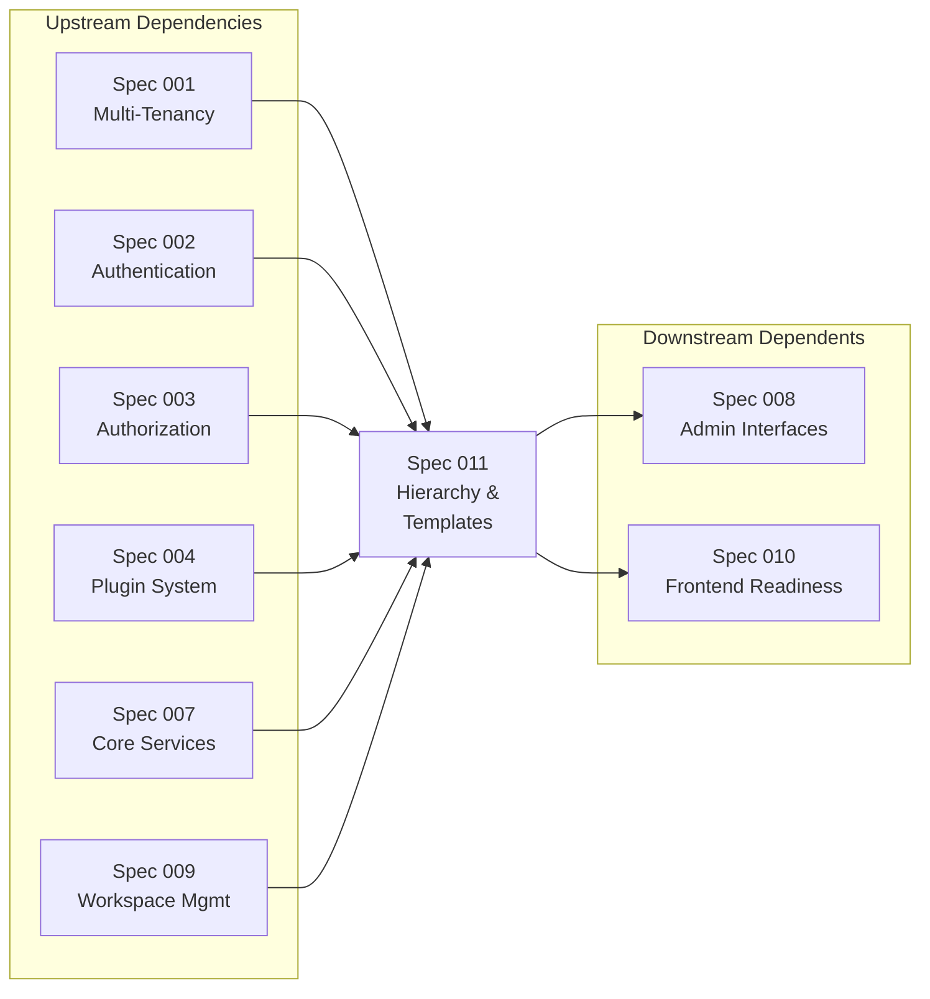
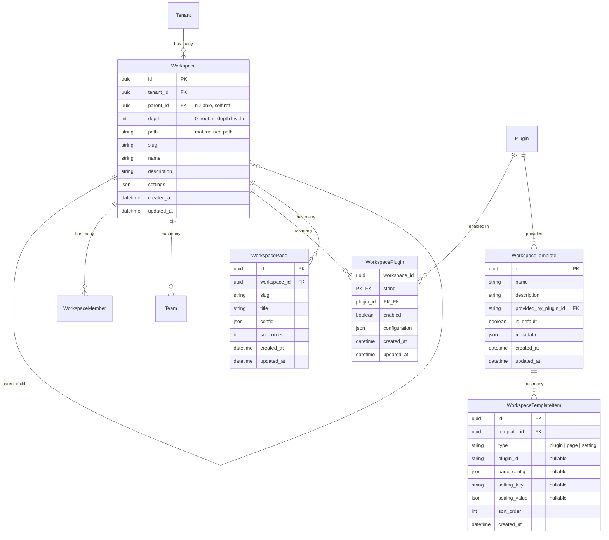
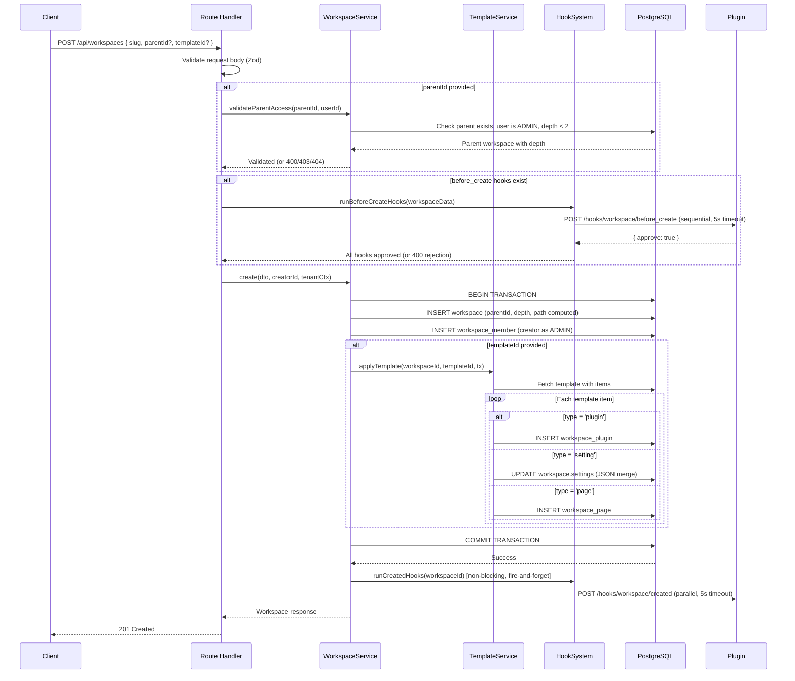
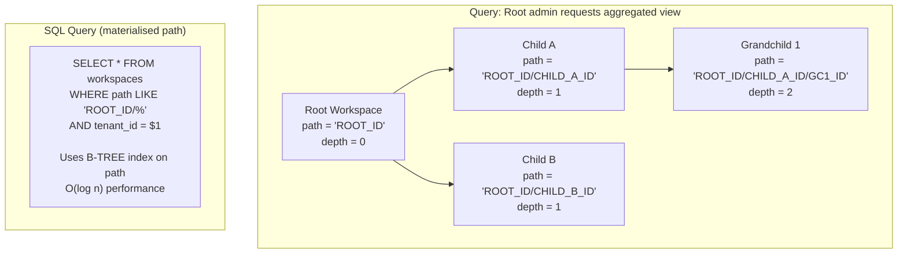
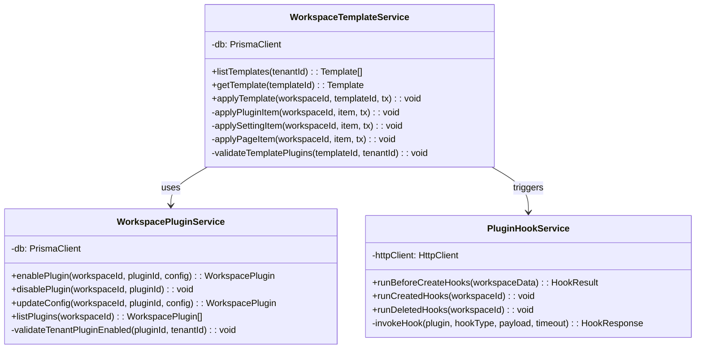
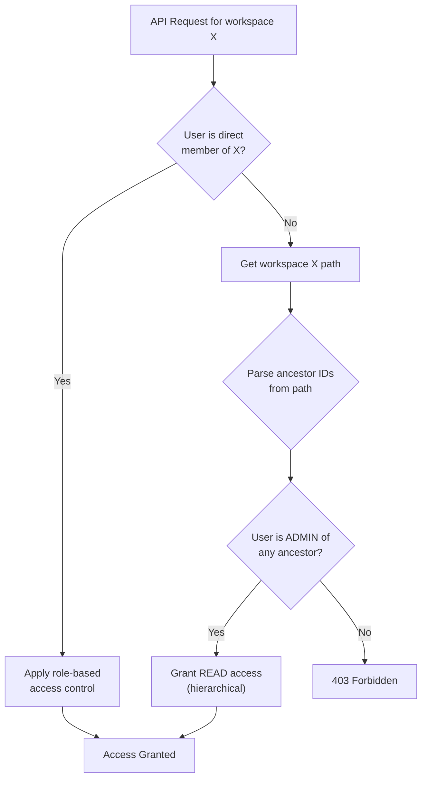

# Spec: 011 - Workspace Hierarchical Visibility & Templates

> Feature specification for workspace hierarchy (parent-child relationships with
> top-down data aggregation), workspace templates, and template provider plugins.
> Created by the `forge-pm` agent via `/forge-specify`.

| Field        | Value                                           |
| ------------ | ----------------------------------------------- |
| Status       | Ready                                           |
| Author       | forge-pm                                        |
| Date         | 2026-02-20                                      |
| Track        | Epic                                            |
| Spec ID      | 011                                             |
| Priority     | HIGH                                            |
| Epic         | E03 - Workspace Hierarchy & Templates           |
| Dependencies | Spec 001, 002, 003, 004, 007, 009               |
| Dependents   | Spec 008 (Admin), Spec 010 (Frontend Readiness) |

---

## Table of Contents

1. [Overview](#1-overview)
2. [Problem Statement](#2-problem-statement)
3. [User Stories & Acceptance Criteria](#3-user-stories--acceptance-criteria)
4. [Functional Requirements](#4-functional-requirements)
5. [Data Model](#5-data-model)
6. [API Specification](#6-api-specification)
7. [Security Requirements](#7-security-requirements)
8. [Non-Functional Requirements](#8-non-functional-requirements)
9. [Technical Design](#9-technical-design)
10. [Testing Strategy](#10-testing-strategy)
11. [Implementation Status](#11-implementation-status)
12. [Edge Cases & Error Scenarios](#12-edge-cases--error-scenarios)
13. [UX/UI Notes](#13-uxui-notes)
14. [Out of Scope](#14-out-of-scope)
15. [Open Questions](#15-open-questions)
16. [Implementation Scope](#16-implementation-scope)
17. [Constitution Compliance](#17-constitution-compliance)
18. [Future Enhancements](#18-future-enhancements)
19. [Cross-References](#19-cross-references)

---

## 1. Overview

### 1.1 Purpose

This specification defines three interconnected pillars of workspace evolution
for the Plexica multi-tenant SaaS platform:

1. **Hierarchical Visibility** — Parent-child workspace relationships with
   top-down data aggregation. Parents see their own data plus an aggregate view
   of all descendant workspaces. Children see only their own data. Siblings
   cannot see each other.

2. **Workspace Templates** — Predefined blueprints that configure a workspace
   at creation time with a set of plugins, settings, and page metadata.
   Templates are applied transactionally — if application fails, the entire
   workspace creation is rolled back.

3. **Template Provider Plugins** — An extension to the plugin manifest (Spec 004)
   that allows plugins to declare a `workspace.template-provider` capability,
   register templates, and react to workspace lifecycle hooks
   (`workspace.created`, `workspace.before_create`).

### 1.2 Scope

This specification covers:

- **Hierarchy model**: `parentId`, `depth`, `path` (materialised path) fields
  on the Workspace model
- **Hierarchy enforcement**: Unlimited depth, slug uniqueness scoped to
  parent, re-parenting supported (tenant ADMIN only, cascade path update)
- **Top-down aggregation**: Parent workspaces aggregate descendant data for
  read operations; children remain isolated
- **Hierarchical permissions**: Root ADMINs can read/manage all descendants;
  child ADMINs manage only their workspace
- **WorkspaceTemplate and WorkspaceTemplateItem models**: Template definition
  and item types (`plugin`, `page`, `setting`)
- **Template application flow**: Transactional application at workspace creation
- **WorkspacePlugin join table**: Per-workspace plugin enablement separate from
  tenant-level plugin enablement
- **Template provider plugin capability**: Manifest extension, template
  registration API, `workspace.created` and `workspace.before_create` hooks
- **New and modified API endpoints** for hierarchy management, template CRUD,
  and template application

### 1.3 Current State

| Category                     | Status         | Coverage |
| ---------------------------- | -------------- | -------- |
| Workspace CRUD               | ✅ IMPLEMENTED | 85%      |
| Workspace Members & Teams    | ✅ IMPLEMENTED | 85%      |
| Workspace Hierarchy          | 🔴 NOT EXISTS  | 0%       |
| Workspace Templates          | 🔴 NOT EXISTS  | 0%       |
| WorkspacePlugin Join Table   | 🔴 NOT EXISTS  | 0%       |
| Template Provider Capability | 🔴 NOT EXISTS  | 0%       |
| Plugin Lifecycle Hooks       | 🔴 STUB (TODO) | 0%       |
| Workspace Events (Spec 009)  | 🔴 GAP         | 0%       |

### 1.4 Dependencies



| Dependency           | Type       | Impact                                                        |
| -------------------- | ---------- | ------------------------------------------------------------- |
| Spec 001 (Tenancy)   | Upstream   | Schema-per-tenant isolation; hierarchy within tenant boundary |
| Spec 002 (Auth)      | Upstream   | User identity for hierarchical permission checks              |
| Spec 003 (AuthZ)     | Upstream   | RBAC framework extended for hierarchical role inheritance     |
| Spec 004 (Plugin)    | Upstream   | Plugin manifest, lifecycle, hooks — extended for templates    |
| Spec 007 (Services)  | Upstream   | EventBus for workspace hooks, Redis for hierarchy cache       |
| Spec 009 (Workspace) | Upstream   | Base workspace model, service, routes, guards — all extended  |
| Spec 008 (Admin)     | Downstream | Admin UI needs hierarchy tree view and template management    |
| Spec 010 (Frontend)  | Downstream | Frontend needs hierarchy-aware workspace switcher             |

---

## 2. Problem Statement

### 2.1 Business Problem

Organizations using Plexica need to model their internal structure within a
tenant. Currently, all workspaces within a tenant are flat and isolated from
each other. This creates three critical gaps:

1. **No organizational hierarchy**: A VP of Engineering cannot see an aggregate
   view of all engineering sub-team workspaces (Backend, Frontend, QA). They
   must manually switch between workspaces and mentally aggregate data. This
   blocks executive dashboards and cross-team reporting.

2. **No workspace standardization**: When creating a new workspace (e.g., a
   new project team), admins must manually configure plugins, settings, and
   pages every time. With 50+ workspaces per tenant, this becomes a significant
   operational burden and leads to inconsistent configurations.

3. **No plugin-driven workspace setup**: Plugins cannot participate in
   workspace creation. A project management plugin cannot automatically create
   a default board when a "Project" workspace is created. The plugin lifecycle
   hook system (`runLifecycleHook()`) is a TODO stub — hooks like
   `workspace.created` and `workspace.deleted` are not implemented.

### 2.2 Why Now

- Spec 009 (Workspace Management) is 85% implemented and provides the stable
  foundation needed for hierarchy and templates.
- Enterprise customers have requested organizational hierarchy as a top-5
  feature for Q1 2026.
- The plugin system (Spec 004) needs workspace-level plugin enablement
  (WorkspacePlugin) to support per-workspace plugin configuration, which is a
  prerequisite for the template system.
- The lifecycle hook system is a TODO stub that must be implemented for the
  broader plugin ecosystem to function — this spec provides the concrete
  use case that drives that implementation.

### 2.3 Assumptions

- Spec 009 workspace CRUD, members, teams, and guards are fully operational
- Spec 004 plugin manifest, registration, and tenant-level enablement work
- Spec 001 schema-per-tenant isolation is production-ready
- Spec 007 EventBus is available (or will be by implementation time)
- The `PluginHookSystem` class exists but `runLifecycleHook()` is a stub

---

## 3. User Stories & Acceptance Criteria

### Pillar 1: Hierarchical Visibility

#### US-001: Create Child Workspace

**As a** workspace admin,
**I want** to create a child workspace under my workspace,
**so that** I can model sub-teams or sub-projects within my organizational unit.

**Status**: 🔴 NOT IMPLEMENTED

**Acceptance Criteria:**

| #   | Given                                          | When                                                            | Then                                                                        | Status |
| --- | ---------------------------------------------- | --------------------------------------------------------------- | --------------------------------------------------------------------------- | ------ |
| AC1 | User is ADMIN of parent workspace              | User submits POST /api/workspaces with `parentId`               | Child workspace is created with `depth = parent.depth + 1`                  | 🔴     |
| AC2 | Parent workspace is at depth 0 (root)          | User creates a child                                            | Child workspace has `depth = 1` and `path = "{parentId}/{childId}"`         | 🔴     |
| AC3 | Parent workspace is at depth 1 (child)         | User creates a grandchild                                       | Grandchild has `depth = 2` and `path = "{rootId}/{parentId}/{childId}"`     | 🔴     |
| AC4 | Slug "backend" exists under same parent        | User creates child with slug "backend" under same parent        | 409 "Workspace slug already exists under this parent"                       | 🔴     |
| AC5 | Slug "backend" exists under a different parent | User creates child with slug "backend" under a different parent | Child workspace created successfully (slug unique per parent, not tenant)   | 🔴     |
| AC6 | User is NOT admin of parent workspace          | User attempts to create child under that parent                 | 403 "Insufficient permissions on parent workspace"                          | 🔴     |
| AC7 | No `parentId` provided                         | User submits POST /api/workspaces                               | Root workspace created with `depth = 0`, `path = "{id}"`, `parentId = null` | 🔴     |

**Validation Rules (updated `CreateWorkspaceSchema`):**

| Field    | Type   | Required | Constraints                                                  |
| -------- | ------ | -------- | ------------------------------------------------------------ |
| slug     | string | Yes      | 2-50 chars, `/^[a-z0-9-]+$/`, unique per parent (not tenant) |
| name     | string | Yes      | 2-100 chars                                                  |
| parentId | string | No       | Valid UUID, must reference existing workspace in same tenant |

---

#### US-001b: Move Workspace to Different Parent (Re-parenting)

**As a** tenant administrator,
**I want** to move a workspace under a different parent workspace,
**so that** I can reorganize the hierarchy as the organization evolves.

**Status**: 🔴 NOT IMPLEMENTED

**Acceptance Criteria:**

| #   | Given                                                   | When                                                            | Then                                                                                              | Status |
| --- | ------------------------------------------------------- | --------------------------------------------------------------- | ------------------------------------------------------------------------------------------------- | ------ |
| AC1 | User is tenant ADMIN                                    | User sends PATCH /api/workspaces/:id/parent with `{ parentId }` | Workspace `parentId`, `path`, `depth` updated; all descendants' `path`/`depth` updated atomically | 🔴     |
| AC2 | Workspace has 3 descendants                             | Re-parenting executed                                           | All 3 descendants have their `path` and `depth` recalculated correctly in same transaction        | 🔴     |
| AC3 | New parent is a descendant of the workspace being moved | User attempts PATCH /api/workspaces/:id/parent                  | 400 `REPARENT_CYCLE_DETECTED` — would create a cycle                                              | 🔴     |
| AC4 | New parent is in a different tenant                     | User attempts PATCH /api/workspaces/:id/parent                  | 404 `PARENT_WORKSPACE_NOT_FOUND`                                                                  | 🔴     |
| AC5 | New parent already has a child with the same slug       | User attempts re-parenting                                      | 409 `WORKSPACE_SLUG_CONFLICT` — slug collision under new parent                                   | 🔴     |
| AC6 | User is workspace ADMIN but NOT tenant ADMIN            | User attempts PATCH /api/workspaces/:id/parent                  | 403 `INSUFFICIENT_PERMISSIONS` — only tenant ADMIN can re-parent                                  | 🔴     |
| AC7 | Re-parenting succeeds                                   | Response returned                                               | Response includes updated workspace with new `parentId`, `depth`, `path`                          | 🔴     |

**Validation Rules:**

| Field    | Type   | Required | Constraints                                                                                       |
| -------- | ------ | -------- | ------------------------------------------------------------------------------------------------- |
| parentId | string | Yes      | Valid UUID; must exist in same tenant; must not be the workspace itself or any of its descendants |

---

#### US-002: View Aggregated Descendant Data

**As a** root workspace admin or member,
**I want** to see my workspace data plus an aggregate of all descendant data,
**so that** I have a top-down view of my organizational unit.

**Status**: 🔴 NOT IMPLEMENTED

**Acceptance Criteria:**

| #   | Given                                             | When                                         | Then                                                                | Status |
| --- | ------------------------------------------------- | -------------------------------------------- | ------------------------------------------------------------------- | ------ |
| AC1 | Root workspace has 2 child workspaces             | Root admin queries GET /api/workspaces/:id   | Response includes `children` array with summary of each child       | 🔴     |
| AC2 | Root workspace has children with members          | Root admin queries aggregated data           | Response includes `aggregatedMemberCount` across all descendants    | 🔴     |
| AC3 | Root workspace queries with `?includeDescendants` | Query includes descendants flag              | Descendant workspace resources are included in the response         | 🔴     |
| AC4 | Child workspace member queries their workspace    | Child member queries GET /api/workspaces/:id | Response includes ONLY the child workspace data (no sibling data)   | 🔴     |
| AC5 | Two sibling workspaces exist                      | Member of sibling A queries workspace list   | Sibling B is NOT visible in the response                            | 🔴     |
| AC6 | Root admin queries descendants                    | Query uses materialised path                 | Query uses `WHERE path LIKE '{rootId}/%'` — no recursive CTE needed | 🔴     |

---

#### US-003: Manage Descendant Workspaces

**As a** root workspace admin,
**I want** to manage (read, update settings for) descendant workspaces,
**so that** I can maintain organizational standards across sub-teams.

**Status**: 🔴 NOT IMPLEMENTED

**Acceptance Criteria:**

| #   | Given                                 | When                                              | Then                                                               | Status |
| --- | ------------------------------------- | ------------------------------------------------- | ------------------------------------------------------------------ | ------ |
| AC1 | User is ADMIN of root workspace       | User queries GET /api/workspaces/:childId         | Child workspace details are returned (hierarchical read access)    | 🔴     |
| AC2 | User is ADMIN of root workspace       | User queries GET /api/workspaces/:childId/members | Child workspace members are listed                                 | 🔴     |
| AC3 | User is MEMBER of root workspace      | User queries GET /api/workspaces/:childId         | Child workspace summary is returned (read-only, no member details) | 🔴     |
| AC4 | User is ADMIN of child workspace only | User queries GET /api/workspaces/:siblingId       | 403 "You are not a member of this workspace"                       | 🔴     |
| AC5 | User is ADMIN of child workspace only | User queries GET /api/workspaces/:rootId          | Only child's own data visible (no ancestor access upward)          | 🔴     |
| AC6 | Root workspace has children           | Admin attempts DELETE /api/workspaces/:rootId     | 400 "Cannot delete workspace with child workspaces"                | 🔴     |

---

#### US-004: List Workspace Hierarchy Tree

**As a** tenant admin,
**I want** to see the full workspace hierarchy as a tree,
**so that** I can understand the organizational structure at a glance.

**Status**: 🔴 NOT IMPLEMENTED

**Acceptance Criteria:**

| #   | Given                                  | When                                   | Then                                                                    | Status |
| --- | -------------------------------------- | -------------------------------------- | ----------------------------------------------------------------------- | ------ |
| AC1 | Tenant has root and child workspaces   | Admin queries GET /api/workspaces/tree | Tree structure returned with nested children arrays                     | 🔴     |
| AC2 | User is member of some workspaces only | User queries GET /api/workspaces/tree  | Only workspaces the user is a member of (+ ancestors for context) shown | 🔴     |
| AC3 | Tree has multiple levels               | Tree is rendered                       | All levels (root → child → grandchild → ...) visible in response        | 🔴     |
| AC4 | Tree response                          | Client renders tree                    | Response time < 200ms (P95) for up to 100 workspaces                    | 🔴     |

---

### Pillar 2: Workspace Templates

#### US-005: Create Workspace from Template

**As a** workspace admin,
**I want** to create a workspace using a predefined template,
**so that** the workspace is automatically configured with the right plugins,
settings, and pages.

**Status**: 🔴 NOT IMPLEMENTED

**Acceptance Criteria:**

| #   | Given                                               | When                                                | Then                                                                   | Status |
| --- | --------------------------------------------------- | --------------------------------------------------- | ---------------------------------------------------------------------- | ------ |
| AC1 | Template "Engineering" exists with 3 plugin items   | User submits POST /api/workspaces with `templateId` | Workspace is created AND all 3 plugins are activated for the workspace | 🔴     |
| AC2 | Template has 2 setting items                        | Template is applied during workspace creation       | Workspace `settings` field contains the template's preset values       | 🔴     |
| AC3 | Template has 1 page item                            | Template is applied during workspace creation       | WorkspacePage record is created for that workspace                     | 🔴     |
| AC4 | Template application fails (e.g., plugin missing)   | Error occurs during applyTemplate()                 | Entire workspace creation is rolled back — no orphan workspace exists  | 🔴     |
| AC5 | Template does not exist                             | User provides invalid `templateId`                  | 404 "Template not found"                                               | 🔴     |
| AC6 | No `templateId` provided                            | User creates workspace without template             | Workspace created normally (backward compatible)                       | 🔴     |
| AC7 | Template specifies a plugin not installed in tenant | Template application evaluates plugin item          | 400 "Plugin {id} is not installed in this tenant"                      | 🔴     |

---

#### US-006: Manage Workspace Templates

**As a** tenant admin,
**I want** to list, view, and manage available workspace templates,
**so that** I can control which templates are available for my organization.

**Status**: 🔴 NOT IMPLEMENTED

**Acceptance Criteria:**

| #   | Given                                 | When                                           | Then                                                        | Status |
| --- | ------------------------------------- | ---------------------------------------------- | ----------------------------------------------------------- | ------ |
| AC1 | Tenant has 3 templates from 2 plugins | Admin queries GET /api/workspace-templates     | All 3 templates listed with source plugin info              | 🔴     |
| AC2 | Admin views template details          | Admin queries GET /api/workspace-templates/:id | Template with all items (plugins, settings, pages) returned | 🔴     |
| AC3 | Plugin provides a default template    | Plugin is enabled for tenant                   | Template marked `isDefault = true` appears in template list | 🔴     |
| AC4 | Plugin is disabled for tenant         | Admin queries templates                        | Templates from disabled plugins are NOT listed              | 🔴     |

---

#### US-007: Activate Plugin for Workspace

**As a** workspace admin,
**I want** to enable or disable specific plugins for my workspace,
**so that** each workspace has only the tools it needs.

**Status**: 🔴 NOT IMPLEMENTED

**Acceptance Criteria:**

| #   | Given                                       | When                                                           | Then                                                          | Status |
| --- | ------------------------------------------- | -------------------------------------------------------------- | ------------------------------------------------------------- | ------ |
| AC1 | Plugin "CRM" is enabled at tenant level     | Admin submits POST /api/workspaces/:id/plugins with `pluginId` | WorkspacePlugin record created with `enabled = true`          | 🔴     |
| AC2 | Plugin "CRM" is NOT enabled at tenant level | Admin attempts to enable it for workspace                      | 400 "Plugin must be enabled at tenant level first"            | 🔴     |
| AC3 | Plugin is enabled for workspace             | Admin submits DELETE /api/workspaces/:id/plugins/:pluginId     | WorkspacePlugin.enabled set to false, configuration preserved | 🔴     |
| AC4 | Admin queries workspace plugins             | Admin submits GET /api/workspaces/:id/plugins                  | List of enabled/disabled plugins for workspace returned       | 🔴     |
| AC5 | Plugin has workspace-level configuration    | Admin submits PATCH /api/workspaces/:id/plugins/:pluginId      | WorkspacePlugin.configuration updated                         | 🔴     |

---

### Pillar 3: Template Provider Plugin

#### US-008: Register Plugin as Template Provider

**As a** plugin developer,
**I want** to declare my plugin as a workspace template provider in the manifest,
**so that** my plugin can offer predefined workspace configurations.

**Status**: 🔴 NOT IMPLEMENTED

**Acceptance Criteria:**

| #   | Given                                                                    | When                                                           | Then                                                               | Status |
| --- | ------------------------------------------------------------------------ | -------------------------------------------------------------- | ------------------------------------------------------------------ | ------ |
| AC1 | Plugin manifest includes `capabilities: ["workspace.template-provider"]` | Plugin is installed                                            | Plugin is recognized as a template provider                        | 🔴     |
| AC2 | Plugin is a template provider                                            | Plugin registers templates via POST /api/plugins/:id/templates | Templates are stored and associated with the plugin                | 🔴     |
| AC3 | Plugin manifest includes `hooks.workspace.created`                       | A workspace is created                                         | Plugin's hook handler endpoint is called with workspace context    | 🔴     |
| AC4 | Plugin manifest includes `hooks.workspace.before_create`                 | A workspace creation is initiated                              | Plugin's before_create handler is called; can modify or reject     | 🔴     |
| AC5 | `before_create` hook handler returns rejection                           | Workspace creation is in progress                              | Workspace creation is aborted with the plugin's error message      | 🔴     |
| AC6 | `workspace.created` hook handler fails                                   | Hook invocation errors                                         | Workspace creation succeeds; hook failure is logged (non-blocking) | 🔴     |
| AC7 | Plugin manifest has invalid capabilities                                 | Manifest validation runs                                       | Validation error: "Unknown capability: {value}"                    | 🔴     |

---

#### US-009: Plugin Reacts to Workspace Lifecycle

**As a** plugin developer,
**I want** my plugin to receive workspace lifecycle hooks,
**so that** I can provision plugin-specific resources when a workspace is created
or clean up when it is deleted.

**Status**: 🔴 NOT IMPLEMENTED

**Acceptance Criteria:**

| #   | Given                                               | When                         | Then                                                                                        | Status |
| --- | --------------------------------------------------- | ---------------------------- | ------------------------------------------------------------------------------------------- | ------ |
| AC1 | Plugin subscribes to `workspace.created` hook       | Workspace is created         | Plugin receives POST to its handler URL with `{ workspaceId, templateId?, tenantId }`       | 🔴     |
| AC2 | Plugin subscribes to `workspace.deleted` hook       | Workspace is deleted         | Plugin receives POST to its handler URL with `{ workspaceId, tenantId }`                    | 🔴     |
| AC3 | Plugin subscribes to `workspace.before_create` hook | Workspace creation initiated | Plugin receives POST; response can include `{ approve: boolean, reason? }`                  | 🔴     |
| AC4 | Multiple plugins subscribe to same hook             | Hook fires                   | All subscribing plugins are called (parallel for `created`, sequential for `before_create`) | 🔴     |
| AC5 | Hook invocation times out (>5s)                     | Plugin handler is slow       | Timeout error logged; workspace operation continues                                         | 🔴     |

---

## 4. Functional Requirements

### 4.1 Pillar 1: Hierarchical Visibility

| ID     | Requirement                                                                                       | Priority | Story Ref | Status      |
| ------ | ------------------------------------------------------------------------------------------------- | -------- | --------- | ----------- |
| FR-001 | System shall support optional `parentId` on workspace creation to establish parent-child relation | Must     | US-001    | 🔴 Not Impl |
| FR-002 | System shall compute and store `depth` (0=root, n=depth level n) on workspace creation            | Must     | US-001    | 🔴 Not Impl |
| FR-003 | System shall compute and store `path` (materialised path) on workspace creation                   | Must     | US-001    | 🔴 Not Impl |
| FR-004 | System shall enforce slug uniqueness scoped to parent workspace (not entire tenant)               | Must     | US-001    | 🔴 Not Impl |
| FR-005 | System shall allow tenant ADMIN to move a workspace to a different parent (re-parenting)          | Must     | US-001b   | 🔴 Not Impl |
| FR-006 | System shall recalculate `path` and `depth` for the workspace and all its descendants atomically  | Must     | US-001b   | 🔴 Not Impl |
| FR-007 | System shall prevent deletion of workspaces that have child workspaces                            | Must     | US-003    | 🔴 Not Impl |
| FR-008 | Parent workspace queries shall aggregate data from all descendant workspaces                      | Must     | US-002    | 🔴 Not Impl |
| FR-009 | Descendant aggregation queries shall use materialised `path` with `LIKE` operator (O(log n))      | Must     | US-002    | 🔴 Not Impl |
| FR-010 | Child workspaces shall see ONLY their own data (complete isolation from siblings and parent)      | Must     | US-002    | 🔴 Not Impl |
| FR-011 | Root ADMIN role shall grant read access to all descendant workspaces                              | Must     | US-003    | 🔴 Not Impl |
| FR-012 | Root MEMBER role shall grant read-only summary access to descendant workspaces                    | Should   | US-003    | 🔴 Not Impl |
| FR-013 | System shall provide a tree-view endpoint returning the full workspace hierarchy                  | Should   | US-004    | 🔴 Not Impl |
| FR-014 | Hierarchy tree endpoint shall respect user membership visibility                                  | Must     | US-004    | 🔴 Not Impl |

### 4.2 Pillar 2: Workspace Templates

| ID     | Requirement                                                                                                                                                                                                                                                           | Priority | Story Ref | Status      |
| ------ | --------------------------------------------------------------------------------------------------------------------------------------------------------------------------------------------------------------------------------------------------------------------- | -------- | --------- | ----------- |
| FR-015 | System shall support `templateId` on workspace creation to apply a template                                                                                                                                                                                           | Must     | US-005    | 🔴 Not Impl |
| FR-016 | Template application shall be transactional — failure rolls back the entire workspace                                                                                                                                                                                 | Must     | US-005    | 🔴 Not Impl |
| FR-017 | Template items of type `plugin` shall create WorkspacePlugin records                                                                                                                                                                                                  | Must     | US-005    | 🔴 Not Impl |
| FR-018 | Template items of type `setting` shall merge values into workspace `settings` JSON field                                                                                                                                                                              | Must     | US-005    | 🔴 Not Impl |
| FR-019 | Template items of type `page` shall create WorkspacePage records                                                                                                                                                                                                      | Should   | US-005    | 🔴 Not Impl |
| FR-020 | System shall validate that all plugins referenced by template are installed at tenant level                                                                                                                                                                           | Must     | US-005    | 🔴 Not Impl |
| FR-021 | System shall provide CRUD endpoints for workspace templates                                                                                                                                                                                                           | Must     | US-006    | 🔴 Not Impl |
| FR-022 | Template listing shall exclude templates from disabled tenant plugins                                                                                                                                                                                                 | Must     | US-006    | 🔴 Not Impl |
| FR-023 | System shall support a `WorkspacePlugin` join table for per-workspace plugin enablement                                                                                                                                                                               | Must     | US-007    | 🔴 Not Impl |
| FR-024 | WorkspacePlugin enablement shall require tenant-level plugin enablement as prerequisite                                                                                                                                                                               | Must     | US-007    | 🔴 Not Impl |
| FR-025 | System shall provide CRUD endpoints for workspace-level plugin management                                                                                                                                                                                             | Must     | US-007    | 🔴 Not Impl |
| FR-026 | When a tenant-level plugin is disabled, all WorkspacePlugin records for that plugin shall be automatically set to `enabled = false` (cascade disable). When tenant plugin is re-enabled, workspace plugins remain disabled until explicitly re-enabled per workspace. | Must     | US-007    | 🔴 Not Impl |

### 4.3 Pillar 3: Template Provider Plugin

| ID     | Requirement                                                                                         | Priority | Story Ref      | Status      |
| ------ | --------------------------------------------------------------------------------------------------- | -------- | -------------- | ----------- |
| FR-027 | Plugin manifest shall support `capabilities` array including `workspace.template-provider`          | Must     | US-008         | 🔴 Not Impl |
| FR-028 | Plugin manifest shall support `hooks` object with `workspace.created` and `workspace.before_create` | Must     | US-008, US-009 | 🔴 Not Impl |
| FR-029 | Template provider plugins shall be able to register templates via API                               | Must     | US-008         | 🔴 Not Impl |
| FR-030 | `workspace.before_create` hook shall be invoked sequentially and can reject creation                | Must     | US-009         | 🔴 Not Impl |
| FR-031 | `workspace.created` hook shall be invoked in parallel (non-blocking, fire-and-forget)               | Must     | US-009         | 🔴 Not Impl |
| FR-032 | Hook invocation shall have a 5-second timeout per plugin handler                                    | Must     | US-009         | 🔴 Not Impl |
| FR-033 | `runLifecycleHook()` stub in PluginHookSystem shall be implemented                                  | Must     | US-009         | 🔴 Not Impl |
| FR-034 | System shall publish `core.workspace.created` and `core.workspace.deleted` events to EventBus       | Must     | US-009         | 🔴 Not Impl |

---

## 5. Data Model

### 5.1 Entity Relationship Diagram



### 5.2 Workspace Model (MODIFIED)

**Status**: 🔴 MODIFICATION REQUIRED — adding `parentId`, `depth`, `path`

**Updated Prisma Schema:**

```prisma
model Workspace {
  id          String   @id @default(uuid())
  tenantId    String   @map("tenant_id")
  parentId    String?  @map("parent_id")
  depth       Int      @default(0)
  path        String   @default("")
  slug        String
  name        String
  description String?
  settings    Json     @default("{}")
  createdAt   DateTime @default(now()) @map("created_at")
  updatedAt   DateTime @updatedAt @map("updated_at")

  parent    Workspace?  @relation("WorkspaceHierarchy", fields: [parentId], references: [id])
  children  Workspace[] @relation("WorkspaceHierarchy")

  members   WorkspaceMember[]
  teams     Team[]
  resources WorkspaceResource[]
  plugins   WorkspacePlugin[]
  pages     WorkspacePage[]

  @@unique([parentId, slug])
  @@index([tenantId])
  @@index([parentId])
  @@index([path])
  @@index([depth])
  @@map("workspaces")
  @@schema("core")
}
```

> **Slug uniqueness strategy (RESOLVED)**: Two complementary constraints ensure
> slug uniqueness at every level of the hierarchy:
>
> 1. **Child workspaces**: `@@unique([parentId, slug])` — slugs are unique among
>    siblings sharing the same parent. Two children of different parents may share
>    a slug (e.g., `parent-a/reports` and `parent-b/reports` are both valid).
> 2. **Root workspaces**: A **PostgreSQL partial unique index** enforces that
>    root workspace slugs (where `parentId IS NULL`) are unique per tenant:
>    ```sql
>    CREATE UNIQUE INDEX idx_workspace_root_slug_unique
>      ON core.workspaces (tenant_id, slug)
>      WHERE parent_id IS NULL;
>    ```
>    This is necessary because PostgreSQL treats `NULL ≠ NULL` in unique
>    constraints, so `@@unique([parentId, slug])` alone would allow duplicate
>    root slugs within the same tenant.
>
> Both constraints are enforced at database level. Application-level validation
> also checks for duplicates before attempting insert to provide friendly error
> messages (`WORKSPACE_SLUG_EXISTS`).

> **Note on `path` field**: Uses the **materialised path pattern** for efficient
> hierarchical queries. The `path` value is computed at creation time:
>
> - Root workspace: `path = "{id}"`
> - Child workspace: `path = "{parent.path}/{id}"`
> - Example: `"a1b2c3d4/e5f6g7h8/i9j0k1l2"`
>
> This enables efficient descendant queries with `WHERE path LIKE '{rootId}/%'`
> which runs in **O(log n)** via the B-TREE index on `path`, avoiding expensive
> recursive CTEs.

**New/Modified Field Details:**

| Column    | SQL Type | Nullable | Default | Constraints                                   | Notes                                         |
| --------- | -------- | -------- | ------- | --------------------------------------------- | --------------------------------------------- |
| parent_id | UUID     | Yes      | NULL    | FK → Workspace (self-ref), ON DELETE RESTRICT | Mutable via PATCH /parent (tenant ADMIN only) |
| depth     | INTEGER  | No       | 0       | CHECK (depth >= 0)                            | 0=root, n=depth level n                       |
| path      | VARCHAR  | No       | ''      | -                                             | Materialised path, computed at creation       |

**New Indexes:**

| Index Name            | Columns   | Type   | Purpose                              |
| --------------------- | --------- | ------ | ------------------------------------ |
| idx_workspaces_parent | parent_id | B-TREE | Direct children lookup               |
| idx_workspaces_path   | path      | B-TREE | Materialised path descendant queries |
| idx_workspaces_depth  | depth     | B-TREE | Depth-level filtering                |

---

### 5.3 WorkspacePlugin Model (NEW)

**Status**: 🔴 NEW MODEL

```prisma
model WorkspacePlugin {
  workspaceId   String   @map("workspace_id")
  pluginId      String   @map("plugin_id")
  enabled       Boolean  @default(true)
  configuration Json     @default("{}")
  createdAt     DateTime @default(now()) @map("created_at")
  updatedAt     DateTime @updatedAt @map("updated_at")

  workspace Workspace @relation(fields: [workspaceId], references: [id], onDelete: Cascade)
  plugin    Plugin    @relation(fields: [pluginId], references: [id])

  @@id([workspaceId, pluginId])
  @@index([workspaceId])
  @@index([pluginId])
  @@map("workspace_plugins")
  @@schema("core")
}
```

**Field Details:**

| Column        | SQL Type     | Nullable | Default | Constraints                    | Notes                                   |
| ------------- | ------------ | -------- | ------- | ------------------------------ | --------------------------------------- |
| workspace_id  | UUID         | No       | -       | PK (composite), FK → Workspace | ON DELETE CASCADE                       |
| plugin_id     | VARCHAR      | No       | -       | PK (composite), FK → Plugin    | Must be enabled at tenant level first   |
| enabled       | BOOLEAN      | No       | true    | -                              | Can be disabled without removing config |
| configuration | JSONB        | No       | `{}`    | -                              | Workspace-specific plugin settings      |
| created_at    | TIMESTAMP(3) | No       | NOW()   | -                              | Immutable                               |
| updated_at    | TIMESTAMP(3) | No       | NOW()   | -                              | Auto-updated via Prisma @updatedAt      |

---

### 5.4 WorkspaceTemplate Model (NEW)

**Status**: 🔴 NEW MODEL

```prisma
model WorkspaceTemplate {
  id                  String   @id @default(uuid())
  name                String
  description         String?
  providedByPluginId  String   @map("provided_by_plugin_id")
  isDefault           Boolean  @default(false) @map("is_default")
  metadata            Json     @default("{}")
  createdAt           DateTime @default(now()) @map("created_at")
  updatedAt           DateTime @updatedAt @map("updated_at")

  plugin Plugin @relation(fields: [providedByPluginId], references: [id])
  items  WorkspaceTemplateItem[]

  @@index([providedByPluginId])
  @@map("workspace_templates")
  @@schema("core")
}
```

**Field Details:**

| Column                | SQL Type     | Nullable | Default           | Constraints | Notes                              |
| --------------------- | ------------ | -------- | ----------------- | ----------- | ---------------------------------- |
| id                    | UUID         | No       | gen_random_uuid() | PK          | Auto-generated                     |
| name                  | VARCHAR      | No       | -                 | -           | Template display name              |
| description           | TEXT         | Yes      | NULL              | -           | Template description               |
| provided_by_plugin_id | VARCHAR      | No       | -                 | FK → Plugin | Plugin that provides this template |
| is_default            | BOOLEAN      | No       | false             | -           | One default per provider plugin    |
| metadata              | JSONB        | No       | `{}`              | -           | Arbitrary plugin-defined metadata  |
| created_at            | TIMESTAMP(3) | No       | NOW()             | -           | Immutable                          |
| updated_at            | TIMESTAMP(3) | No       | NOW()             | -           | Auto-updated via Prisma @updatedAt |

---

### 5.5 WorkspaceTemplateItem Model (NEW)

**Status**: 🔴 NEW MODEL

```prisma
model WorkspaceTemplateItem {
  id           String   @id @default(uuid())
  templateId   String   @map("template_id")
  type         String   // 'plugin' | 'page' | 'setting'
  pluginId     String?  @map("plugin_id")
  pageConfig   Json?    @map("page_config")
  settingKey   String?  @map("setting_key")
  settingValue Json?    @map("setting_value")
  sortOrder    Int      @default(0) @map("sort_order")
  createdAt    DateTime @default(now()) @map("created_at")

  template WorkspaceTemplate @relation(fields: [templateId], references: [id], onDelete: Cascade)

  @@index([templateId])
  @@map("workspace_template_items")
  @@schema("core")
}
```

**Field Details:**

| Column        | SQL Type     | Nullable | Default           | Constraints                         | Notes                          |
| ------------- | ------------ | -------- | ----------------- | ----------------------------------- | ------------------------------ |
| id            | UUID         | No       | gen_random_uuid() | PK                                  | Auto-generated                 |
| template_id   | UUID         | No       | -                 | FK → WorkspaceTemplate              | ON DELETE CASCADE              |
| type          | VARCHAR      | No       | -                 | CHECK ('plugin', 'page', 'setting') | Item type discriminator        |
| plugin_id     | VARCHAR      | Yes      | NULL              | -                                   | Required when type = 'plugin'  |
| page_config   | JSONB        | Yes      | NULL              | -                                   | Required when type = 'page'    |
| setting_key   | VARCHAR      | Yes      | NULL              | -                                   | Required when type = 'setting' |
| setting_value | JSONB        | Yes      | NULL              | -                                   | Required when type = 'setting' |
| sort_order    | INTEGER      | No       | 0                 | -                                   | Application order              |
| created_at    | TIMESTAMP(3) | No       | NOW()             | -                                   | Immutable                      |

---

### 5.6 WorkspacePage Model (NEW)

**Status**: 🔴 NEW MODEL

```prisma
model WorkspacePage {
  id          String   @id @default(uuid())
  workspaceId String   @map("workspace_id")
  slug        String
  title       String
  config      Json     @default("{}")
  sortOrder   Int      @default(0) @map("sort_order")
  createdAt   DateTime @default(now()) @map("created_at")
  updatedAt   DateTime @updatedAt @map("updated_at")

  workspace Workspace @relation(fields: [workspaceId], references: [id], onDelete: Cascade)

  @@unique([workspaceId, slug])
  @@index([workspaceId])
  @@map("workspace_pages")
  @@schema("core")
}
```

**Field Details:**

| Column       | SQL Type     | Nullable | Default           | Constraints                       | Notes                     |
| ------------ | ------------ | -------- | ----------------- | --------------------------------- | ------------------------- |
| id           | UUID         | No       | gen_random_uuid() | PK                                | Auto-generated            |
| workspace_id | UUID         | No       | -                 | FK → Workspace, ON DELETE CASCADE | Owning workspace          |
| slug         | VARCHAR      | No       | -                 | UNIQUE(workspace_id, slug)        | Page identifier           |
| title        | VARCHAR      | No       | -                 | -                                 | Display title             |
| config       | JSONB        | No       | `{}`              | -                                 | Page layout/configuration |
| sort_order   | INTEGER      | No       | 0                 | -                                 | Display order             |
| created_at   | TIMESTAMP(3) | No       | NOW()             | -                                 | Immutable                 |
| updated_at   | TIMESTAMP(3) | No       | NOW()             | -                                 | Auto-updated              |

### 5.7 Migration Plan

| Migration                              | Status      | Notes                                            |
| -------------------------------------- | ----------- | ------------------------------------------------ |
| Add parentId, depth, path to Workspace | 🔴 Required | Non-breaking: all nullable/default values        |
| Update slug unique constraint          | 🔴 Required | Change from (tenantId, slug) to (parentId, slug) |
| Create WorkspacePlugin model           | 🔴 Required | New join table                                   |
| Create WorkspaceTemplate model         | 🔴 Required | New table                                        |
| Create WorkspaceTemplateItem model     | 🔴 Required | New table                                        |
| Create WorkspacePage model             | 🔴 Required | New table                                        |
| Backfill path for existing workspaces  | 🔴 Required | `path = id` for all existing root workspaces     |
| Add path, parent_id indexes            | 🔴 Required | B-TREE indexes for hierarchy queries             |

**Backward Compatibility**: All new fields on Workspace have defaults
(`parentId = null`, `depth = 0`, `path = ""`). Existing workspaces will be
treated as root workspaces. A data migration must backfill `path = id` for
all existing workspaces.

---

## 6. API Specification

### 6.1 API Overview

**Base URLs**:

- Workspace hierarchy: `/api/workspaces` (extended existing endpoints)
- Workspace templates: `/api/workspace-templates`
- Workspace plugins: `/api/workspaces/:id/plugins`
- Plugin template registration: `/api/plugins/:id/templates`

**API Version**: v1 (implicit, per Constitution Art. 3.4)
**Authentication**: Required on all endpoints
**Tenant Context**: Required on all endpoints

### 6.2 Endpoint Summary

| Method | Path                                         | Description                                       | Pillar | Status      |
| ------ | -------------------------------------------- | ------------------------------------------------- | ------ | ----------- |
| POST   | /api/workspaces                              | Create workspace (extended: parentId, templateId) | 1, 2   | 🔴 Modified |
| PATCH  | /api/workspaces/:id/parent                   | Move workspace to a different parent (re-parent)  | 1      | 🔴 New      |
| GET    | /api/workspaces/:id                          | Get workspace (extended: children, aggregation)   | 1      | 🔴 Modified |
| GET    | /api/workspaces/tree                         | Get workspace hierarchy tree                      | 1      | 🔴 New      |
| GET    | /api/workspaces/:id/children                 | List direct children of workspace                 | 1      | 🔴 New      |
| GET    | /api/workspace-templates                     | List available templates                          | 2      | 🔴 New      |
| GET    | /api/workspace-templates/:id                 | Get template details                              | 2      | 🔴 New      |
| POST   | /api/workspaces/:id/plugins                  | Enable plugin for workspace                       | 2      | 🔴 New      |
| GET    | /api/workspaces/:id/plugins                  | List workspace plugins                            | 2      | 🔴 New      |
| PATCH  | /api/workspaces/:id/plugins/:pluginId        | Update workspace plugin config                    | 2      | 🔴 New      |
| DELETE | /api/workspaces/:id/plugins/:pluginId        | Disable plugin for workspace                      | 2      | 🔴 New      |
| POST   | /api/plugins/:pluginId/templates             | Register template (plugin API)                    | 3      | 🔴 New      |
| PUT    | /api/plugins/:pluginId/templates/:templateId | Update template (plugin API)                      | 3      | 🔴 New      |
| DELETE | /api/plugins/:pluginId/templates/:templateId | Remove template (plugin API)                      | 3      | 🔴 New      |

### 6.3 Endpoint Details

---

#### 6.3.1 Create Workspace (MODIFIED)

**`POST /api/workspaces`**

| Attribute       | Value                                                               |
| --------------- | ------------------------------------------------------------------- |
| Authentication  | Required                                                            |
| Tenant Context  | Required                                                            |
| Workspace Guard | Not applied (creating new workspace)                                |
| Role Required   | Any authenticated tenant user; ADMIN on parent if parentId provided |

**Request Body Schema:**

```json
{
  "type": "object",
  "required": ["slug", "name"],
  "properties": {
    "slug": {
      "type": "string",
      "minLength": 2,
      "maxLength": 50,
      "pattern": "^[a-z0-9-]+$"
    },
    "name": {
      "type": "string",
      "minLength": 2,
      "maxLength": 100
    },
    "description": {
      "type": "string",
      "maxLength": 500
    },
    "settings": {
      "type": "object"
    },
    "parentId": {
      "type": "string",
      "format": "uuid",
      "description": "Optional parent workspace ID for hierarchy"
    },
    "templateId": {
      "type": "string",
      "format": "uuid",
      "description": "Optional template ID to apply at creation"
    }
  },
  "additionalProperties": false
}
```

**Responses:**

| Status | Description                                            | Body                                        |
| ------ | ------------------------------------------------------ | ------------------------------------------- |
| 201    | Workspace created (with template applied if specified) | Workspace object with depth, path, parentId |
| 400    | Validation / depth exceeded / plugin missing           | `{ error: { code, message, details } }`     |
| 403    | Not admin of parent workspace                          | `{ error: { code, message } }`              |
| 404    | Parent / template not found                            | `{ error: { code, message } }`              |
| 409    | Slug already exists under parent                       | `{ error: { code, message } }`              |

**201 Response Body (new fields):**

```json
{
  "id": "i9j0k1l2-...",
  "tenantId": "660e8400-...",
  "parentId": "a1b2c3d4-...",
  "depth": 1,
  "path": "a1b2c3d4-.../i9j0k1l2-...",
  "slug": "backend",
  "name": "Backend Engineering",
  "description": "Backend team workspace",
  "settings": { "defaultTeamRole": "MEMBER" },
  "members": [
    /* ... */
  ],
  "_count": { "members": 1, "teams": 0, "children": 0 },
  "appliedTemplateId": "tmpl_xxx",
  "createdAt": "2026-02-20T10:00:00.000Z",
  "updatedAt": "2026-02-20T10:00:00.000Z"
}
```

---

#### 6.3.2 Get Workspace Details (MODIFIED)

**`GET /api/workspaces/:workspaceId`**

**Modified behavior**: When the requesting user is an admin of an ancestor
workspace, they gain read access to this workspace even without direct
membership. Response includes `children` summary when applicable.

**New Query Parameters:**

| Parameter          | Type    | Required | Default | Constraints                       |
| ------------------ | ------- | -------- | ------- | --------------------------------- |
| includeDescendants | boolean | No       | false   | Include descendant aggregate data |

**200 Response Body (extended):**

```json
{
  "id": "a1b2c3d4-...",
  "parentId": null,
  "depth": 0,
  "path": "a1b2c3d4-...",
  "slug": "engineering",
  "name": "Engineering",
  "children": [
    {
      "id": "i9j0k1l2-...",
      "slug": "backend",
      "name": "Backend Engineering",
      "depth": 1,
      "_count": { "members": 8, "teams": 2 }
    }
  ],
  "aggregatedMemberCount": 25,
  "aggregatedTeamCount": 6,
  "_count": { "members": 5, "teams": 2, "children": 2 }
}
```

---

#### 6.3.3 Get Workspace Hierarchy Tree (NEW)

**`GET /api/workspaces/tree`**

| Attribute      | Value                         |
| -------------- | ----------------------------- |
| Authentication | Required                      |
| Tenant Context | Required                      |
| Role Required  | Any authenticated tenant user |

**200 Response Body:**

```json
[
  {
    "id": "a1b2c3d4-...",
    "slug": "engineering",
    "name": "Engineering",
    "depth": 0,
    "memberRole": "ADMIN",
    "_count": { "members": 5, "teams": 2 },
    "children": [
      {
        "id": "i9j0k1l2-...",
        "slug": "backend",
        "name": "Backend Engineering",
        "depth": 1,
        "memberRole": "MEMBER",
        "_count": { "members": 8, "teams": 2 },
        "children": []
      }
    ]
  }
]
```

---

#### 6.3.4 List Direct Children (NEW)

**`GET /api/workspaces/:workspaceId/children`**

| Attribute       | Value                               |
| --------------- | ----------------------------------- |
| Authentication  | Required                            |
| Tenant Context  | Required                            |
| Workspace Guard | Applied (parent must be accessible) |
| Role Required   | Any member of parent workspace      |

**Query Parameters:**

| Parameter | Type    | Required | Default | Constraints |
| --------- | ------- | -------- | ------- | ----------- |
| limit     | integer | No       | 50      | 1-100       |
| offset    | integer | No       | 0       | >= 0        |

**200 Response Body:**

```json
[
  {
    "id": "i9j0k1l2-...",
    "slug": "backend",
    "name": "Backend Engineering",
    "depth": 1,
    "_count": { "members": 8, "teams": 2, "children": 0 }
  }
]
```

---

#### 6.3.5 List Available Templates (NEW)

**`GET /api/workspace-templates`**

| Attribute      | Value                         |
| -------------- | ----------------------------- |
| Authentication | Required                      |
| Tenant Context | Required                      |
| Role Required  | Any authenticated tenant user |

**200 Response Body:**

```json
[
  {
    "id": "tmpl_001",
    "name": "Engineering Team",
    "description": "Standard engineering workspace with CI/CD and project tools",
    "providedByPluginId": "project-management",
    "isDefault": false,
    "metadata": { "icon": "code", "category": "engineering" },
    "itemCount": 5,
    "createdAt": "2026-02-20T10:00:00.000Z"
  }
]
```

---

#### 6.3.6 Get Template Details (NEW)

**`GET /api/workspace-templates/:templateId`**

**200 Response Body:**

```json
{
  "id": "tmpl_001",
  "name": "Engineering Team",
  "description": "Standard engineering workspace with CI/CD and project tools",
  "providedByPluginId": "project-management",
  "isDefault": false,
  "metadata": {},
  "items": [
    { "id": "item_1", "type": "plugin", "pluginId": "ci-cd-plugin", "sortOrder": 0 },
    { "id": "item_2", "type": "plugin", "pluginId": "code-review-plugin", "sortOrder": 1 },
    {
      "id": "item_3",
      "type": "setting",
      "settingKey": "defaultTeamRole",
      "settingValue": "MEMBER",
      "sortOrder": 2
    },
    {
      "id": "item_4",
      "type": "page",
      "pageConfig": { "slug": "kanban", "title": "Kanban Board", "layout": "board" },
      "sortOrder": 3
    }
  ],
  "createdAt": "2026-02-20T10:00:00.000Z",
  "updatedAt": "2026-02-20T10:00:00.000Z"
}
```

---

#### 6.3.7 Enable Plugin for Workspace (NEW)

**`POST /api/workspaces/:workspaceId/plugins`**

| Attribute       | Value    |
| --------------- | -------- |
| Authentication  | Required |
| Tenant Context  | Required |
| Workspace Guard | Applied  |
| Role Required   | ADMIN    |

**Request Body:**

```json
{
  "pluginId": "ci-cd-plugin",
  "configuration": {}
}
```

**Responses:**

| Status | Description                        | Body                          |
| ------ | ---------------------------------- | ----------------------------- |
| 201    | Plugin enabled for workspace       | WorkspacePlugin object        |
| 400    | Plugin not enabled at tenant level | `{ error: { code, message }}` |
| 404    | Plugin not found                   | `{ error: { code, message }}` |
| 409    | Plugin already enabled             | `{ error: { code, message }}` |

---

#### 6.3.8 List Workspace Plugins (NEW)

**`GET /api/workspaces/:workspaceId/plugins`**

| Attribute       | Value                |
| --------------- | -------------------- |
| Authentication  | Required             |
| Tenant Context  | Required             |
| Workspace Guard | Applied              |
| Role Required   | Any workspace member |

**200 Response Body:**

```json
[
  {
    "pluginId": "ci-cd-plugin",
    "pluginName": "CI/CD Pipeline",
    "enabled": true,
    "configuration": {},
    "createdAt": "2026-02-20T10:00:00.000Z"
  }
]
```

---

#### 6.3.9 Update Workspace Plugin Config (NEW)

**`PATCH /api/workspaces/:workspaceId/plugins/:pluginId`**

| Attribute       | Value    |
| --------------- | -------- |
| Authentication  | Required |
| Tenant Context  | Required |
| Workspace Guard | Applied  |
| Role Required   | ADMIN    |

**Request Body:**

```json
{
  "configuration": { "pipeline": "standard", "reviewRequired": true },
  "enabled": true
}
```

---

#### 6.3.10 Disable Plugin for Workspace (NEW)

**`DELETE /api/workspaces/:workspaceId/plugins/:pluginId`**

| Attribute       | Value    |
| --------------- | -------- |
| Authentication  | Required |
| Tenant Context  | Required |
| Workspace Guard | Applied  |
| Role Required   | ADMIN    |

**Responses:**

| Status | Description      | Body                          |
| ------ | ---------------- | ----------------------------- |
| 204    | Plugin disabled  | (empty)                       |
| 404    | Plugin not found | `{ error: { code, message }}` |

**Note**: Disabling sets `WorkspacePlugin.enabled = false` but preserves the
record and configuration. To fully remove, DELETE the record.

---

#### 6.3.11 Register Template (Plugin API) (NEW)

**`POST /api/plugins/:pluginId/templates`**

| Attribute      | Value                                               |
| -------------- | --------------------------------------------------- |
| Authentication | Required (plugin service-to-service or super admin) |
| Tenant Context | Not required (templates are global to plugin)       |
| Role Required  | Super Admin or plugin service token                 |

**Request Body:**

```json
{
  "name": "Engineering Team",
  "description": "Standard engineering workspace",
  "isDefault": false,
  "metadata": { "icon": "code", "category": "engineering" },
  "items": [
    { "type": "plugin", "pluginId": "ci-cd-plugin" },
    { "type": "setting", "settingKey": "defaultTeamRole", "settingValue": "MEMBER" },
    { "type": "page", "pageConfig": { "slug": "kanban", "title": "Kanban Board" } }
  ]
}
```

**Responses:**

| Status | Description                       | Body                                    |
| ------ | --------------------------------- | --------------------------------------- |
| 201    | Template registered               | WorkspaceTemplate with items            |
| 400    | Validation error / invalid items  | `{ error: { code, message, details } }` |
| 403    | Not authorized (not plugin owner) | `{ error: { code, message } }`          |
| 404    | Plugin not found                  | `{ error: { code, message } }`          |

---

#### 6.3.12 Update Template (Plugin API) (NEW)

**`PUT /api/plugins/:pluginId/templates/:templateId`**

Same schema as POST. Replaces all items. Returns 200 with updated template.

---

#### 6.3.13 Remove Template (Plugin API) (NEW)

**`DELETE /api/plugins/:pluginId/templates/:templateId`**

Returns 204 on success. Cascade-deletes all template items.

---

### 6.4 Error Codes (New)

| Code                            | HTTP Status | Description                                             |
| ------------------------------- | ----------- | ------------------------------------------------------- |
| `HIERARCHY_DEPTH_EXCEEDED`      | 400         | Cannot create workspace beyond depth 2                  |
| `PARENT_WORKSPACE_NOT_FOUND`    | 404         | Parent workspace ID does not exist in tenant            |
| `PARENT_PERMISSION_DENIED`      | 403         | User is not ADMIN of parent workspace                   |
| `WORKSPACE_HAS_CHILDREN`        | 400         | Cannot delete workspace with child workspaces           |
| `REPARENT_CYCLE_DETECTED`       | 400         | New parent is a descendant of the workspace being moved |
| `INSUFFICIENT_PERMISSIONS`      | 403         | Operation requires tenant ADMIN role                    |
| `TEMPLATE_NOT_FOUND`            | 404         | Template ID does not exist                              |
| `TEMPLATE_PLUGIN_NOT_INSTALLED` | 400         | Template references a plugin not installed in tenant    |
| `TEMPLATE_APPLICATION_FAILED`   | 500         | Template application failed; workspace rolled back      |
| `PLUGIN_NOT_TENANT_ENABLED`     | 400         | Plugin must be enabled at tenant level first            |
| `WORKSPACE_PLUGIN_EXISTS`       | 409         | Plugin already enabled for this workspace               |
| `WORKSPACE_PLUGIN_NOT_FOUND`    | 404         | Plugin not enabled for this workspace                   |
| `HOOK_REJECTED_CREATION`        | 400         | A `before_create` hook rejected workspace creation      |
| `INVALID_CAPABILITY`            | 400         | Unknown capability in plugin manifest                   |

---

## 7. Security Requirements

### 7.1 Hierarchical Access Control

**Constitution Reference**: Art. 1.2 (Multi-Tenancy), Art. 5.1 (AuthZ)

**Hierarchical Permission Model:**

| Actor        | Can access parent data? | Can access child data?  | Can access sibling data? |
| ------------ | ----------------------- | ----------------------- | ------------------------ |
| Root ADMIN   | ✅ Own data             | ✅ Read + manage        | N/A (is root)            |
| Root MEMBER  | ✅ Own data             | ✅ Read-only summary    | N/A (is root)            |
| Root VIEWER  | ✅ Own data (read-only) | ❌ No access            | N/A (is root)            |
| Child ADMIN  | ❌ No access            | ✅ Own data (manage)    | ❌ No access             |
| Child MEMBER | ❌ No access            | ✅ Own data (read)      | ❌ No access             |
| Child VIEWER | ❌ No access            | ✅ Own data (read-only) | ❌ No access             |

**Key Rule**: Visibility flows **top-down only**. A child workspace member
cannot see parent data or sibling data. Only ancestors with sufficient roles
can view descendant data.

### 7.2 Workspace Guard Extension

The existing `workspaceGuard` must be extended to support hierarchical access:

1. **Direct membership check** (existing): User is a member of the workspace
2. **Ancestor admin check** (new): User is ADMIN of an ancestor workspace
   (checked via materialised `path`)

```
Pseudocode:
  if (directMembership) → grant access per role
  else if (isAncestorAdmin(userId, workspace.path)) → grant read access
  else → 403 Forbidden
```

### 7.3 Template Security

- Templates are registered by plugins — only the owning plugin (or super admin)
  can create/update/delete templates for that plugin
- Template application validates all referenced plugins are installed in the
  tenant before applying
- Template items cannot reference plugins not in the tenant's `tenant_plugins`

### 7.4 Hook Security

- Hook handler URLs must be within the plugin's registered API basePath
- Hook payloads include `X-Tenant-ID`, `X-User-ID`, `X-Trace-ID` headers
  (per Spec 004 FR-010)
- Hook responses are validated: only `{ approve: boolean, reason?: string }`
  accepted from `before_create` hooks
- Hook timeout enforced at 5 seconds to prevent DoS

### 7.5 SQL Injection Prevention

**Constitution Reference**: Art. 3.3, Art. 5.3

All new queries (hierarchy path queries, template queries, workspace plugin
queries) must use parameterized queries via `Prisma.sql`:

```typescript
// Correct: materialised path query with parameterization
const descendants = await this.db.$queryRaw<WorkspaceRow[]>(
  Prisma.sql`SELECT * FROM ${Prisma.raw(`"${schemaName}"."workspaces"`)}
   WHERE path LIKE ${rootPath + '/%'}
   AND tenant_id = ${tenantId}`
);
```

---

## 8. Non-Functional Requirements

| ID      | Category    | Requirement                                                              | Target         | Status      |
| ------- | ----------- | ------------------------------------------------------------------------ | -------------- | ----------- |
| NFR-001 | Performance | Hierarchy tree query response time (up to 100 workspaces)                | < 200ms (P95)  | 🔴 Not Impl |
| NFR-002 | Performance | Descendant aggregation query (materialised path LIKE)                    | < 50ms (P95)   | 🔴 Not Impl |
| NFR-003 | Performance | Template application time (up to 10 items)                               | < 1000ms (P95) | 🔴 Not Impl |
| NFR-004 | Performance | Workspace creation with template (end-to-end)                            | < 1500ms (P95) | 🔴 Not Impl |
| NFR-005 | Performance | Plugin hook invocation timeout                                           | 5s max         | 🔴 Not Impl |
| NFR-006 | Scalability | Maximum workspaces per tenant (with hierarchy)                           | 500+           | 🔴 Not Impl |
| NFR-007 | Scalability | Maximum children per parent workspace                                    | 50+            | 🔴 Not Impl |
| NFR-008 | Scalability | Maximum templates per tenant                                             | 100+           | 🔴 Not Impl |
| NFR-009 | Reliability | Template application atomicity (all-or-nothing)                          | 100%           | 🔴 Not Impl |
| NFR-010 | Reliability | Hook failure does not block workspace creation (created hook)            | 100%           | 🔴 Not Impl |
| NFR-011 | Quality     | Test coverage for new hierarchy code                                     | ≥ 85%          | 🔴 Not Impl |
| NFR-012 | Quality     | Test coverage for template application code                              | ≥ 85%          | 🔴 Not Impl |
| NFR-013 | Security    | All new queries use parameterized inputs                                 | 100%           | 🔴 Not Impl |
| NFR-014 | Security    | Hierarchical access checks on every descendant query                     | 100%           | 🔴 Not Impl |
| NFR-P01 | Performance | `getDescendants` P95 latency for tenants with ≤500 workspaces (uncached) | < 50ms (P95)   | 🔴 Not Impl |
| NFR-P02 | Performance | `getAggregatedCounts` P95 latency (uncached) / cache hit                 | < 30ms / < 2ms | 🔴 Not Impl |
| NFR-P03 | Performance | Re-parenting a 50-node subtree (single transaction)                      | < 200ms (P95)  | 🔴 Not Impl |
| NFR-P04 | Performance | `idx_workspaces_path` uses `varchar_pattern_ops` for LIKE sargability    | 100%           | 🔴 Not Impl |
| NFR-P05 | Performance | `idx_workspace_members_workspace_id` exists before any hierarchy query   | 100%           | 🔴 Not Impl |

### NFR Measurement Methods

| NFR     | Measurement Method                                                                          |
| ------- | ------------------------------------------------------------------------------------------- |
| NFR-001 | P95 latency via Pino request duration; load test with 100 workspace tree                    |
| NFR-002 | PostgreSQL `EXPLAIN ANALYZE` on `WHERE path LIKE 'root/%'` with path index                  |
| NFR-003 | P95 latency of `WorkspaceTemplateService.applyTemplate()` with 10 items                     |
| NFR-004 | End-to-end timing from POST to 201 response including template + hooks                      |
| NFR-005 | Integration test: mock plugin handler with 6s delay, verify timeout error                   |
| NFR-006 | Load test: create 500 workspaces in hierarchy, verify no degradation                        |
| NFR-007 | Load test: create 50 children under single parent, verify query performance                 |
| NFR-008 | Load test: create 100 templates, verify listing response < 200ms                            |
| NFR-009 | Integration test: force template item failure, verify workspace rollback                    |
| NFR-010 | Integration test: mock hook failure, verify workspace still created                         |
| NFR-011 | Vitest coverage report on `workspace/hierarchy/` module                                     |
| NFR-012 | Vitest coverage report on `workspace/templates/` module                                     |
| NFR-013 | Code audit: grep for `$queryRawUnsafe` or interpolation in new modules                      |
| NFR-014 | Integration test: child member attempts ancestor query, verify 403                          |
| NFR-P01 | Vitest benchmark fixture: `getDescendants` with 500-workspace tenant, P95 assertion         |
| NFR-P02 | Vitest benchmark fixture: `getAggregatedCounts` cold + warm cache, P95 assertion            |
| NFR-P03 | Integration test timing: PATCH /parent on 50-node subtree, assert total time < 200ms        |
| NFR-P04 | Migration review: confirm `varchar_pattern_ops` operator class on `idx_workspaces_path`     |
| NFR-P05 | Migration review: confirm `idx_workspace_members_workspace_id` present in T011-01 migration |

---

## 9. Technical Design

### 9.1 Workspace Creation Flow (with Hierarchy + Template + Hooks)



### 9.2 Hierarchical Data Aggregation Pattern



**Materialised Path Query Patterns:**

```sql
-- Get all descendants of a workspace
SELECT * FROM workspaces WHERE path LIKE '{rootId}/%' AND tenant_id = $1;

-- Get direct children only
SELECT * FROM workspaces WHERE parent_id = $1 AND tenant_id = $2;

-- Get ancestor chain
-- Parse path string: "root/child/grandchild" → ["root", "child", "grandchild"]
-- Query by IDs
SELECT * FROM workspaces WHERE id = ANY($1::uuid[]) ORDER BY depth ASC;

-- Aggregated member count for a subtree
SELECT COUNT(DISTINCT wm.user_id) as total_members
FROM workspace_members wm
JOIN workspaces w ON wm.workspace_id = w.id
WHERE (w.id = $1 OR w.path LIKE $2)
AND w.tenant_id = $3;
```

### 9.3 Template Application Service



### 9.4 Hierarchy Guard Extension



### 9.5 Transaction Pattern for Template Application

```typescript
// Template application within workspace creation transaction
return await this.db.$transaction(async (tx) => {
  // 1. Set tenant schema
  await tx.$executeRaw(Prisma.raw(`SET LOCAL search_path TO "${schemaName}", public`));

  // 2. Compute hierarchy fields
  const depth = parentWorkspace ? parentWorkspace.depth + 1 : 0;
  // path is computed after workspace ID is generated

  // 3. Create workspace
  const workspace = await this.insertWorkspace(tx, dto, depth);

  // 4. Set materialised path (requires workspace ID)
  const path = parentWorkspace ? `${parentWorkspace.path}/${workspace.id}` : workspace.id;
  await this.updateWorkspacePath(tx, workspace.id, path);

  // 5. Create creator as ADMIN member
  await this.insertMember(tx, workspace.id, creatorId, 'ADMIN');

  // 6. Apply template (if templateId provided)
  if (dto.templateId) {
    await this.templateService.applyTemplate(workspace.id, dto.templateId, tenantId, tx);
  }

  // 7. Fetch complete result
  return this.fetchWorkspaceWithRelations(tx, workspace.id);
});
// 8. After transaction: fire non-blocking hooks
```

---

## 10. Testing Strategy

### 10.1 Test Plan Overview

| Category    | Pillar 1 (Hierarchy) | Pillar 2 (Templates) | Pillar 3 (Hooks) | Total   |
| ----------- | -------------------- | -------------------- | ---------------- | ------- |
| Unit        | 25                   | 15                   | 12               | 52      |
| Integration | 18                   | 10                   | 8                | 36      |
| E2E         | 8                    | 5                    | 4                | 17      |
| **Total**   | **51**               | **30**               | **24**           | **105** |

### 10.2 Pillar 1: Hierarchy Tests

**Unit Tests (25):**

| Test Area                                  | Count | Description                                                   |
| ------------------------------------------ | ----- | ------------------------------------------------------------- |
| Depth calculation and validation           | 5     | depth 0/1/2/n computation, unlimited depth supported          |
| Materialised path computation              | 5     | Root path, child path, grandchild path, deep nesting, parsing |
| Slug uniqueness scoping (parent vs tenant) | 4     | Same slug under different parents, duplicate slug             |
| Re-parenting validation                    | 4     | Cycle detection, slug conflict, cross-tenant, non-admin       |
| Re-parenting path cascade                  | 3     | Move workspace, verify descendants' path/depth updated        |
| Delete with children prevention            | 3     | Delete parent with children, verify 400                       |
| Hierarchical permission resolution         | 5     | Root admin → child access, child admin → no sibling           |

**Integration Tests (18):**

| Test Area                                | Count | Description                                      |
| ---------------------------------------- | ----- | ------------------------------------------------ |
| Create workspace hierarchy (multi-level) | 4     | Root → child → grandchild → deep nesting         |
| Descendant aggregation queries           | 4     | Member counts, team counts, resource counts      |
| Hierarchical access control              | 5     | Root admin reads child, child can't read sibling |
| Tree endpoint                            | 3     | Full tree, filtered tree, empty tree             |
| Migration: backfill existing workspaces  | 2     | Existing workspaces get path = id, depth = 0     |

**E2E Tests (8):**

| Test Area                 | Count | Description                                      |
| ------------------------- | ----- | ------------------------------------------------ |
| Full hierarchy lifecycle  | 3     | Create deep tree, query, aggregate, delete       |
| Cross-workspace isolation | 3     | Siblings can't see each other under load         |
| Concurrent child creation | 2     | Parallel child creation with same slug, one wins |

### 10.3 Pillar 2: Template Tests

**Unit Tests (15):**

| Test Area                     | Count | Description                                   |
| ----------------------------- | ----- | --------------------------------------------- |
| Template CRUD validation      | 4     | Create, read, update, delete templates        |
| Template item type validation | 4     | Plugin, setting, page item processing         |
| Template application logic    | 4     | Apply template, verify all items processed    |
| Template rollback on failure  | 3     | Plugin missing → entire workspace rolled back |

**Integration Tests (10):**

| Test Area                                     | Count | Description                                      |
| --------------------------------------------- | ----- | ------------------------------------------------ |
| Workspace creation with template              | 4     | Full flow: create + template + verify state      |
| WorkspacePlugin CRUD                          | 3     | Enable, disable, configure plugins per workspace |
| Template listing (filtered by tenant plugins) | 3     | Disabled plugin → templates hidden               |

**E2E Tests (5):**

| Test Area                       | Count | Description                                    |
| ------------------------------- | ----- | ---------------------------------------------- |
| Full template lifecycle         | 2     | Register → apply → verify → cleanup            |
| Template + hierarchy combined   | 2     | Create child workspace from template           |
| Concurrent template application | 1     | Parallel workspace creation with same template |

### 10.4 Pillar 3: Hook Tests

**Unit Tests (12):**

| Test Area                     | Count | Description                                |
| ----------------------------- | ----- | ------------------------------------------ |
| Hook discovery from manifest  | 3     | Parse capabilities, find hook handlers     |
| before_create hook invocation | 4     | Approve, reject, timeout, multiple plugins |
| created hook invocation       | 3     | Success, failure (non-blocking), timeout   |
| Hook payload validation       | 2     | Correct headers, correct body structure    |

**Integration Tests (8):**

| Test Area                      | Count | Description                                |
| ------------------------------ | ----- | ------------------------------------------ |
| Hook-to-plugin communication   | 3     | Mock plugin endpoint, verify invocation    |
| Hook rejection blocks creation | 2     | before_create returns { approve: false }   |
| Hook failure is non-blocking   | 2     | created hook fails, workspace still exists |
| Hook timeout handling          | 1     | 6s handler → timeout → workspace created   |

**E2E Tests (4):**

| Test Area                 | Count | Description                                     |
| ------------------------- | ----- | ----------------------------------------------- |
| Full hook lifecycle       | 2     | Install plugin → create workspace → verify hook |
| Template + hooks combined | 2     | Template application triggers hooks correctly   |

### 10.5 Coverage Targets

| Module                       | Target Coverage | Measurement                         |
| ---------------------------- | --------------- | ----------------------------------- |
| WorkspaceService (hierarchy) | ≥ 85%           | Vitest coverage on hierarchy code   |
| WorkspaceTemplateService     | ≥ 85%           | Vitest coverage on template module  |
| WorkspacePluginService       | ≥ 85%           | Vitest coverage on plugin module    |
| PluginHookService            | ≥ 85%           | Vitest coverage on hook module      |
| Hierarchy guards             | ≥ 90%           | Vitest coverage on guard extensions |
| New DTOs                     | ≥ 90%           | Vitest coverage on DTOs             |
| New routes                   | ≥ 80%           | Vitest coverage on route handlers   |

---

## 11. Implementation Status

### 11.1 Overall Status: NOT IMPLEMENTED

| Pillar                             | Status      | Story Points | Effort Estimate  |
| ---------------------------------- | ----------- | ------------ | ---------------- |
| Pillar 1: Hierarchical Visibility  | 🔴 Not Impl | ~21          | 40-55 hours      |
| Pillar 2: Workspace Templates      | 🔴 Not Impl | ~13          | 25-35 hours      |
| Pillar 3: Template Provider Plugin | 🔴 Not Impl | ~13          | 25-35 hours      |
| **Total**                          |             | **~47**      | **90-125 hours** |

### 11.2 Component Status

| Component                                 | Status      | Notes                           |
| ----------------------------------------- | ----------- | ------------------------------- |
| Workspace.parentId field                  | 🔴 Not Impl | Schema migration required       |
| Workspace.depth field                     | 🔴 Not Impl | Schema migration required       |
| Workspace.path field                      | 🔴 Not Impl | Schema migration + backfill     |
| Slug uniqueness constraint change         | 🔴 Not Impl | Breaking change to unique index |
| Hierarchy guard extension                 | 🔴 Not Impl | WorkspaceGuard modification     |
| Tree endpoint                             | 🔴 Not Impl | New route                       |
| Children endpoint                         | 🔴 Not Impl | New route                       |
| Aggregation queries                       | 🔴 Not Impl | New service methods             |
| WorkspacePlugin model                     | 🔴 Not Impl | New Prisma model                |
| WorkspaceTemplate model                   | 🔴 Not Impl | New Prisma model                |
| WorkspaceTemplateItem model               | 🔴 Not Impl | New Prisma model                |
| WorkspacePage model                       | 🔴 Not Impl | New Prisma model                |
| WorkspaceTemplateService                  | 🔴 Not Impl | New service                     |
| WorkspacePluginService                    | 🔴 Not Impl | New service                     |
| Template CRUD endpoints                   | 🔴 Not Impl | New routes                      |
| Workspace plugin endpoints                | 🔴 Not Impl | New routes                      |
| Plugin template registration endpoints    | 🔴 Not Impl | New routes                      |
| Plugin manifest capabilities extension    | 🔴 Not Impl | Manifest schema update          |
| Plugin manifest hooks extension           | 🔴 Not Impl | Manifest schema update          |
| PluginHookService (runLifecycleHook impl) | 🔴 Not Impl | Replace TODO stub               |
| workspace.before_create hook invocation   | 🔴 Not Impl | Sequential hook pipeline        |
| workspace.created hook invocation         | 🔴 Not Impl | Parallel non-blocking hooks     |
| Data migration (backfill path)            | 🔴 Not Impl | One-time migration script       |

---

## 12. Edge Cases & Error Scenarios

| #   | Scenario                                                 | Expected Behavior                                                                                                                                                                | Pillar | Status |
| --- | -------------------------------------------------------- | -------------------------------------------------------------------------------------------------------------------------------------------------------------------------------- | ------ | ------ |
| 1   | Create workspace at depth 3 (exceeds max)                | 400 `HIERARCHY_DEPTH_EXCEEDED`                                                                                                                                                   | 1      | 🔴     |
| 2   | Create child with slug that exists under same parent     | 409 `WORKSPACE_SLUG_CONFLICT` (scoped to parent)                                                                                                                                 | 1      | 🔴     |
| 3   | Same slug under different parents                        | Both workspaces created successfully                                                                                                                                             | 1      | 🔴     |
| 4   | Delete workspace that has children                       | 400 `WORKSPACE_HAS_CHILDREN`                                                                                                                                                     | 1      | 🔴     |
| 5   | Re-parent: new parent is a descendant of moved workspace | 400 `REPARENT_CYCLE_DETECTED`                                                                                                                                                    | 1      | 🔴     |
| 6   | Re-parent: new parent is in a different tenant           | 404 `PARENT_WORKSPACE_NOT_FOUND`                                                                                                                                                 | 1      | 🔴     |
| 7   | Re-parent: new parent has child with same slug           | 409 `WORKSPACE_SLUG_CONFLICT`                                                                                                                                                    | 1      | 🔴     |
| 8   | Re-parent: user is workspace ADMIN but not tenant ADMIN  | 403 `INSUFFICIENT_PERMISSIONS`                                                                                                                                                   | 1      | 🔴     |
| 9   | Re-parent: workspace has 50 descendants                  | All 50 descendants' `path` and `depth` updated in single transaction                                                                                                             | 1      | 🔴     |
| 10  | parentId references workspace in different tenant        | 404 `PARENT_WORKSPACE_NOT_FOUND`                                                                                                                                                 | 1      | 🔴     |
| 11  | parentId references non-existent workspace               | 404 `PARENT_WORKSPACE_NOT_FOUND`                                                                                                                                                 | 1      | 🔴     |
| 12  | Non-admin of parent creates child                        | 403 `PARENT_PERMISSION_DENIED`                                                                                                                                                   | 1      | 🔴     |
| 13  | Child member queries sibling workspace                   | 403 "You are not a member of this workspace"                                                                                                                                     | 1      | 🔴     |
| 14  | Root VIEWER queries child workspace                      | 403 (VIEWER gets no hierarchical downward access)                                                                                                                                | 1      | 🔴     |
| 15  | Template references plugin not installed in tenant       | 400 `TEMPLATE_PLUGIN_NOT_INSTALLED`                                                                                                                                              | 2      | 🔴     |
| 16  | Template application fails mid-way (e.g., page creation) | Transaction rollback — workspace does not exist                                                                                                                                  | 2      | 🔴     |
| 17  | Template with 0 items applied                            | Workspace created normally (empty template is no-op)                                                                                                                             | 2      | 🔴     |
| 18  | Plugin disabled at tenant level after workspace enabled  | All WorkspacePlugin records for that plugin cascade to `enabled = false`. Plugin functionality unavailable. Re-enabling tenant plugin does NOT auto-re-enable workspace plugins. | 2      | 🔴     |
| 19  | Enable plugin for workspace when not enabled at tenant   | 400 `PLUGIN_NOT_TENANT_ENABLED`                                                                                                                                                  | 2      | 🔴     |
| 20  | Duplicate plugin enablement for workspace                | 409 `WORKSPACE_PLUGIN_EXISTS`                                                                                                                                                    | 2      | 🔴     |
| 21  | before_create hook returns { approve: false }            | 400 `HOOK_REJECTED_CREATION` with plugin's reason message                                                                                                                        | 3      | 🔴     |
| 22  | before_create hook times out (>5s)                       | Timeout logged; creation continues (timeout = implicit approve)                                                                                                                  | 3      | 🔴     |
| 23  | created hook fails (plugin endpoint down)                | Workspace created successfully; hook failure logged at warn                                                                                                                      | 3      | 🔴     |
| 24  | Multiple before_create hooks, second rejects             | Creation aborted; first hook's side effects should be idempotent                                                                                                                 | 3      | 🔴     |
| 25  | Plugin manifest has unknown capability                   | 400 `INVALID_CAPABILITY` during manifest validation                                                                                                                              | 3      | 🔴     |
| 26  | Template + hierarchy combined: child with template       | Child workspace created with template applied at correct depth                                                                                                                   | 1, 2   | 🔴     |
| 27  | Concurrent child creation under same parent (same slug)  | One succeeds, one gets 409 (database unique constraint)                                                                                                                          | 1      | 🔴     |
| 28  | Workspace tree query with 100+ workspaces                | Response < 200ms using path index, paginated if needed                                                                                                                           | 1      | 🔴     |

---

## 13. UX/UI Notes

### 13.1 Hierarchy-Aware Workspace Switcher

**Location**: `apps/web/src/components/WorkspaceSwitcher.tsx` (MODIFIED)

**Changes Required:**

- Tree-view display instead of flat list for workspaces with children
- Indentation to show parent-child relationships (depth 0 → no indent,
  depth 1 → 16px indent, depth 2 → 32px indent)
- Expand/collapse for parent workspaces with children
- Badge showing child count next to parent workspace name
- "Create Child Workspace" option in context menu for admin users

**Accessibility Requirements** (per Constitution Art. 1.3):

- ARIA: `role="tree"`, `role="treeitem"`, `aria-expanded`, `aria-level`
- Keyboard: Arrow keys for tree navigation, Enter to select, Right to expand,
  Left to collapse
- Screen reader: Depth level and child count announced

### 13.2 Template Selection During Workspace Creation

**Location**: `apps/web/src/components/CreateWorkspaceDialog.tsx` (NEW/MODIFIED)

**UI Elements:**

- Template picker card grid (optional step during workspace creation)
- Each card shows: template name, description, plugin count, icon
- "Blank Workspace" card always available (no template)
- Selected template shows preview of what will be configured
- Loading state during template application

### 13.3 Workspace Plugin Management

**Location**: `apps/web/src/routes/workspace-plugins.tsx` (NEW)

**UI Elements:**

- Grid of available plugins (tenant-level enabled)
- Toggle to enable/disable per workspace
- Configuration panel for workspace-specific plugin settings
- Status indicators (enabled, disabled, not available)

### 13.4 Hierarchy Tree View (Admin)

**Location**: `apps/web/src/routes/workspace-tree.tsx` (NEW)

**UI Elements:**

- Full hierarchy tree visualization
- Drag-and-drop re-parenting via UI is out of scope (API-only for now)
- Click to navigate to workspace
- Aggregated member/team counts per node
- Filter by depth level

---

## 14. Out of Scope

The following features are explicitly **NOT** part of this specification:

| Feature                                             | Reason                                                              | Future Spec |
| --------------------------------------------------- | ------------------------------------------------------------------- | ----------- |
| Drag-and-drop re-parenting UI                       | UI interaction out of scope; API PATCH /parent endpoint is in scope | Future      |
| Cross-tenant template sharing                       | Templates are tenant-scoped via plugin enablement                   | Future      |
| Template versioning                                 | First version uses overwrite semantics (PUT)                        | Future      |
| Template marketplace / registry                     | Requires platform-level template distribution                       | Future      |
| Workspace cloning (copy workspace as template)      | Requires deep-copy infrastructure                                   | Future      |
| Real-time hierarchy updates (WebSocket)             | Deferred per DD-002 (decision-log.md)                               | Q2 2026     |
| Permission inheritance from parent to child         | Only read access flows down; full inheritance is complex            | Future      |
| Custom workspace hooks beyond created/before_create | Start with 2 hooks, expand based on demand                          | Future      |
| Plugin-defined workspace roles                      | Requires custom role framework                                      | Future      |
| Workspace activity feed                             | Depends on event infrastructure (Spec 009 Gap 1)                    | Future      |
| GraphQL API for hierarchy queries                   | Deferred per DD-001 (decision-log.md)                               | Q2 2026     |

---

## 15. Open Questions

| #   | Question                                                                                                                                                              | Status      | Resolution                                                                                                                                                                                                                                                             |
| --- | --------------------------------------------------------------------------------------------------------------------------------------------------------------------- | ----------- | ---------------------------------------------------------------------------------------------------------------------------------------------------------------------------------------------------------------------------------------------------------------------- |
| 1   | Should root workspace slugs remain unique per tenant, or also scoped to `parentId = null`?                                                                            | ✅ Resolved | **Composite unique + partial index**: Use `@@unique([parentId, slug])` for child uniqueness plus a PostgreSQL partial unique index `WHERE parent_id IS NULL` scoped to `tenant_id` for root uniqueness. Both enforced at DB level. See data model section for details. |
| 2   | When a tenant-level plugin is disabled, should all WorkspacePlugin records for that plugin be automatically disabled (cascade disable) or remain as-is (stale state)? | ✅ Resolved | **Cascade disable**: All WorkspacePlugin records for the disabled tenant plugin are automatically set to `enabled = false`. Re-enabling the tenant plugin does NOT auto-re-enable workspace plugins — they must be explicitly re-enabled per workspace. See FR-026.    |
| 3   | Should the `before_create` hook timeout (5s) result in implicit approval or implicit rejection?                                                                       | ✅ Resolved | **Implicit approval (fail-open)**: Timeout = workspace creation proceeds. A slow or broken plugin cannot block workspace creation. Timeout is logged as a warning for debugging. This follows the fail-open principle — availability over control. See edge case #19.  |

> **All open questions have been resolved.** No `[NEEDS CLARIFICATION]` markers remain.

---

## 16. Implementation Scope

> **Note**: All paths are relative to the project root.

### Story Point Estimates by Pillar

| Pillar                             | Story Points | Effort Estimate  | Sprint Allocation        |
| ---------------------------------- | ------------ | ---------------- | ------------------------ |
| Pillar 1: Hierarchical Visibility  | ~21          | 40-55 hours      | Sprint 1-2 (2-3 weeks)   |
| Pillar 2: Workspace Templates      | ~13          | 25-35 hours      | Sprint 2-3 (1.5-2 weeks) |
| Pillar 3: Template Provider Plugin | ~13          | 25-35 hours      | Sprint 3-4 (1.5-2 weeks) |
| **Total**                          | **~47**      | **90-125 hours** | **4-6 weeks**            |

### Story Point Breakdown

**Pillar 1 (~21 points):**

| Task                                          | Points | Dependencies |
| --------------------------------------------- | ------ | ------------ |
| Schema migration (parentId, depth, path)      | 3      | None         |
| Data migration (backfill existing workspaces) | 2      | Schema       |
| Update slug uniqueness constraint             | 2      | Schema       |
| WorkspaceService hierarchy methods            | 5      | Schema       |
| Hierarchy guard extension                     | 3      | Service      |
| Tree and children endpoints                   | 3      | Guard        |
| Aggregation queries (materialised path)       | 3      | Service      |

**Pillar 2 (~13 points):**

| Task                                   | Points | Dependencies   |
| -------------------------------------- | ------ | -------------- |
| WorkspacePlugin model + service        | 3      | None           |
| WorkspaceTemplate + Item models        | 2      | None           |
| WorkspacePage model                    | 1      | None           |
| WorkspaceTemplateService (apply logic) | 3      | Models         |
| Template CRUD endpoints                | 2      | Service        |
| Workspace plugin endpoints             | 2      | Plugin service |

**Pillar 3 (~13 points):**

| Task                                           | Points | Dependencies |
| ---------------------------------------------- | ------ | ------------ |
| Plugin manifest capabilities extension         | 2      | None         |
| Plugin manifest hooks extension                | 2      | None         |
| PluginHookService implementation               | 3      | Manifest     |
| Plugin template registration endpoints         | 2      | Manifest     |
| before_create hook pipeline (sequential)       | 2      | HookService  |
| created hook pipeline (parallel, non-blocking) | 2      | HookService  |

### New Components

| Component Type     | Path                                                                              | Description                                   |
| ------------------ | --------------------------------------------------------------------------------- | --------------------------------------------- |
| Prisma Migration   | `packages/database/prisma/migrations/YYYYMMDD_workspace_hierarchy/`               | Add hierarchy fields to Workspace model       |
| Prisma Migration   | `packages/database/prisma/migrations/YYYYMMDD_workspace_templates/`               | Create template, plugin, page models          |
| Service            | `apps/core-api/src/modules/workspace/workspace-hierarchy.service.ts`              | Hierarchy query and validation logic          |
| Service            | `apps/core-api/src/modules/workspace/workspace-template.service.ts`               | Template CRUD and application logic           |
| Service            | `apps/core-api/src/modules/workspace/workspace-plugin.service.ts`                 | Per-workspace plugin management               |
| Service            | `apps/core-api/src/modules/plugin/plugin-hook.service.ts`                         | Lifecycle hook invocation (replaces stub)     |
| DTO                | `apps/core-api/src/modules/workspace/dto/create-child-workspace.dto.ts`           | Extended create DTO with parentId, templateId |
| DTO                | `apps/core-api/src/modules/workspace/dto/workspace-plugin.dto.ts`                 | Workspace plugin DTOs                         |
| DTO                | `apps/core-api/src/modules/workspace/dto/workspace-template.dto.ts`               | Template registration/listing DTOs            |
| Routes             | `apps/core-api/src/routes/workspace-templates.ts`                                 | Template CRUD routes                          |
| Routes Extension   | `apps/core-api/src/routes/workspace.ts`                                           | Extended: hierarchy, children, plugins routes |
| Routes Extension   | `apps/core-api/src/routes/plugin.ts`                                              | Extended: template registration routes        |
| Frontend Component | `apps/web/src/components/WorkspaceTreeView.tsx`                                   | Hierarchy tree visualization                  |
| Frontend Component | `apps/web/src/components/TemplateSelector.tsx`                                    | Template picker for workspace creation        |
| Frontend Page      | `apps/web/src/routes/workspace-plugins.tsx`                                       | Workspace plugin management page              |
| Test Suite         | `apps/core-api/src/__tests__/workspace/unit/workspace-hierarchy.test.ts`          | Hierarchy unit tests                          |
| Test Suite         | `apps/core-api/src/__tests__/workspace/unit/workspace-templates.test.ts`          | Template unit tests                           |
| Test Suite         | `apps/core-api/src/__tests__/workspace/unit/workspace-plugins.test.ts`            | Plugin service unit tests                     |
| Test Suite         | `apps/core-api/src/__tests__/workspace/unit/plugin-hooks.test.ts`                 | Hook invocation unit tests                    |
| Test Suite         | `apps/core-api/src/__tests__/workspace/integration/hierarchy.integration.test.ts` | Hierarchy integration tests                   |
| Test Suite         | `apps/core-api/src/__tests__/workspace/integration/templates.integration.test.ts` | Template integration tests                    |
| Test Suite         | `apps/core-api/src/__tests__/workspace/e2e/hierarchy-lifecycle.e2e.test.ts`       | Hierarchy E2E tests                           |
| Test Suite         | `apps/core-api/src/__tests__/workspace/e2e/template-lifecycle.e2e.test.ts`        | Template E2E tests                            |

### Modified Components

| Path                                                              | Modification Type | Description                                  |
| ----------------------------------------------------------------- | ----------------- | -------------------------------------------- |
| `packages/database/prisma/schema.prisma`                          | Enhancement       | Add hierarchy fields, new models             |
| `apps/core-api/src/modules/workspace/workspace.service.ts`        | Enhancement       | Integrate hierarchy and template in create() |
| `apps/core-api/src/routes/workspace.ts`                           | Enhancement       | Add hierarchy/children/plugin routes         |
| `apps/core-api/src/routes/plugin.ts`                              | Enhancement       | Add template registration routes             |
| `apps/core-api/src/modules/workspace/guards/workspace.guard.ts`   | Enhancement       | Add hierarchical access check                |
| `apps/core-api/src/modules/workspace/dto/create-workspace.dto.ts` | Enhancement       | Add parentId, templateId fields              |
| `apps/core-api/src/modules/workspace/dto/index.ts`                | Enhancement       | Export new DTOs                              |
| `apps/core-api/src/modules/plugin/plugin.service.ts`              | Enhancement       | Manifest validation for capabilities/hooks   |
| `apps/web/src/components/WorkspaceSwitcher.tsx`                   | Enhancement       | Hierarchy tree display                       |
| `apps/web/src/contexts/WorkspaceContext.tsx`                      | Enhancement       | Hierarchy-aware context                      |

### Documentation Updates

| Path                                                     | Section          | Update Description                |
| -------------------------------------------------------- | ---------------- | --------------------------------- |
| `.forge/specs/011-workspace-hierarchy-templates/spec.md` | All              | This specification                |
| `.forge/knowledge/decision-log.md`                       | Active Decisions | Document spec 011 creation        |
| `docs/ARCHITECTURE.md`                                   | Data Model       | Add hierarchy and template models |
| `docs/API_REFERENCE.md`                                  | Workspace APIs   | Add new endpoints                 |

---

## 17. Constitution Compliance

### Constitution Compliance Report

**Target**: Spec 011 - Workspace Hierarchical Visibility & Templates
**Date**: 2026-02-20
**Constitution Version**: 1.0 (2026-02-13, original)

### Overall Status: COMPLIANT (pending implementation)

| Article | Title                 | Status    | Notes                                                                                                                                                                                                                                     |
| ------- | --------------------- | --------- | ----------------------------------------------------------------------------------------------------------------------------------------------------------------------------------------------------------------------------------------- |
| Art. 1  | Core Principles       | COMPLIANT | Security-first ✅ (hook validation, template auth), Multi-tenancy ✅ (within tenant), API-first ✅ (REST endpoints), Plugin integrity ✅ (capability model), TDD ✅ (105 tests planned), Zero-downtime ✅ (backward-compatible migration) |
| Art. 2  | Technology Stack      | COMPLIANT | Uses approved stack: Fastify, Prisma, PostgreSQL, Zod, Redis. No new dependencies.                                                                                                                                                        |
| Art. 3  | Architecture Patterns | COMPLIANT | Feature modules ✅, layered (Controller → Service → Repository) ✅, Prisma ORM ✅, service layer ✅, parameterized queries ✅, REST conventions ✅, API versioning ✅, pagination ✅, standard error format ✅                            |
| Art. 4  | Quality Standards     | COMPLIANT | 105 tests planned across unit/integration/E2E. Target ≥85% coverage per module. Adversarial review required before merge.                                                                                                                 |
| Art. 5  | Security              | COMPLIANT | Keycloak auth ✅, RBAC extended for hierarchy ✅, tenant validation ✅, parameterized queries ✅, Zod validation on all inputs ✅, hook payload validation ✅                                                                             |
| Art. 6  | Error Handling        | COMPLIANT | 13 new error codes with `{ error: { code, message, details } }` format. Structured logging for hook failures. No sensitive data in errors.                                                                                                |
| Art. 7  | Naming & Conventions  | COMPLIANT | kebab-case files ✅, PascalCase classes ✅, camelCase functions ✅, snake_case DB columns ✅, plural tables ✅, REST plural nouns ✅                                                                                                      |
| Art. 8  | Testing Standards     | COMPLIANT | Unit + Integration + E2E tests for all pillars. Deterministic, independent, fast. AAA pattern. Descriptive names.                                                                                                                         |
| Art. 9  | Operational           | COMPLIANT | Backward-compatible migration (defaults on new fields). Feature flags recommended for gradual rollout. Health check not impacted.                                                                                                         |

### Findings

No compliance violations found. All new functionality follows established
patterns from Spec 009 workspace implementation.

### Tensions

**Art. 4.1 (85% coverage) vs. Art. 1.2 (Plugin integrity)**: The hook system
introduces external HTTP calls to plugin endpoints during workspace creation.
Testing hook behavior requires mocking plugin endpoints, which may reduce
integration test realism. Mitigated by E2E tests with real plugin containers.

---

## 18. Future Enhancements

### 18.1 Workspace Re-parenting (Move to Different Parent)

> **⚠️ Note: Re-parenting is IN SCOPE for this spec.**
>
> This section previously listed re-parenting as a future enhancement. That
> was an error. Re-parenting is fully specified and implemented as part of
> **Pillar 1** of this specification:
>
> - **US-001b** — Move Workspace to Different Parent (§3.2)
> - **FR-005** — Tenant ADMIN may move a workspace to a different parent (§4.1)
> - **FR-006** — `parentId` immutability constraint is enforced at schema level; re-parenting uses a dedicated `PATCH /parent` endpoint (§4.1)
> - **NFR-P03** — Re-parenting a 50-node subtree must complete in < 200ms P95 (§8)
> - **ADR-013** — Materialised path pattern chosen in part because re-parenting cost is bounded: O(n) subtree UPDATE in a single transaction (§9)
>
> Refer to those sections for full acceptance criteria, constraints, and
> implementation details. There are no remaining future enhancements related
> to basic re-parenting.

### 18.2 Template Versioning

**Priority**: MEDIUM
**Estimated Effort**: 12-16 hours

Version templates so that:

- Previous versions are preserved
- Workspaces track which template version they were created from
- Template updates don't affect already-created workspaces
- Diff view between template versions

### 18.3 Template Marketplace

**Priority**: LOW
**Estimated Effort**: 40-60 hours

A platform-level template registry where:

- Plugin developers publish templates to a shared marketplace
- Tenants can browse and install templates from the marketplace
- Templates have ratings, reviews, and usage statistics

### 18.4 Permission Inheritance

**Priority**: MEDIUM
**Estimated Effort**: 24-40 hours

Full permission inheritance from parent to child workspaces:

- Parent ADMIN automatically becomes ADMIN of all children
- Parent MEMBER automatically becomes MEMBER of all children
- Permissions can be overridden at child level
- Permission changes propagate down the tree

### 18.5 Workspace Hooks Expansion

**Priority**: MEDIUM
**Estimated Effort**: 8-12 hours

Additional hooks beyond `workspace.created` and `workspace.before_create`:

- `workspace.updated` — after workspace settings/name change
- `workspace.deleted` — after workspace deletion (cleanup)
- `workspace.member.added` — after member addition
- `workspace.template.applied` — after template application

### 18.6 Hierarchy Depth Expansion (4+ levels)

**Priority**: LOW
**Estimated Effort**: 4-8 hours

If organizations need deeper hierarchies (e.g., Division → Department →
Team → Project), the depth constraint can be relaxed. The materialised path
pattern scales to arbitrary depth without schema changes.

---

## 19. Cross-References

| Document                | Path                                                      |
| ----------------------- | --------------------------------------------------------- |
| Constitution            | `.forge/constitution.md`                                  |
| System Architecture     | `.forge/architecture/system-architecture.md`              |
| Security Architecture   | `.forge/architecture/security-architecture.md`            |
| Plan                    | `.forge/specs/011-workspace-hierarchy-templates/plan.md`  |
| Tasks                   | `.forge/specs/011-workspace-hierarchy-templates/tasks.md` |
| Spec 001 (Tenancy)      | `.forge/specs/001-multi-tenancy/spec.md`                  |
| Spec 002 (Auth)         | `.forge/specs/002-authentication/spec.md`                 |
| Spec 003 (AuthZ)        | `.forge/specs/003-authorization/spec.md`                  |
| Spec 004 (Plugins)      | `.forge/specs/004-plugin-system/spec.md`                  |
| Spec 007 (Services)     | `.forge/specs/007-core-services/spec.md`                  |
| Spec 009 (Workspace)    | `.forge/specs/009-workspace-management/spec.md`           |
| Spec 010 (Frontend)     | `.forge/specs/010-frontend-production-readiness/spec.md`  |
| ADR-002 (Multi-tenancy) | `.forge/knowledge/adr/adr-002-database-multi-tenancy.md`  |
| ADR-005 (Event System)  | `.forge/knowledge/adr/adr-005-event-system-redpanda.md`   |
| ADR-007 (Prisma)        | `.forge/knowledge/adr/adr-007-prisma-orm.md`              |
| Decision Log            | `.forge/knowledge/decision-log.md`                        |
| AGENTS.md               | `AGENTS.md`                                               |

---

**End of Spec 011 - Workspace Hierarchical Visibility & Templates**

_Document Version: 1.0_
_Created: 2026-02-20_
_Last Updated: 2026-02-20 (clarified)_
_Author: forge-pm_
_Track: Epic_
_Status: Ready_
_Total Story Points: ~47 (Pillar 1: ~21, Pillar 2: ~13, Pillar 3: ~13)_
