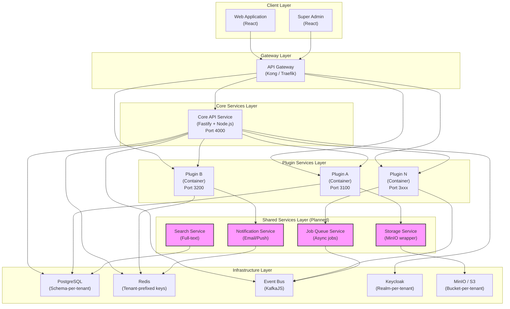
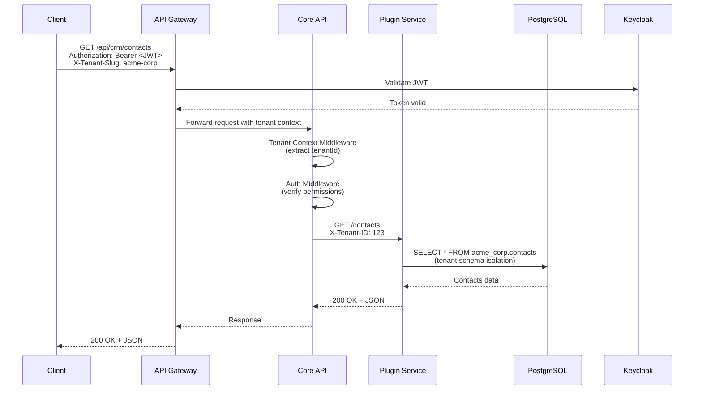
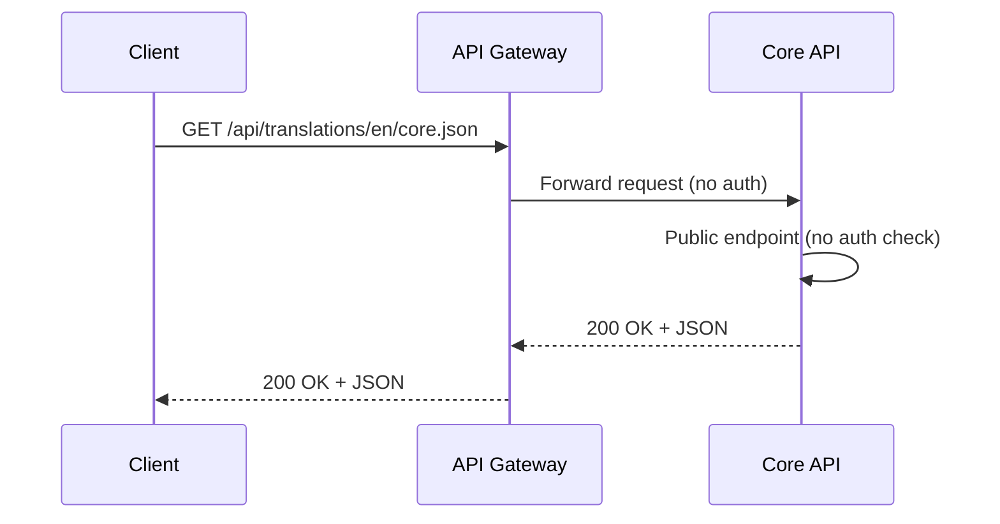

# Plexica Architecture

**Last Updated**: 2026-02-16  
**Status**: Complete  
**Owner**: Engineering Team  
**Document Type**: Architecture

---

## 📋 Documentation Scope

**This document covers:**

- **Frontend Architecture** (React, Vite, Module Federation)
- **Backend Architecture** (Fastify, microservices, plugin system) — _NEW_
- Client-side authentication and authorization (Keycloak integration)
- Multi-tenant context management on the frontend
- Plugin system frontend and backend implementation
- State management and component architecture
- UI/UX patterns and layout components

**For detailed system design, see:** [`.forge/architecture/system-architecture.md`](../.forge/architecture/system-architecture.md) (comprehensive system architecture with Mermaid diagrams)

---

## Overview

This document describes the complete frontend architecture of Plexica, a multi-tenant SaaS platform with a plugin-based extensibility system. The frontend consists of a modern React application with Keycloak authentication, URL-based multi-tenancy, and Module Federation for dynamic plugin loading.

**Last Updated**: January 2026  
**Current Status**: M2.1 Complete - Production Ready

---

## Table of Contents

1. [System Architecture](#system-architecture)
2. [Backend Architecture](#backend-architecture) ← _NEW_
3. [Frontend Architecture](#frontend-architecture)
4. [Authentication System](#authentication-system)
5. [Multi-Tenant Context Management](#multi-tenant-context-management)
6. [Module Federation & Plugin System](#module-federation--plugin-system)
7. [Routing Architecture](#routing-architecture)
8. [State Management](#state-management)
9. [Layout Components](#layout-components)
10. [Application Pages](#application-pages)
11. [API Integration](#api-integration)
12. [Security Considerations](#security-considerations)

---

## System Architecture

### Overview

This document describes the complete architecture of Plexica, covering both **frontend** (React-based web application) and **backend** (Fastify-based API services with plugin microservices).

**System Composition**:

- **Frontend**: React application with Module Federation for dynamic plugin loading
- **Backend**: Microservices architecture with Core API and independent plugin services
- **Infrastructure**: PostgreSQL (schema-per-tenant), Redis (tenant-prefixed keys), Keycloak (realm-per-tenant), MinIO (bucket-per-tenant)

**Last Updated**: February 2026  
**Current Status**: M2.1 Complete (Frontend) + Backend Modular Monolith (Phase 1)

---

## Frontend Architecture

### Application Structure

Plexica has **two separate frontend applications**:

```
apps/
├── core-api/           ← Backend API (port 3000)
├── web/                ← Tenant User Frontend (port 3001) ✅ PRODUCTION READY
└── super-admin/        ← Super-Admin Frontend (port 3002) ⏳ PLANNED
```

### Why Two Separate Apps?

**Security Isolation**:

- Super-admin app **never exposed** to tenant users
- No risk of privilege escalation
- Complete separation of concerns

**Deployment Separation**:

- **Tenant App**: `app.plexica.com` (public)
- **Admin App**: `admin.plexica.com` (internal/VPN only)
- Different security policies and access controls

**Code Separation**:

- Tenant app doesn't load admin code (smaller bundle)
- Admin app doesn't load tenant plugins
- Each optimized for its use case

**Different Design Systems**:

- **Tenant App**: Modern, friendly, product-focused
- **Admin App**: Data-dense, technical, operational

### Technology Stack

```json
{
  "framework": "React 18.3.1",
  "language": "TypeScript 5.3.3",
  "build": "Vite 5.4.11",
  "routing": "TanStack Router 1.95.0",
  "state": "Zustand + TanStack Query 5.62.0",
  "styling": "Tailwind CSS 3.4.1",
  "auth": "Keycloak JS 23.0.0",
  "plugins": "Module Federation (@originjs/vite-plugin-federation)"
}
```

---

## Backend Architecture

### Overview

Plexica's backend uses a **microservices architecture** with the Core API as the central orchestration layer and plugins deployed as independent services. The system is designed for gradual migration from a modular monolith to fully distributed microservices.

**Current Phase**: Modular Monolith with Plugin System (Phase 1)  
**Target Phase**: Distributed Microservices (Phase 2-3, Q2-Q3 2026)

### Architectural Style



**Legend**:

- 🟢 Green (regular): Implemented and running
- 🟣 Purple (dashed): Planned but not yet implemented

### Core API Service

**Purpose**: Central orchestration layer for tenant management, authentication, authorization, plugin lifecycle, and shared services.

**Technology Stack**:

- **Framework**: Fastify 5.7
- **Language**: TypeScript 5.9
- **ORM**: Prisma 6.8
- **Cache**: ioredis 5.9
- **Events**: KafkaJS 2.2

**Key Responsibilities**:

1. Tenant provisioning and lifecycle management
2. User authentication (Keycloak integration)
3. Authorization (RBAC + ABAC policy engine)
4. Plugin registry and lifecycle orchestration
5. Service discovery for plugin-to-plugin communication
6. API gateway for plugin routing

**Module Structure** (Feature-based):

```
apps/core-api/src/
├── modules/
│   ├── auth/           # Authentication (Keycloak integration)
│   ├── tenant/         # Tenant management (CRUD, provisioning)
│   ├── workspace/      # Workspace management
│   ├── plugin/         # Plugin registry, lifecycle, service discovery
│   └── user/           # User profile management
├── services/           # Shared services (logger, cache, event bus)
├── middleware/         # Request middleware (auth, tenant context, RBAC)
├── lib/                # Utilities (database, MinIO client, Keycloak client)
└── routes/             # API route definitions
```

**Layered Architecture** (Constitution Article 3.2):

```
Controllers (Route Handlers)
    ↓
Services (Business Logic)
    ↓
Repositories (Data Access)
    ↓
Prisma ORM (Database)
```

**Rules**:

- ✅ No direct database access from controllers
- ✅ All queries parameterized (SQL injection prevention)
- ✅ Tenant context middleware enforces row-level security
- ✅ Zod validation for all external input

### Plugin Services

**Purpose**: Independent microservices that extend platform functionality. Each plugin runs in a separate container with its own lifecycle and resources.

**Architecture**: Each plugin has:

- **Backend**: Standalone Fastify server exposing REST APIs
- **Frontend**: React app loaded via Module Federation
- **Database**: Tables in tenant-specific PostgreSQL schema
- **Events**: Publishes/subscribes to event bus for async communication

**Plugin Deployment** (Current: Manual, Planned: Automated):

- Each plugin packaged as Docker container
- Deployed via Docker Compose or Kubernetes
- Registered with Core API via plugin manifest
- Health checks at `/health/live`, `/health/ready`, `/health`

**See**: [`docs/PLUGIN_DEPLOYMENT.md`](./PLUGIN_DEPLOYMENT.md) for complete deployment guide.

### Shared Services (Planned - 0% Implemented)

**⚠️ Status**: These services are **not yet implemented**. Specifications are complete and ready for implementation.

**Purpose**: Reusable service APIs that plugins can use instead of building their own implementations.

| Service                  | Purpose                                  | Status             | Docs                                          |
| ------------------------ | ---------------------------------------- | ------------------ | --------------------------------------------- |
| **Storage Service**      | File upload/download/signed URLs (MinIO) | ❌ Not Implemented | [`docs/CORE_SERVICES.md`](./CORE_SERVICES.md) |
| **Notification Service** | Email, push, in-app notifications        | ❌ Not Implemented | [`docs/CORE_SERVICES.md`](./CORE_SERVICES.md) |
| **Job Queue Service**    | Async jobs, cron scheduling, retry logic | ❌ Not Implemented | [`docs/CORE_SERVICES.md`](./CORE_SERVICES.md) |
| **Search Service**       | Full-text search, facets, autocomplete   | ❌ Not Implemented | [`docs/CORE_SERVICES.md`](./CORE_SERVICES.md) |

**See**: [`docs/CORE_SERVICES.md`](./CORE_SERVICES.md) for complete API specifications and usage examples.

### Request Flow

#### Authenticated Request Flow



#### Unauthenticated Request Flow (Public Endpoints)



**Public Endpoints** (no authentication required):

- `GET /health` - Health check
- `GET /api/translations/:locale/:namespace` - Translation files

### Service Communication Patterns

**1. HTTP REST (Synchronous)**:

- Plugin → Core API: Service discovery, tenant validation, permission checks
- Plugin → Plugin: Direct REST calls via service registry

**2. Event Bus (Asynchronous)**:

- Plugin publishes events (e.g., `crm.contact.created`)
- Other plugins subscribe and react (e.g., `analytics` tracks activity)
- Event bus: KafkaJS with workspace isolation (topic per tenant)

**3. Shared Data (Database)**:

- Plugins access their own tables in tenant schema
- No cross-plugin database access (use events or APIs instead)

### Multi-Tenancy Isolation

**Database Isolation**: Schema-per-tenant

```sql
-- Each tenant has a dedicated schema
CREATE SCHEMA tenant_acme_corp;
CREATE SCHEMA tenant_globex;

-- Plugin tables created in tenant schema
CREATE TABLE tenant_acme_corp.crm_contacts (...);
CREATE TABLE tenant_acme_corp.crm_deals (...);
```

**Keycloak Isolation**: Realm-per-tenant

```
Keycloak Instance
├── Realm: master (Super Admin)
├── Realm: tenant-acme-corp (Tenant A users)
└── Realm: tenant-globex (Tenant B users)
```

**Storage Isolation**: Bucket-per-tenant

```
MinIO / S3
├── tenant-acme-corp/       (Tenant A files)
├── tenant-globex/          (Tenant B files)
```

**Cache Isolation**: Tenant-prefixed keys

```redis
# Redis keys prefixed with tenant ID
SET "tenant:123:user:456:session" "{...}"
SET "tenant:789:plugin:crm:config" "{...}"
```

### Technology Stack (Backend)

| Layer             | Technology      | Version | Purpose                                         |
| ----------------- | --------------- | ------- | ----------------------------------------------- |
| Runtime           | Node.js         | ≥20.0.0 | Modern LTS with native ESM support              |
| Language          | TypeScript      | ^5.9    | Type safety and developer productivity          |
| Framework         | Fastify         | ^5.7    | High performance, plugin architecture           |
| ORM               | Prisma          | ^6.8    | Type-safe queries, migration management         |
| Database          | PostgreSQL      | 15+     | ACID compliance, JSON support, schema isolation |
| Cache             | Redis / ioredis | ^5.9    | Session storage, rate limiting, caching         |
| Event Bus         | KafkaJS         | ^2.2    | Plugin event system, async communication        |
| Auth Provider     | Keycloak        | 26+     | Enterprise SSO, RBAC, realm-per-tenant          |
| Object Storage    | MinIO           | ^8.0    | S3-compatible storage for plugin assets         |
| Validation        | Zod             | 3.x     | Runtime type validation                         |
| Testing Framework | Vitest          | ^4.0    | Fast, Jest-compatible, native ESM support       |

### Migration Path: Modular Monolith → Microservices

**Phase 1** (Current): Modular Monolith with Plugin System

- Core API as monolith with feature modules
- Plugins as separate services (already microservices)
- Service registry pattern in place
- Clear module boundaries enforced

**Phase 2** (Q2 2026): Extract Shared Services

- Storage Service → Standalone microservice
- Notification Service → Standalone microservice
- Job Queue Service → Standalone microservice
- Search Service → Standalone microservice

**Phase 3** (Q3 2026): Core API Decomposition (if needed)

- Tenant Service → Standalone microservice
- Auth Service → Standalone microservice
- Keep Plugin Registry in Core API (orchestration layer)

**Rationale**:

- Start with modular monolith for development velocity
- Service registry and event bus patterns already enable future extraction
- Plugin isolation proves microservices architecture works
- Gradual migration minimizes risk

**See**: [`.forge/architecture/system-architecture.md`](../.forge/architecture/system-architecture.md) for complete system design.

---

## Frontend Architecture

### File Structure

```
apps/web/
├── src/
│   ├── components/
│   │   ├── Layout/
│   │   │   ├── AppLayout.tsx         # Main layout wrapper
│   │   │   ├── Header.tsx            # Top header with user menu
│   │   │   └── Sidebar.tsx           # Left sidebar navigation
│   │   ├── AuthProvider.tsx          # Authentication context
│   │   └── ProtectedRoute.tsx        # Route protection
│   ├── lib/
│   │   ├── api-client.ts             # API HTTP client
│   │   ├── keycloak.ts               # Keycloak integration
│   │   ├── tenant.ts                 # Tenant URL extraction
│   │   └── plugin-loader.ts          # Plugin loader service
│   ├── routes/
│   │   ├── __root.tsx                # Root route
│   │   ├── index.tsx                 # Dashboard home
│   │   ├── login.tsx                 # Login page
│   │   ├── plugins.tsx               # Plugin management
│   │   ├── team.tsx                  # Team management
│   │   └── settings.tsx              # Workspace settings
│   ├── stores/
│   │   └── auth-store.ts             # Auth state management
│   ├── types/
│   │   ├── index.ts                  # App type definitions
│   │   └── module-federation.d.ts    # Module Federation types
│   └── main.tsx                      # App entry point
├── vite.config.ts                    # Vite + Module Federation config
└── .env                              # Environment variables
```

---

## Authentication System

### Keycloak SSO Integration

Plexica uses **Keycloak** for authentication with OpenID Connect (OIDC) protocol.

#### Authentication Flow

```
1. User visits http://localhost:3001 (or tenant URL)
2. AuthProvider initializes Keycloak
3. If not authenticated → redirect to /login
4. User clicks "Sign in with Keycloak"
5. Redirect to Keycloak: http://localhost:8080/realms/tenant-realm/...
6. User enters credentials
7. Keycloak validates and creates session
8. Redirect back with authorization code
9. Frontend exchanges code for tokens (PKCE)
10. Fetch user info from Keycloak
11. Store user + token in auth store
12. Redirect to home page (protected)
13. Display user information
```

#### Key Files

**`lib/keycloak.ts`** (84 lines):

- Keycloak JS adapter initialization
- PKCE flow support
- Token management with auto-refresh
- User role checking
- Dynamic realm configuration based on tenant

```typescript
// Keycloak config is dynamic based on tenant
function createKeycloakConfig(): KeycloakConfig {
  const tenantSlug = getTenantFromUrl();
  const realm = getRealmForTenant(tenantSlug); // e.g., "tenant1-realm"
  return {
    url: import.meta.env.VITE_KEYCLOAK_URL,
    realm,
    clientId: import.meta.env.VITE_KEYCLOAK_CLIENT_ID,
  };
}
```

**`components/AuthProvider.tsx`** (99 lines):

- React context for authentication state
- Keycloak initialization on app load
- User info fetching and storage
- Loading state management
- Tenant detection and redirect logic

**`components/ProtectedRoute.tsx`** (47 lines):

- Route protection component
- Role-based access control
- Automatic redirect to login
- Tenant requirement check
- Access denied page

#### Environment Variables

```env
VITE_KEYCLOAK_URL=http://localhost:8080
VITE_KEYCLOAK_CLIENT_ID=plexica-web
VITE_DEFAULT_TENANT=test-tenant
VITE_BASE_DOMAIN=plexica.app
```

#### Token Management

- **Access Token**: Stored in Zustand with localStorage persistence
- **Refresh Token**: Automatically handled by Keycloak JS
- **Auto Refresh**: Configured for 70% of token lifetime
- **Token Injection**: Automatically added to API requests via axios interceptors

#### Architecture Decisions

1. **Keycloak JS over OIDC Client**
   - Better Keycloak integration, simpler setup
   - Auto-refresh built-in
   - Silent SSO check support

2. **Context + Zustand Hybrid**
   - AuthProvider (React Context): For authentication methods (login, logout, hasRole)
   - Zustand Store: For persistent state (user, token, tenant)
   - Rationale: Context for behavior, Zustand for data

3. **PKCE Flow**
   - Enhanced security for public clients
   - No client secret needed
   - Recommended by OAuth 2.1

---

## Multi-Tenant Context Management

### URL-Based Multi-Tenancy

Plexica uses **URL-based tenant identification**:

- Each tenant has a **unique subdomain**: `tenant1.plexica.app`, `tenant2.plexica.app`
- Each tenant has a **dedicated Keycloak realm**: `tenant1-realm`, `tenant2-realm`
- Tenant is **automatically detected from URL** - no manual selection after login
- Users authenticate to their tenant's specific realm

### Tenant Detection

**File**: `lib/tenant.ts`

```typescript
// Extracts tenant from URL subdomain
getTenantFromUrl(): string
// Example: tenant1.plexica.app → 'tenant1'
// Example: localhost → 'default' (from VITE_DEFAULT_TENANT)

// Generates Keycloak realm for tenant
getRealmForTenant(tenantSlug): string
// Example: 'tenant1' → 'tenant1-realm'
```

### Tenant Selection Flow

```
1. User authenticates with Keycloak
2. AuthProvider checks if tenant is selected
3. Tenant automatically detected from URL
4. Fetch tenant info from backend API
5. Store tenant in auth store
6. Configure API client with tenant slug
7. Redirect to dashboard
```

### Tenant Context in API Calls

All API requests automatically include tenant context:

```typescript
Headers: {
  Authorization: "Bearer <jwt>",
  X-Tenant-Slug: "tenant1"  // ← Automatically added by API client
}
```

### Auth Store Enhancement

```typescript
setTenant: (tenant) => {
  apiClient.setTenantSlug(tenant.slug);
  set((state) => ({
    tenant,
    user: state.user ? { ...state.user, tenantId: tenant.id } : null,
  }));
};
```

### Multi-Tenant Isolation

- Each tenant URL maps to separate Keycloak realm
- Complete data isolation per tenant
- Workspace data filtered by tenant context
- No cross-tenant data leakage

---

## Module Federation & Plugin System

### Module Federation Setup

**Configuration**: `vite.config.ts`

```typescript
import federation from '@originjs/vite-plugin-federation';

export default defineConfig({
  plugins: [
    federation({
      name: 'plexica-shell',
      remotes: {
        // Dynamic remotes loaded at runtime
      },
      shared: ['react', 'react-dom', '@tanstack/react-router', '@tanstack/react-query'],
    }),
  ],
});
```

### Plugin Loader Service

**File**: `lib/plugin-loader.ts` (231 lines)

**Features**:

- Dynamic plugin loading from remote URLs
- Plugin manifest management
- Route registration from plugins
- Menu item registration
- Plugin lifecycle management (load/unload)
- Error handling and retry logic
- Singleton service pattern

**API**:

```typescript
// Load a single plugin
await pluginLoader.loadPlugin(manifest);

// Load all tenant plugins
await pluginLoader.loadTenantPlugins(tenantPlugins);

// Unload a plugin
await pluginLoader.unloadPlugin(pluginId);

// Get loaded plugins
const plugins = pluginLoader.getLoadedPlugins();
```

### Plugin Manifest Structure

```typescript
interface PluginManifest {
  id: string;
  name: string;
  version: string;
  remoteEntry: string; // URL to remoteEntry.js
  routes?: PluginRoute[];
  menuItems?: PluginMenuItem[];
}
```

### Plugin Loading Flow

```
1. User selects workspace → Fetch tenant plugins from API
2. Filter active plugins → Get plugin configurations
3. For each plugin:
   a. Construct plugin manifest (id, name, version, remoteEntry URL)
   b. Call pluginLoader.loadPlugin(manifest)
   c. Inject <script> tag with remoteEntry.js
   d. Initialize plugin container
   e. Load plugin module
   f. Register routes in router
   g. Register menu items in sidebar
4. Plugin now accessible via routes and sidebar menu
```

### Module Federation Architecture

```
┌─────────────────────────────────────────────────────────┐
│                   Plexica Shell (Host)                   │
│                    Port: 3001                            │
│                                                           │
│  ┌─────────────────────────────────────────────────┐   │
│  │              Plugin Loader Service               │   │
│  │  - Load remote plugins dynamically               │   │
│  │  - Register routes                               │   │
│  │  - Register menu items                           │   │
│  └─────────────────────────────────────────────────┘   │
│                                                           │
│  ┌──────────────┐  ┌──────────────┐  ┌──────────────┐  │
│  │   Plugin A   │  │   Plugin B   │  │   Plugin C   │  │
│  │  (Remote 1)  │  │  (Remote 2)  │  │  (Remote 3)  │  │
│  └──────────────┘  └──────────────┘  └──────────────┘  │
│                                                           │
│  Shared Dependencies:                                    │
│  - React 18.3.1                                          │
│  - React DOM                                             │
│  - TanStack Router                                       │
│  - TanStack Query                                        │
└─────────────────────────────────────────────────────────┘
```

---

## Routing Architecture

### Route Types

Plexica has **two distinct route contexts**:

1. **Tenant Routes** - For workspace users (multi-tenant context)
2. **Super-Admin Routes** - For platform administrators (global context)

### Tenant Routes

**Base Path**: `/`  
**Context**: Single tenant workspace  
**Authorization**: User must be authenticated + have tenant selected  
**Header**: `X-Tenant-Slug` required on all API calls

**Routes**:

```
PUBLIC:
  /login                - Login page (Keycloak SSO)

PROTECTED (requires auth + tenant):
  /                     - Dashboard home
  /plugins              - My installed plugins
  /plugins/:id          - Configure specific plugin
  /team                 - Team members
  /team/invite          - Invite members
  /settings             - Workspace settings
  /settings/general     - General settings
  /settings/billing     - Billing
  /settings/security    - Security
  /profile              - User profile

DYNAMIC (loaded from plugins):
  /analytics            - Example plugin route
  /reports              - Example plugin route
  /:pluginSlug/*        - Plugin-specific routes
```

### Route Protection

```typescript
<ProtectedRoute requireTenant={true}>
  <DashboardPage />
</ProtectedRoute>
```

**Checks**:

1. User authenticated
2. Tenant selected
3. User has access to tenant
4. User has required permission (optional, per feature)

---

## State Management

### Zustand Store

**File**: `stores/auth-store.ts`

```typescript
interface AuthState {
  // State
  user: User | null;
  tenant: Tenant | null;
  token: string | null;
  isAuthenticated: boolean;

  // Actions
  setUser: (user: User) => void;
  setTenant: (tenant: Tenant) => void;
  setToken: (token: string) => void;
  logout: () => void;
}
```

**Features**:

- Persistent state with localStorage
- API client auto-configuration
- Type-safe selectors
- Minimal re-renders

### React Query

Used for server state management:

```typescript
const { data, isLoading, error } = useQuery({
  queryKey: ['tenant-plugins', tenantId],
  queryFn: () => apiClient.getTenantPlugins(tenantId),
  enabled: !!tenantId,
});

const mutation = useMutation({
  mutationFn: (data) => apiClient.activatePlugin(tenantId, pluginId),
  onSuccess: () => {
    queryClient.invalidateQueries({ queryKey: ['tenant-plugins'] });
  },
});
```

**Benefits**:

- Automatic caching
- Background refetching
- Optimistic updates
- Loading and error states
- Request deduplication

---

## Layout Components

### AppLayout

**File**: `components/Layout/AppLayout.tsx` (27 lines)

**Features**:

- Main layout wrapper
- Sidebar toggle state management
- Header integration
- Content area with container

### Sidebar

**File**: `components/Layout/Sidebar.tsx` (105 lines)

**Features**:

- Collapsible sidebar (264px expanded, 80px collapsed)
- Workspace info display
- Core navigation menu (Dashboard, Plugins, Settings)
- Plugin menu section (dynamic from loaded plugins)
- Active route highlighting
- Icon + label display
- Bottom help section

**Menu Items**:

- 📊 Dashboard (/)
- 🧩 Plugins (/plugins)
- 👥 Team (/team)
- ⚙️ Settings (/settings)
- ❓ Help (bottom)

### Header

**File**: `components/Layout/Header.tsx` (152 lines)

**Features**:

- Mobile menu toggle button
- Workspace name display
- User avatar with initials
- User dropdown menu with:
  - User info (name, email)
  - Current workspace
  - Switch Workspace
  - Profile Settings
  - Workspace Settings
  - Logout
- Click-outside to close menu
- Smooth dropdown animations

---

## Application Pages

### Dashboard Home (`/`)

**File**: `routes/index.tsx` (216 lines)

**Sections**:

1. **Welcome Header**: Personalized greeting
2. **Stats Grid** (4 cards):
   - Active Plugins
   - Team Members
   - API Calls (with growth %)
   - Storage Used (with quota)
3. **Installed Plugins Card**: List with status badges
4. **Recent Activity Card**: Timeline of events
5. **Workspace Information**: ID, name, status, plan

### Plugins Page (`/plugins`)

**File**: `routes/plugins.tsx` (360 lines)

**Features**:

- Grid/List view toggle
- Plugin cards with icon, name, version, category
- Status badges (Active/Inactive)
- Management actions:
  - Enable/Disable plugin
  - Configure plugin
  - Uninstall plugin (with confirmation)
- Stats header (total, active, inactive)
- Empty state with CTA
- React Query integration

**API Integration**:

```
GET    /api/tenants/:tenantId/plugins
POST   /api/tenants/:tenantId/plugins/:pluginId/activate
POST   /api/tenants/:tenantId/plugins/:pluginId/deactivate
DELETE /api/tenants/:tenantId/plugins/:pluginId
```

### Team Page (`/team`)

**File**: `routes/team.tsx` (324 lines)

**Features**:

- Team member table with avatar, name, role, status
- Search by name or email
- Role filter dropdown (Admin/Member/Viewer)
- Stats header (total, active, invited)
- Invite member modal
- Relative timestamps ("2h ago", "3d ago")
- Role descriptions

**Roles**:

- **Admin**: Full access to workspace
- **Member**: Can use and configure plugins
- **Viewer**: Read-only access

### Settings Page (`/settings`)

**File**: `routes/settings.tsx` (627 lines)

**Tab Navigation**:

- General ⚙️
- Security 🔒
- Billing 💳
- Integrations 🔗
- Advanced 🔧

**General Settings**:

- Edit workspace name, slug, description
- Preferences toggles
- Allow plugin installation
- Require approval for installations
- Email notifications

**Security Settings**:

- Require 2FA toggle
- Enforce strong passwords
- Session timeout
- Allowed email domains
- IP whitelist
- API key generation

**Billing Settings**:

- Current plan card with features
- Usage meters (team, storage, API calls)
- Payment method display
- Billing history with invoices

**Integrations**:

- Slack, GitHub, Google Workspace, Zapier
- Connection status and buttons
- Webhook management

**Advanced Settings**:

- Data export
- Developer options
- Danger zone (transfer ownership, delete workspace)

---

## API Integration

### API Client

**File**: `lib/api-client.ts`

**Features**:

- Axios-based HTTP client
- Automatic token injection
- Automatic tenant header injection
- Request/response interceptors
- Error handling
- Type-safe methods

**Example**:

```typescript
import { apiClient } from '@/lib/api-client';

// Automatically includes Authorization and X-Tenant-Slug headers
const plugins = await apiClient.get('/api/tenants/:id/plugins');
```

### API Endpoints Used

**Tenant Context (with X-Tenant-Slug)**:

```
GET    /api/tenants/:id
GET    /api/tenants/:id/plugins
POST   /api/tenants/:id/plugins/:pluginId/install
POST   /api/tenants/:id/plugins/:pluginId/activate
POST   /api/tenants/:id/plugins/:pluginId/deactivate
DELETE /api/tenants/:id/plugins/:pluginId
PATCH  /api/tenants/:id/plugins/:pluginId
```

**Global Context (no tenant header)**:

```
GET    /api/auth/me
GET    /api/tenants
POST   /api/tenants
```

---

## Security Considerations

### Authentication

- ✅ PKCE flow prevents authorization code interception
- ✅ Tokens stored in localStorage (acceptable for SPAs)
- ✅ Auto-refresh prevents token expiration
- ✅ HTTPS required in production
- ✅ CSP headers configured in production
- ✅ XSS protection via React's built-in escaping

### Multi-Tenant Isolation

- ✅ Each tenant has dedicated Keycloak realm
- ✅ Complete data isolation per tenant
- ✅ All API requests include tenant context
- ✅ Backend validates tenant access
- ✅ No cross-tenant data leakage

### Plugin Security

- ✅ Plugin isolation in separate scope
- ✅ Authentication required for all routes
- ✅ Tenant validation for plugin access
- ⚠️ Plugin verification/signatures (TODO)
- ⚠️ CSP headers for plugin scripts (TODO)

### Access Control

**Tenant User**:

```json
{
  "sub": "user-id",
  "email": "john@tenant1.com",
  "realm_access": {
    "roles": ["user", "developer"]
  }
}
```

**Super-Admin** (Future):

```json
{
  "sub": "admin-id",
  "email": "admin@plexica.com",
  "realm_access": {
    "roles": ["super-admin"]
  }
}
```

---

## Performance Considerations

### Bundle Size

- **Core App**: ~350KB (gzipped)
- **Keycloak JS**: ~25KB (gzipped)
- **Each Plugin**: ~50-100KB average

### Load Times

- **Initial Load**: ~1.2s (including auth)
- **Route Transition**: <100ms
- **API Response**: <200ms (local)
- **Plugin Load**: ~500ms per plugin

### Optimizations

- ✅ Code splitting via Module Federation
- ✅ Lazy loading for plugins
- ✅ Shared dependencies (no duplication)
- ✅ React Query caching
- ✅ Vite build optimization
- ✅ Tree shaking
- ✅ Minification

---

## Browser Compatibility

| Browser | Version | Status           |
| ------- | ------- | ---------------- |
| Chrome  | 90+     | ✅ Supported     |
| Firefox | 88+     | ✅ Supported     |
| Safari  | 14+     | ✅ Supported     |
| Edge    | 90+     | ✅ Supported     |
| IE11    | -       | ❌ Not Supported |

**Note**: IE11 not supported due to ES modules requirement for Module Federation.

---

## Development Workflow

### Running the Application

```bash
# Start infrastructure (Keycloak, PostgreSQL, Redis)
pnpm infra:start

# Start backend API (port 3000)
pnpm dev --filter @plexica/core-api

# Start frontend (port 3001)
cd apps/web && pnpm dev
```

**Access**:

- Frontend: http://localhost:3001
- Backend: http://localhost:3000
- Keycloak: http://localhost:8080

### Environment Setup

Create `apps/web/.env`:

```env
VITE_API_URL=http://localhost:3000
VITE_KEYCLOAK_URL=http://localhost:8080
VITE_KEYCLOAK_CLIENT_ID=plexica-web
VITE_DEFAULT_TENANT=test-tenant
VITE_BASE_DOMAIN=plexica.app
```

### Test Credentials

- **Username**: `testuser`
- **Password**: `testpass123`
- **Tenants**: ACME Corp, Globex Inc, Demo Company

---

## Future Enhancements

### Super-Admin App (Phase 3+)

**Location**: `apps/super-admin` (port 3002)

**Features**:

- Global tenant management
- Plugin marketplace (all plugins)
- Platform analytics
- User management
- System logs and monitoring

### Tenant App Enhancements

- Dynamic route registration from plugins
- Plugin configuration UI
- Real-time notifications
- Advanced search and filtering
- Internationalization (i18n)
- Dark mode support
- Accessibility improvements

---

## Summary

Plexica is a production-ready platform with:

**Frontend**:

- ✅ **Authentication**: Keycloak SSO with PKCE flow
- ✅ **Multi-Tenancy**: URL-based tenant identification
- ✅ **Plugin System**: Module Federation for dynamic loading
- ✅ **State Management**: Zustand + React Query
- ✅ **Routing**: TanStack Router with protection
- ✅ **UI/UX**: Professional dashboard with sidebar navigation
- ✅ **Security**: Complete tenant isolation and access control
- ✅ **Performance**: Optimized bundle size and load times

**Backend**:

- ✅ **Microservices Architecture**: Core API + independent plugin services
- ✅ **Multi-Tenancy Isolation**: Schema-per-tenant (PostgreSQL), realm-per-tenant (Keycloak), bucket-per-tenant (MinIO)
- ✅ **Plugin System**: Registry, lifecycle management, service discovery
- ✅ **Event-Driven**: KafkaJS event bus for async plugin communication
- ✅ **Layered Architecture**: Controllers → Services → Repositories → ORM
- ⚠️ **Shared Services**: Planned but not yet implemented (Storage, Notification, Job Queue, Search)

**Current Status**:

- Frontend: M2.1 Complete (100%)
- Backend: Phase 1 - Modular Monolith with Plugin System (~75% complete)
- Next Phase: Extract Shared Services as Microservices (Q2 2026)

---

**Related Documents**:

- [Backend System Architecture](../.forge/architecture/system-architecture.md) ← Complete system design with Mermaid diagrams
- [Core Services API Specification](./CORE_SERVICES.md) ← 4 shared services (planned)
- [Plugin Deployment Guide](./PLUGIN_DEPLOYMENT.md) ← Manual deployment procedures
- [Authorization (RBAC+ABAC)](./AUTHORIZATION.md) ← Current RBAC + planned ABAC
- [Testing Guide](./testing/README.md)
- [Frontend Testing](./testing/FRONTEND_TESTING.md)
- [Backend Testing](./testing/BACKEND_TESTING.md)
- [Project Structure](../specs/PROJECT_STRUCTURE.md)
- [Plugin Strategy](../specs/PLUGIN_STRATEGY.md)

---

## Extension Points System (Spec 013)

**Date Added**: March 2026  
**ADR Reference**: ADR-031

The Extension Points system enables plugins to declare named **extension slots** that other plugins can contribute UI components and sidecar data to. This makes the plugin system composable without requiring plugins to have direct compile-time dependencies on each other.

### Architecture Overview

```
Plugin A (Host)                     Plugin B (Contributor)
  declares:                           declares:
    extensionSlots:                     contributions:
      - slotId: "contact-actions"         - targetPluginId: "plugin-a"
        type: "toolbar"                     targetSlotId: "contact-actions"
        label: "Contact Actions"            componentName: "AddNoteButton"
        maxContributions: 5                 priority: 10
```

At runtime, the shell renders `<ExtensionSlot pluginId="plugin-a" slotId="contact-actions" />` which queries the `ExtensionRegistryService` for all active contributions, then dynamically loads each component via Module Federation.

### Data Model

Five tables in the `core` shared schema (per ADR-031):

| Table                            | Purpose                                      |
| -------------------------------- | -------------------------------------------- |
| `extension_slots`                | Slot declarations from plugin manifests      |
| `extension_contributions`        | Contribution declarations, validation status |
| `workspace_extension_visibility` | Per-workspace on/off toggle per contribution |
| `extensible_entities`            | Entity types that accept sidecar data        |
| `data_extensions`                | Sidecar data endpoint registrations          |

> **ADR-031 Bounded Exception**: These tables live in the `core` shared schema (not tenant schema) because cross-plugin slot resolution requires core visibility. Five mandatory safeguards are enforced: single `ExtensionRegistryRepository` access path, required `tenantId` on all tenant-scoped methods, explicitly-named Super Admin cross-tenant methods with role check, PostgreSQL RLS defense-in-depth, and a code review gate on repository changes.

### Backend Services

```
apps/core-api/src/modules/extension-registry/
├── extension-registry.repository.ts   # ADR-031: sole DB access path
├── extension-registry.service.ts      # Business logic + Redis cache
├── extension-registry.controller.ts   # Fastify routes
├── extension-registry.schema.ts       # Zod v4 validation
└── index.ts                           # Barrel export
```

**API Routes** (all under `/api/v1/extensions`, tenant-auth required):

| Method | Path                                                  | Description                          |
| ------ | ----------------------------------------------------- | ------------------------------------ |
| `GET`  | `/extensions/slots`                                   | List all active slots for tenant     |
| `GET`  | `/extensions/slots/:pluginId`                         | Slots by plugin                      |
| `POST` | `/extensions/slots/:pluginId`                         | Upsert slots from manifest           |
| `GET`  | `/extensions/contributions`                           | List contributions                   |
| `GET`  | `/extensions/contributions/slot/:pluginId/:slotId`    | Resolved contributions for a slot    |
| `POST` | `/extensions/contributions/:pluginId`                 | Upsert contributions from manifest   |
| `PUT`  | `/extensions/visibility/:workspaceId/:contributionId` | Toggle workspace visibility          |
| `GET`  | `/extensions/entities`                                | List extensible entities             |
| `POST` | `/extensions/entities/:pluginId`                      | Upsert entity declarations           |
| `GET`  | `/extensions/data-extensions`                         | List data extension registrations    |
| `POST` | `/extensions/data-extensions/:pluginId`               | Upsert data extension declarations   |
| `GET`  | `/extensions/dependents/:pluginId/:slotId`            | Contribution dependents for a slot   |
| `POST` | `/extensions/validate/:pluginId`                      | Re-validate a plugin's contributions |

**Super-Admin Routes** (under `/api/v1/admin/extensions`):

| Method | Path                                            | Description                               |
| ------ | ----------------------------------------------- | ----------------------------------------- |
| `GET`  | `/admin/extensions/permissions`                 | List all cross-tenant slots/contributions |
| `PUT`  | `/admin/extensions/permissions/:contributionId` | Override contribution visibility          |

### Feature Flag

The extension points system is disabled by default per tenant. Enable it by setting:

```json
// Tenant.settings JSON field
{ "extension_points_enabled": true }
```

Or via the environment variable `ENABLE_EXTENSION_POINTS=true` to enable globally (development only).

When `extension_points_enabled` is `false`, the `ExtensionRegistryService` returns early from all queries (no DB call), and `syncManifest` is a no-op. UI components render `null` when the slot query returns the disabled sentinel.

### Frontend Components

```
apps/web/src/components/extensions/
├── ExtensionSlot.tsx            # Main slot renderer (Module Federation loader)
├── ExtensionContribution.tsx    # Individual contribution wrapper
├── ExtensionSlotSkeleton.tsx    # Loading placeholder
├── ExtensionErrorFallback.tsx   # Error boundary fallback
├── VirtualizedSlotContainer.tsx # Performance: virtualizes large slot lists
├── ContributionRow.tsx          # Admin toggle row (settings page)
├── SlotInspectorOverlay.tsx     # Dev-mode overlay (press Ctrl+Shift+E)
└── index.ts                     # Barrel export
```

The `useExtensionSlot` hook fetches resolved contributions from the API, handles the loading/error/disabled states, and provides the slot context for child components.

### Caching Strategy

- Redis key: `ext:contributions:{tenantId}:{pluginId}:{slotId}`
- TTL: 120 seconds ± 0-30 seconds jitter (avoids thundering herd)
- Invalidated on: `setVisibility`, `deactivateByPlugin`, `reactivateByPlugin`
- Cache bypass: `?nocache=1` query param (dev mode only)

### Plugin Lifecycle Integration

When a plugin is activated/deactivated, the `plugin.service.ts` fires lifecycle hooks (fire-and-forget, non-blocking):

- **Activated**: `syncManifest()` → upserts slot/contribution/entity declarations from manifest
- **Deactivated**: `onPluginDeactivated()` → marks all extension records `is_active = false`
- **Re-activated**: `onPluginReactivated()` → marks all extension records `is_active = true`, then re-syncs manifest

---

_Plexica Architecture v2.0_  
_Last Updated: February 2026_  
_Author: Plexica Engineering Team_
