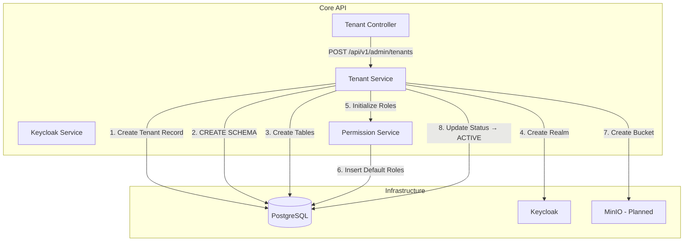
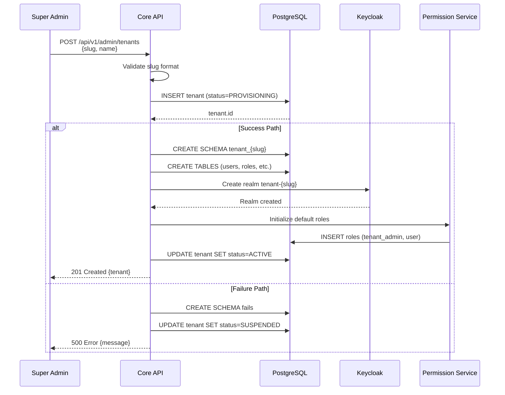
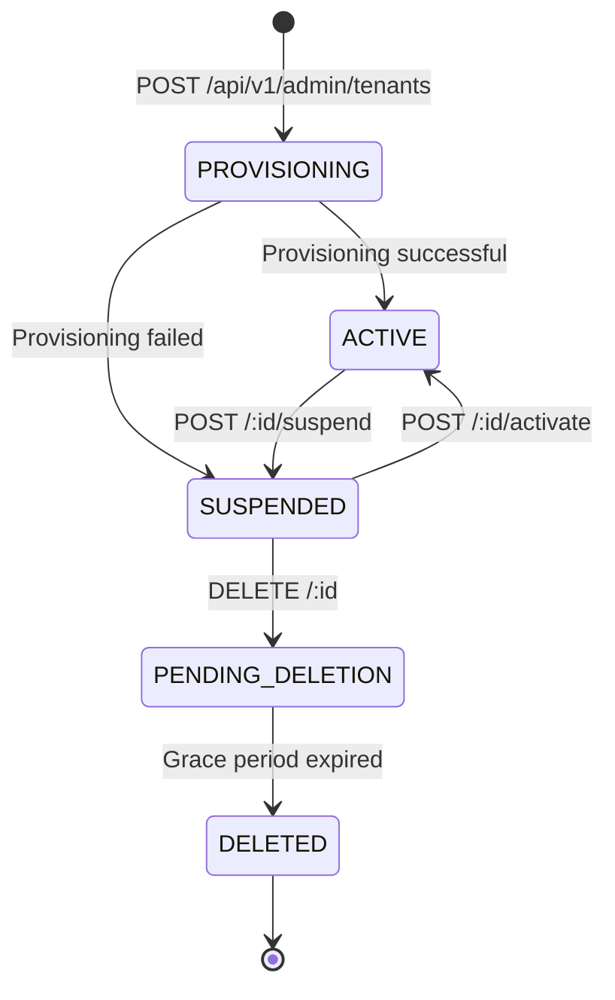

# Tenant Provisioning Guide

**Last Updated**: February 16, 2026  
**Status**: Active  
**Owner**: Engineering Team  
**Spec Reference**: [`.forge/specs/001-multi-tenancy/spec.md`](../.forge/specs/001-multi-tenancy/spec.md)

---

## ⚠️ Implementation Status

| Component                    | Status      | Notes                                                |
| ---------------------------- | ----------- | ---------------------------------------------------- |
| Manual Tenant Creation       | ✅ Complete | POST /api/v1/admin/tenants                           |
| PostgreSQL Schema Creation   | ✅ Complete | Automated `tenant_{slug}` schema creation            |
| Keycloak Realm Creation      | ✅ Complete | Automated `tenant-{slug}` realm provisioning         |
| Default Roles/Permissions    | ✅ Complete | Initialized on schema creation                       |
| Tenant Status Lifecycle      | ✅ Complete | PROVISIONING → ACTIVE → SUSPENDED → PENDING_DELETION |
| Rollback on Partial Failure  | ⚠️ Partial  | Status set to SUSPENDED, manual cleanup required     |
| MinIO Bucket Creation        | ❌ Planned  | Not yet implemented                                  |
| Automated Provisioning Flow  | ❌ Planned  | No orchestration system (Phase 2)                    |
| Self-Service Tenant Creation | ❌ Planned  | Only Super Admin can create tenants                  |
| Grace Period Management      | ❌ Planned  | PENDING_DELETION → DELETED transition manual         |

**Current Provisioning Method**: ⚠️ **Semi-automated** - Tenant creation is manual via API, but schema/realm creation is automatic. Full orchestration (rollback, MinIO, grace period) planned for Phase 2.

---

## Table of Contents

1. [Overview](#overview)
2. [Architecture](#architecture)
3. [Tenant Lifecycle States](#tenant-lifecycle-states)
4. [Manual Tenant Provisioning](#manual-tenant-provisioning)
5. [Automated Provisioning Steps](#automated-provisioning-steps)
6. [Rollback on Failure](#rollback-on-failure)
7. [Tenant Deletion](#tenant-deletion)
8. [Grace Period Management](#grace-period-management)
9. [Monitoring & Observability](#monitoring--observability)
10. [Troubleshooting](#troubleshooting)
11. [Planned Automation](#planned-automation)
12. [FAQ](#faq)

---

## Overview

Plexica uses a **schema-per-tenant** isolation model where each customer organization gets:

1. **PostgreSQL schema** - `tenant_{slug}` with isolated tables
2. **Keycloak realm** - `tenant-{slug}` for authentication and user management
3. **MinIO storage bucket** - `tenant-{slug}` for file storage (planned)
4. **Redis key prefix** - `tenant:{slug}:*` for caching and sessions
5. **Default roles & permissions** - `tenant_admin`, `user` roles initialized

**Key Principles**:

- **Zero Cross-Tenant Data Leakage**: Complete logical isolation (Constitution Article 1.2.2)
- **Fast Provisioning**: Target < 30 seconds (NFR-001)
- **Automatic Rollback**: Failed provisioning should not leave partial state (NFR-006)
- **Minimal Downtime**: Tenant operations should not affect other tenants

---

## Architecture

### Provisioning Components



### Provisioning Flow



---

## Tenant Lifecycle States

Tenants transition through the following states:



### State Definitions

| State                | Description                                                   | User Access | Data Preserved |
| -------------------- | ------------------------------------------------------------- | ----------- | -------------- |
| **PROVISIONING**     | Initial state during creation; infrastructure being set up    | ❌ Blocked  | ✅ Yes         |
| **ACTIVE**           | Fully operational; users can authenticate and access platform | ✅ Allowed  | ✅ Yes         |
| **SUSPENDED**        | Temporarily disabled; users cannot authenticate               | ❌ Blocked  | ✅ Yes         |
| **PENDING_DELETION** | Marked for deletion; grace period before permanent removal    | ❌ Blocked  | ✅ Yes         |
| **DELETED**          | Permanently removed; all data destroyed                       | ❌ Blocked  | ❌ No          |

---

## Manual Tenant Provisioning

### Prerequisites

1. **Super Admin Token**: Obtain bearer token with `super_admin` role
2. **Valid Tenant Slug**: Lowercase alphanumeric with hyphens, 1-50 chars
3. **Infrastructure Running**: PostgreSQL, Keycloak, Redis must be healthy

### Step 1: Create Tenant

```bash
curl -X POST http://localhost:3000/api/v1/admin/tenants \
  -H "Authorization: Bearer $SUPER_ADMIN_TOKEN" \
  -H "Content-Type: application/json" \
  -d '{
    "slug": "acme-corp",
    "name": "ACME Corporation",
    "settings": {
      "timezone": "America/New_York",
      "locale": "en-US"
    },
    "theme": {
      "primaryColor": "#1976D2",
      "logo": "https://cdn.example.com/acme-logo.png"
    }
  }'
```

**Expected Response** (201 Created):

```json
{
  "id": "550e8400-e29b-41d4-a716-446655440000",
  "slug": "acme-corp",
  "name": "ACME Corporation",
  "status": "ACTIVE",
  "settings": {
    "timezone": "America/New_York",
    "locale": "en-US"
  },
  "theme": {
    "primaryColor": "#1976D2",
    "logo": "https://cdn.example.com/acme-logo.png"
  },
  "createdAt": "2026-02-16T10:30:00.000Z",
  "updatedAt": "2026-02-16T10:30:00.000Z"
}
```

**Error Response** (409 Conflict - Duplicate Slug):

```json
{
  "error": {
    "code": "DUPLICATE_TENANT",
    "message": "Tenant with slug 'acme-corp' already exists"
  }
}
```

**Error Response** (400 Bad Request - Invalid Slug):

```json
{
  "error": {
    "code": "INVALID_SLUG",
    "message": "Tenant slug must be 1-50 chars, lowercase alphanumeric with hyphens only"
  }
}
```

---

### Step 2: Verify Tenant Creation

```bash
# Check tenant status
curl http://localhost:3000/api/v1/admin/tenants/acme-corp \
  -H "Authorization: Bearer $SUPER_ADMIN_TOKEN"

# Expected response
{
  "id": "550e8400-e29b-41d4-a716-446655440000",
  "slug": "acme-corp",
  "name": "ACME Corporation",
  "status": "ACTIVE",
  ...
}
```

---

### Step 3: Verify Infrastructure Provisioning

#### PostgreSQL Schema

```sql
-- Connect to PostgreSQL
psql -U plexica -d plexica

-- List all schemas (look for tenant_acme_corp)
\dn

-- Check tenant schema tables
\dt tenant_acme_corp.*

-- Expected tables:
-- tenant_acme_corp.users
-- tenant_acme_corp.roles
-- tenant_acme_corp.role_permissions
-- tenant_acme_corp.user_roles
-- tenant_acme_corp.policies
-- tenant_acme_corp.audit_logs
```

#### Keycloak Realm

```bash
# Access Keycloak Admin Console
http://localhost:8080/admin

# Login: admin / admin (development)
# Navigate to: Realms → tenant-acme-corp

# Or via API:
curl http://localhost:8080/realms/tenant-acme-corp/.well-known/openid-configuration
```

#### Redis Key Prefix

```bash
# Connect to Redis
redis-cli

# Check tenant keys
KEYS tenant:acme-corp:*

# Example keys:
# tenant:acme-corp:session:abc123
# tenant:acme-corp:cache:user:xyz
```

---

## Automated Provisioning Steps

When you call `POST /api/v1/admin/tenants`, the following steps execute automatically:

### Step 1: Validate Slug

**Source**: `apps/core-api/src/services/tenant.service.ts:30`

```typescript
private validateSlug(slug: string): void {
  const slugPattern = /^[a-z0-9-]{1,50}$/;
  if (!slugPattern.test(slug)) {
    throw new Error('Tenant slug must be 1-50 chars, lowercase alphanumeric with hyphens only');
  }
}
```

**Rules**:

- 1-50 characters
- Lowercase letters (a-z)
- Numbers (0-9)
- Hyphens (-) allowed
- No uppercase, spaces, underscores, or special chars

**Valid Examples**: `acme`, `acme-corp`, `my-company-123`  
**Invalid Examples**: `ACME`, `acme_corp`, `acme corp`, `acme@corp`

---

### Step 2: Create Tenant Record

**Database**: `public.tenants` table

```sql
INSERT INTO tenants (slug, name, status, settings, theme)
VALUES ('acme-corp', 'ACME Corporation', 'PROVISIONING', '{}', '{}');
```

**Status**: `PROVISIONING` - indicates tenant creation in progress

**Unique Constraint**: `slug` must be unique across all tenants (enforced by database)

---

### Step 3: Create PostgreSQL Schema

**Source**: `apps/core-api/src/services/tenant.service.ts:150`

```typescript
private async createTenantSchema(slug: string): Promise<void> {
  const schemaName = this.getSchemaName(slug); // Returns: tenant_{slug}

  // Create schema
  await this.db.$executeRawUnsafe(`CREATE SCHEMA IF NOT EXISTS "${schemaName}"`);

  // Grant privileges
  const dbUser = process.env.DATABASE_USER || 'plexica';
  await this.db.$executeRawUnsafe(
    `GRANT ALL PRIVILEGES ON SCHEMA "${schemaName}" TO "${dbUser}"`
  );
}
```

**Schema Name**: `tenant_{slug}` (hyphens converted to underscores)

Example: `acme-corp` → `tenant_acme_corp`

---

### Step 4: Create Tenant Tables

**Source**: `apps/core-api/src/services/tenant.service.ts:180`

The following tables are created in the tenant schema:

| Table              | Description                        | Columns                                    |
| ------------------ | ---------------------------------- | ------------------------------------------ |
| `users`            | Tenant user records                | id, keycloak_id, email, first/last name    |
| `roles`            | Custom tenant roles                | id, name, description, permissions (JSONB) |
| `role_permissions` | Role-permission mappings (planned) | role_id, permission_id                     |
| `user_roles`       | User-role assignments              | user_id, role_id                           |
| `policies`         | ABAC policies (planned)            | id, name, rules (JSONB), conditions        |
| `audit_logs`       | Audit trail for tenant actions     | id, user_id, action, resource, timestamp   |

**SQL Example** (users table):

```sql
CREATE TABLE IF NOT EXISTS "tenant_acme_corp"."users" (
  id TEXT PRIMARY KEY,
  keycloak_id TEXT UNIQUE NOT NULL,
  email TEXT UNIQUE NOT NULL,
  first_name TEXT,
  last_name TEXT,
  created_at TIMESTAMP(3) NOT NULL DEFAULT CURRENT_TIMESTAMP,
  updated_at TIMESTAMP(3) NOT NULL DEFAULT CURRENT_TIMESTAMP
);
```

---

### Step 5: Create Keycloak Realm

**Source**: `apps/core-api/src/services/keycloak.service.ts`

```typescript
async createRealm(tenantSlug: string, tenantName: string): Promise<void> {
  const realmName = `tenant-${tenantSlug}`;

  await this.adminClient.realms.create({
    realm: realmName,
    enabled: true,
    displayName: tenantName,
    registrationAllowed: false,
    resetPasswordAllowed: true,
    rememberMe: true,
    accessTokenLifespan: 86400, // 24 hours
    ssoSessionIdleTimeout: 86400,
    ssoSessionMaxLifespan: 86400,
  });
}
```

**Realm Name**: `tenant-{slug}`

Example: `acme-corp` → `tenant-acme-corp`

**Realm Configuration**:

- **Enabled**: Yes
- **User Registration**: Disabled (admin creates users)
- **Password Reset**: Enabled
- **Remember Me**: Enabled
- **Session Timeout**: 24 hours

---

### Step 6: Initialize Default Roles

**Source**: `apps/core-api/src/services/permission.service.ts`

```typescript
async initializeDefaultRoles(schemaName: string): Promise<void> {
  await this.db.$executeRawUnsafe(`
    INSERT INTO "${schemaName}"."roles" (id, name, description, permissions)
    VALUES
      ('tenant_admin', 'Tenant Admin', 'Full access to tenant', '["*"]'),
      ('user', 'User', 'Standard user access', '["workspaces:read", "workspaces:write"]')
  `);
}
```

**Default Roles**:

| Role           | Description                | Permissions                               |
| -------------- | -------------------------- | ----------------------------------------- |
| `tenant_admin` | Full tenant administration | `["*"]` (all permissions)                 |
| `user`         | Standard user              | `["workspaces:read", "workspaces:write"]` |

---

### Step 7: Create MinIO Bucket (Planned)

⚠️ **Not Yet Implemented**

**Planned Implementation**:

```typescript
private async createMinIOBucket(slug: string): Promise<void> {
  const bucketName = `tenant-${slug}`;

  await this.minioClient.makeBucket(bucketName, 'us-east-1');

  // Set bucket policy (private by default)
  await this.minioClient.setBucketPolicy(bucketName, {
    Version: '2012-10-17',
    Statement: [{
      Effect: 'Allow',
      Principal: { AWS: ['*'] },
      Action: ['s3:GetObject'],
      Resource: [`arn:aws:s3:::${bucketName}/public/*`],
    }],
  });
}
```

**Bucket Name**: `tenant-{slug}`

Example: `acme-corp` → `tenant-acme-corp`

---

### Step 8: Update Tenant Status

```sql
UPDATE tenants
SET status = 'ACTIVE', updated_at = NOW()
WHERE slug = 'acme-corp';
```

**Status Transition**: `PROVISIONING` → `ACTIVE`

**Tenant is now operational** - Users can authenticate and access the platform.

---

## Rollback on Failure

⚠️ **Current Status**: Partial rollback only - tenant status set to `SUSPENDED`, manual cleanup required.

### Failure Scenarios

| Failure Point             | Current Behavior              | Cleanup Required                   |
| ------------------------- | ----------------------------- | ---------------------------------- |
| Slug validation fails     | Tenant record not created     | None                               |
| Duplicate slug            | Database constraint violation | None                               |
| Schema creation fails     | Tenant status → SUSPENDED     | Manual: delete tenant record       |
| Keycloak realm fails      | Tenant status → SUSPENDED     | Manual: drop schema, delete tenant |
| Role initialization fails | Tenant status → SUSPENDED     | Manual: delete realm, drop schema  |

### Current Rollback Logic

**Source**: `apps/core-api/src/services/tenant.service.ts:118`

```typescript
async createTenant(input: CreateTenantInput): Promise<any> {
  // ... create tenant record ...

  try {
    await this.createTenantSchema(slug);
    await keycloakService.createRealm(slug, name);
    await permissionService.initializeDefaultRoles(schemaName);

    // Success: mark as ACTIVE
    return await this.db.tenant.update({
      where: { id: tenant.id },
      data: { status: TenantStatus.ACTIVE },
    });
  } catch (error) {
    // Failure: mark as SUSPENDED
    await this.db.tenant.update({
      where: { id: tenant.id },
      data: {
        status: TenantStatus.SUSPENDED,
        settings: {
          ...settings,
          provisioningError: error.message,
        },
      },
    });

    throw new Error(`Failed to provision tenant: ${error.message}`);
  }
}
```

### Manual Cleanup Steps

If provisioning fails and tenant is in `SUSPENDED` state:

```bash
# 1. Check tenant status
curl http://localhost:3000/api/v1/admin/tenants/acme-corp \
  -H "Authorization: Bearer $SUPER_ADMIN_TOKEN"

# If status is "SUSPENDED" and settings.provisioningError exists:

# 2. Delete tenant record (triggers soft delete → PENDING_DELETION)
curl -X DELETE http://localhost:3000/api/v1/admin/tenants/acme-corp \
  -H "Authorization: Bearer $SUPER_ADMIN_TOKEN"

# 3. Clean up database schema manually
psql -U plexica -d plexica -c 'DROP SCHEMA IF EXISTS tenant_acme_corp CASCADE;'

# 4. Clean up Keycloak realm manually
curl -X DELETE http://localhost:8080/admin/realms/tenant-acme-corp \
  -H "Authorization: Bearer $KEYCLOAK_ADMIN_TOKEN"

# 5. Hard delete tenant record from database
psql -U plexica -d plexica -c "DELETE FROM tenants WHERE slug = 'acme-corp';"
```

---

## Tenant Deletion

### Soft Delete (Current)

Tenants are soft-deleted by setting status to `PENDING_DELETION`:

```bash
curl -X DELETE http://localhost:3000/api/v1/admin/tenants/acme-corp \
  -H "Authorization: Bearer $SUPER_ADMIN_TOKEN"
```

**Response** (200 OK):

```json
{
  "id": "550e8400-e29b-41d4-a716-446655440000",
  "slug": "acme-corp",
  "name": "ACME Corporation",
  "status": "PENDING_DELETION",
  "updatedAt": "2026-02-16T10:45:00.000Z"
}
```

**What Happens**:

- Tenant status → `PENDING_DELETION`
- User access blocked immediately
- Data preserved (schema, realm, bucket)
- Manual hard delete required after grace period

---

### Hard Delete (Manual)

⚠️ **Planned for Phase 2**: Automatic hard delete after grace period (default: 30 days)

**Current Manual Process**:

```bash
# 1. Verify tenant is in PENDING_DELETION status
curl http://localhost:3000/api/v1/admin/tenants/acme-corp \
  -H "Authorization: Bearer $SUPER_ADMIN_TOKEN"

# 2. Drop PostgreSQL schema
psql -U plexica -d plexica -c 'DROP SCHEMA IF EXISTS tenant_acme_corp CASCADE;'

# 3. Delete Keycloak realm
curl -X DELETE http://localhost:8080/admin/realms/tenant-acme-corp \
  -H "Authorization: Bearer $KEYCLOAK_ADMIN_TOKEN"

# 4. Delete MinIO bucket (when implemented)
mc rb --force minio/tenant-acme-corp

# 5. Delete tenant record from database
psql -U plexica -d plexica -c "DELETE FROM tenants WHERE slug = 'acme-corp';"

# 6. Clear Redis keys
redis-cli --scan --pattern "tenant:acme-corp:*" | xargs redis-cli DEL
```

---

## Grace Period Management

⚠️ **Status**: Not Yet Implemented - Planned for Phase 2

### Planned Behavior

When a tenant is soft-deleted (status → `PENDING_DELETION`):

1. **Grace Period Starts**: Default 30 days
2. **User Access Blocked**: Immediately
3. **Data Preserved**: All data remains intact
4. **Reactivation Allowed**: Admin can reactivate tenant before grace period expires
5. **Hard Delete**: After grace period, automatic hard delete (schema, realm, bucket removed)

### Planned Implementation

```typescript
// apps/core-api/src/services/tenant-cleanup.service.ts (future)

export class TenantCleanupService {
  async processExpiredGracePeriod(): Promise<void> {
    const gracePeriodDays = 30;
    const cutoffDate = new Date();
    cutoffDate.setDate(cutoffDate.getDate() - gracePeriodDays);

    // Find tenants in PENDING_DELETION older than grace period
    const tenantsToDelete = await this.db.tenant.findMany({
      where: {
        status: TenantStatus.PENDING_DELETION,
        updatedAt: { lt: cutoffDate },
      },
    });

    for (const tenant of tenantsToDelete) {
      try {
        // Hard delete tenant
        await this.hardDeleteTenant(tenant.slug);
      } catch (error) {
        logger.error({ tenantSlug: tenant.slug, error }, 'Failed to hard delete expired tenant');
      }
    }
  }

  private async hardDeleteTenant(slug: string): Promise<void> {
    // 1. Drop schema
    await this.db.$executeRawUnsafe(`DROP SCHEMA IF EXISTS tenant_${slug} CASCADE`);

    // 2. Delete Keycloak realm
    await keycloakService.deleteRealm(`tenant-${slug}`);

    // 3. Delete MinIO bucket
    await minioClient.deleteBucket(`tenant-${slug}`);

    // 4. Delete tenant record
    await this.db.tenant.delete({ where: { slug } });
  }
}
```

### Cron Job Configuration

```typescript
// Schedule daily cleanup job at 2 AM UTC
import cron from 'node-cron';

cron.schedule('0 2 * * *', async () => {
  const cleanupService = new TenantCleanupService();
  await cleanupService.processExpiredGracePeriod();
});
```

---

## Monitoring & Observability

### Tenant Provisioning Metrics

**Prometheus Metrics**:

```typescript
// apps/core-api/src/metrics/tenant-metrics.ts

import promClient from 'prom-client';

export const tenantProvisioningDuration = new promClient.Histogram({
  name: 'tenant_provisioning_duration_seconds',
  help: 'Duration of tenant provisioning in seconds',
  labelNames: ['status'], // success, failure
});

export const tenantProvisioningTotal = new promClient.Counter({
  name: 'tenant_provisioning_total',
  help: 'Total number of tenant provisioning attempts',
  labelNames: ['status'], // success, failure
});

export const tenantStatusGauge = new promClient.Gauge({
  name: 'tenant_status_count',
  help: 'Number of tenants by status',
  labelNames: ['status'], // ACTIVE, SUSPENDED, PENDING_DELETION
});
```

**Grafana Dashboard**:

```json
{
  "title": "Tenant Provisioning",
  "panels": [
    {
      "title": "Provisioning Success Rate",
      "targets": [
        {
          "expr": "rate(tenant_provisioning_total{status=\"success\"}[5m]) / rate(tenant_provisioning_total[5m])"
        }
      ]
    },
    {
      "title": "Provisioning Duration (P95)",
      "targets": [
        {
          "expr": "histogram_quantile(0.95, rate(tenant_provisioning_duration_seconds_bucket[5m]))"
        }
      ]
    },
    {
      "title": "Tenants by Status",
      "targets": [
        {
          "expr": "tenant_status_count"
        }
      ]
    }
  ]
}
```

---

### Logging

**Constitution Article 6.3**: All tenant provisioning logs must use structured JSON logging with Pino.

**Example Log Output**:

```json
{
  "level": "info",
  "time": 1708080000000,
  "pid": 12345,
  "hostname": "core-api-pod-1",
  "tenantSlug": "acme-corp",
  "tenantId": "550e8400-e29b-41d4-a716-446655440000",
  "step": "create_schema",
  "duration": 1234,
  "msg": "Tenant schema created successfully"
}
```

**Log Levels**:

| Level | Event                          | Example                                 |
| ----- | ------------------------------ | --------------------------------------- |
| info  | Provisioning started/completed | "Tenant provisioning started"           |
| warn  | Provisioning retry             | "Schema creation retry (attempt 2/3)"   |
| error | Provisioning failed            | "Keycloak realm creation failed"        |
| debug | Detailed step-by-step progress | "Creating users table in tenant schema" |

---

## Troubleshooting

### Provisioning Fails with "Schema already exists"

**Symptoms**: Tenant creation returns 500 error, logs show "schema already exists"

**Cause**: Previous failed provisioning left orphaned schema

**Solution**:

```bash
# 1. Check for orphaned schema
psql -U plexica -d plexica -c "\dn tenant_acme_corp"

# 2. Drop orphaned schema
psql -U plexica -d plexica -c "DROP SCHEMA IF EXISTS tenant_acme_corp CASCADE;"

# 3. Retry tenant creation
curl -X POST http://localhost:3000/api/v1/admin/tenants \
  -H "Authorization: Bearer $SUPER_ADMIN_TOKEN" \
  -d '{"slug": "acme-corp", "name": "ACME Corporation"}'
```

---

### Provisioning Fails with "Realm already exists"

**Symptoms**: Tenant stuck in `PROVISIONING` status, logs show "Realm already exists"

**Cause**: Previous failed provisioning left orphaned Keycloak realm

**Solution**:

```bash
# 1. List Keycloak realms
curl http://localhost:8080/admin/realms \
  -H "Authorization: Bearer $KEYCLOAK_ADMIN_TOKEN"

# 2. Delete orphaned realm
curl -X DELETE http://localhost:8080/admin/realms/tenant-acme-corp \
  -H "Authorization: Bearer $KEYCLOAK_ADMIN_TOKEN"

# 3. Update tenant status to allow retry
psql -U plexica -d plexica -c \
  "UPDATE tenants SET status = 'SUSPENDED' WHERE slug = 'acme-corp';"

# 4. Retry provisioning (manual schema recreation required)
```

---

### Tenant Stuck in PROVISIONING State

**Symptoms**: Tenant created but status never changes to `ACTIVE`

**Cause**: Provisioning step failed but error was not logged

**Diagnosis**:

```bash
# 1. Check tenant record
curl http://localhost:3000/api/v1/admin/tenants/acme-corp \
  -H "Authorization: Bearer $SUPER_ADMIN_TOKEN"

# Look for settings.provisioningError field

# 2. Check schema exists
psql -U plexica -d plexica -c "\dn tenant_acme_corp"

# 3. Check realm exists
curl http://localhost:8080/realms/tenant-acme-corp/.well-known/openid-configuration

# 4. Check application logs
docker logs plexica-core-api --tail=100 | grep "acme-corp"
```

**Solution**:

```bash
# If schema missing: retry creation
psql -U plexica -d plexica <<EOF
CREATE SCHEMA IF NOT EXISTS tenant_acme_corp;
GRANT ALL PRIVILEGES ON SCHEMA tenant_acme_corp TO plexica;
EOF

# If realm missing: recreate via Keycloak Admin UI or API

# Update tenant status manually
psql -U plexica -d plexica -c \
  "UPDATE tenants SET status = 'ACTIVE' WHERE slug = 'acme-corp';"
```

---

### Slow Provisioning (> 30 seconds)

**Symptoms**: Tenant creation takes longer than 30 seconds (NFR-001 violation)

**Common Causes**:

1. **Keycloak startup slow** - Keycloak not fully initialized
2. **Database slow** - High load on PostgreSQL
3. **Network latency** - Core API → Keycloak/PostgreSQL

**Diagnosis**:

```bash
# Check Keycloak health
curl http://localhost:8080/health/ready

# Check PostgreSQL performance
psql -U plexica -d plexica -c "
  SELECT schemaname, tablename, seq_scan, idx_scan
  FROM pg_stat_user_tables
  WHERE schemaname LIKE 'tenant_%'
  ORDER BY seq_scan DESC
  LIMIT 10;
"

# Check Core API logs for timing
docker logs plexica-core-api | grep "duration"
```

**Solution**:

```bash
# 1. Warm up Keycloak (create test realm on startup)
curl -X POST http://localhost:8080/admin/realms \
  -H "Authorization: Bearer $ADMIN_TOKEN" \
  -d '{"realm": "test-warmup", "enabled": false}'

# 2. Add database indexes (if needed)
CREATE INDEX IF NOT EXISTS idx_tenants_slug ON tenants(slug);

# 3. Increase database connection pool
# Edit docker-compose.yml or .env:
DATABASE_POOL_SIZE=20  # Increase from default 10
```

---

### Cannot Delete Tenant (Foreign Key Constraint)

**Symptoms**: DELETE /api/v1/admin/tenants/:id returns 409 Conflict

**Cause**: Foreign key references to tenant record (plugins, workspaces, etc.)

**Solution**:

```bash
# 1. Check foreign key constraints
psql -U plexica -d plexica -c "
  SELECT conname, conrelid::regclass, confrelid::regclass
  FROM pg_constraint
  WHERE confrelid = 'tenants'::regclass;
"

# 2. Delete dependent records first
psql -U plexica -d plexica -c "
  DELETE FROM tenant_plugins WHERE tenant_id = '550e8400-e29b-41d4-a716-446655440000';
  DELETE FROM workspaces WHERE tenant_id = '550e8400-e29b-41d4-a716-446655440000';
"

# 3. Retry tenant deletion
curl -X DELETE http://localhost:3000/api/v1/admin/tenants/acme-corp \
  -H "Authorization: Bearer $SUPER_ADMIN_TOKEN"
```

---

## Planned Automation

⚠️ The following features are **planned** for Phase 2 (Q2 2026):

### 1. Automated Rollback on Failure

**Goal**: Automatically clean up partial state if provisioning fails

**Implementation Plan**:

```typescript
async createTenant(input: CreateTenantInput): Promise<Tenant> {
  const { slug, name } = input;
  let tenant: Tenant | null = null;
  let schemaCreated = false;
  let realmCreated = false;

  try {
    // Step 1: Create tenant record
    tenant = await this.db.tenant.create({
      data: { slug, name, status: TenantStatus.PROVISIONING },
    });

    // Step 2: Create schema
    await this.createTenantSchema(slug);
    schemaCreated = true;

    // Step 3: Create Keycloak realm
    await keycloakService.createRealm(slug, name);
    realmCreated = true;

    // Step 4: Initialize roles
    await permissionService.initializeDefaultRoles(this.getSchemaName(slug));

    // Step 5: Create MinIO bucket
    await minioClient.createBucket(`tenant-${slug}`);

    // Success: mark as ACTIVE
    return await this.db.tenant.update({
      where: { id: tenant.id },
      data: { status: TenantStatus.ACTIVE },
    });

  } catch (error) {
    logger.error({ slug, error }, 'Tenant provisioning failed, rolling back');

    // Rollback in reverse order
    try {
      if (realmCreated) {
        await keycloakService.deleteRealm(`tenant-${slug}`);
      }
      if (schemaCreated) {
        await this.db.$executeRawUnsafe(`DROP SCHEMA IF EXISTS tenant_${slug} CASCADE`);
      }
      if (tenant) {
        await this.db.tenant.delete({ where: { id: tenant.id } });
      }
    } catch (rollbackError) {
      logger.error({ slug, rollbackError }, 'Rollback failed - manual cleanup required');
    }

    throw new Error(`Tenant provisioning failed: ${error.message}`);
  }
}
```

---

### 2. MinIO Bucket Creation

**Goal**: Automatically create tenant storage bucket during provisioning

**Implementation Plan**:

```typescript
// apps/core-api/src/services/minio.service.ts

export class MinIOService {
  async createTenantBucket(tenantSlug: string): Promise<void> {
    const bucketName = `tenant-${tenantSlug}`;

    // Create bucket
    await this.client.makeBucket(bucketName, 'us-east-1');

    // Set bucket policy (private by default)
    const policy = {
      Version: '2012-10-17',
      Statement: [
        {
          Effect: 'Allow',
          Principal: { AWS: ['*'] },
          Action: ['s3:GetObject'],
          Resource: [`arn:aws:s3:::${bucketName}/public/*`],
        },
      ],
    };

    await this.client.setBucketPolicy(bucketName, JSON.stringify(policy));

    // Create default folders
    await this.client.putObject(bucketName, 'avatars/.gitkeep', Buffer.from(''));
    await this.client.putObject(bucketName, 'documents/.gitkeep', Buffer.from(''));
    await this.client.putObject(bucketName, 'public/.gitkeep', Buffer.from(''));
  }

  async deleteTenantBucket(tenantSlug: string): Promise<void> {
    const bucketName = `tenant-${tenantSlug}`;

    // Delete all objects first
    const objectsList = await this.client.listObjects(bucketName, '', true);
    const objectsToDelete = [];

    for await (const obj of objectsList) {
      objectsToDelete.push(obj.name);
    }

    if (objectsToDelete.length > 0) {
      await this.client.removeObjects(bucketName, objectsToDelete);
    }

    // Delete bucket
    await this.client.removeBucket(bucketName);
  }
}
```

**Integration**:

```typescript
// Add to tenant.service.ts createTenant()
await minioService.createTenantBucket(slug);
```

---

### 3. Grace Period Automation

**Goal**: Automatically hard-delete tenants after grace period expires

**Implementation Plan**:

```typescript
// apps/core-api/src/jobs/tenant-cleanup.job.ts

import cron from 'node-cron';

export class TenantCleanupJob {
  constructor(
    private tenantService: TenantService,
    private gracePeriodDays: number = 30
  ) {}

  start(): void {
    // Run daily at 2 AM UTC
    cron.schedule('0 2 * * *', async () => {
      await this.processExpiredTenants();
    });
  }

  private async processExpiredTenants(): Promise<void> {
    const cutoffDate = new Date();
    cutoffDate.setDate(cutoffDate.getDate() - this.gracePeriodDays);

    const expiredTenants = await this.db.tenant.findMany({
      where: {
        status: TenantStatus.PENDING_DELETION,
        updatedAt: { lt: cutoffDate },
      },
    });

    logger.info(
      { count: expiredTenants.length, cutoffDate },
      'Processing expired tenants for hard deletion'
    );

    for (const tenant of expiredTenants) {
      try {
        await this.hardDeleteTenant(tenant);
        logger.info({ tenantSlug: tenant.slug }, 'Tenant hard deleted successfully');
      } catch (error) {
        logger.error({ tenantSlug: tenant.slug, error }, 'Failed to hard delete tenant');
      }
    }
  }

  private async hardDeleteTenant(tenant: Tenant): Promise<void> {
    // 1. Drop schema
    await this.db.$executeRawUnsafe(`DROP SCHEMA IF EXISTS tenant_${tenant.slug} CASCADE`);

    // 2. Delete Keycloak realm
    await keycloakService.deleteRealm(`tenant-${tenant.slug}`);

    // 3. Delete MinIO bucket
    await minioService.deleteTenantBucket(tenant.slug);

    // 4. Clear Redis keys
    const keys = await redis.keys(`tenant:${tenant.slug}:*`);
    if (keys.length > 0) {
      await redis.del(...keys);
    }

    // 5. Delete tenant record (hard delete)
    await this.db.tenant.delete({ where: { id: tenant.id } });
  }
}
```

**Startup Integration**:

```typescript
// apps/core-api/src/index.ts

import { TenantCleanupJob } from './jobs/tenant-cleanup.job';

const cleanupJob = new TenantCleanupJob(tenantService, 30); // 30 day grace period
cleanupJob.start();
```

---

### 4. Self-Service Tenant Creation

**Goal**: Allow users to sign up and create their own tenants (planned for Phase 4 - M4.2)

**Features**:

- Public registration page
- Email verification
- Automatic tenant provisioning
- Free tier limits
- Payment integration (future)

**API Endpoint**:

```bash
POST /api/v1/signup
Content-Type: application/json

{
  "email": "admin@acme-corp.com",
  "password": "SecurePassword123!",
  "tenantSlug": "acme-corp",
  "tenantName": "ACME Corporation"
}
```

**Flow**:

1. User submits signup form
2. Email verification sent
3. User clicks verification link
4. Tenant provisioned automatically
5. User logged in as tenant_admin

---

## FAQ

### Q: How long does tenant provisioning take?

**A**: Target is < 30 seconds (NFR-001). Typical provisioning takes 5-15 seconds in development, 10-20 seconds in production. Slow provisioning (> 30s) indicates infrastructure performance issues.

---

### Q: Can I provision tenants in bulk?

**A**: Not currently supported. Each tenant must be created individually via `POST /api/v1/admin/tenants`. Bulk provisioning API planned for Phase 3.

**Workaround**:

```bash
# Bash script for bulk provisioning
for slug in acme-corp globex-corp initech-corp; do
  curl -X POST http://localhost:3000/api/v1/admin/tenants \
    -H "Authorization: Bearer $SUPER_ADMIN_TOKEN" \
    -H "Content-Type: application/json" \
    -d "{\"slug\": \"$slug\", \"name\": \"$slug\"}"
  sleep 5  # Wait between provisioning to avoid load spike
done
```

---

### Q: What happens if provisioning fails mid-way?

**A**: Currently, the tenant status is set to `SUSPENDED` and provisioning error is logged in `settings.provisioningError`. Manual cleanup is required. **Planned**: Automatic rollback in Phase 2.

---

### Q: Can I customize the tenant schema structure?

**A**: Yes, but requires code changes. Edit `apps/core-api/src/services/tenant.service.ts:180` to modify the default schema tables. Changes apply to **new tenants only** - existing tenants require manual migration.

---

### Q: How do I migrate existing tenants to a new schema version?

**A**: Use tenant-scoped migrations:

```bash
# Create migration script
# migrations/add_workspace_members_table.sql

-- Apply to all active tenants
for schema in $(psql -U plexica -d plexica -t -c "SELECT 'tenant_' || slug FROM tenants WHERE status = 'ACTIVE'"); do
  psql -U plexica -d plexica -c "
    CREATE TABLE IF NOT EXISTS ${schema}.workspace_members (
      id UUID PRIMARY KEY,
      workspace_id UUID NOT NULL,
      user_id TEXT NOT NULL,
      role TEXT NOT NULL,
      created_at TIMESTAMP DEFAULT NOW()
    );
  "
done
```

---

### Q: Can a tenant slug be changed after creation?

**A**: No. Tenant slugs are immutable because they are used for:

- PostgreSQL schema names (`tenant_{slug}`)
- Keycloak realm names (`tenant-{slug}`)
- MinIO bucket names (`tenant-{slug}`)
- Redis key prefixes (`tenant:{slug}:*`)

Changing a slug requires reprovisioning the entire tenant.

---

### Q: What is the maximum number of tenants supported?

**A**: Target is ~10,000 tenants per deployment (NFR-003). PostgreSQL supports up to 10,000 schemas per database. Beyond this, database sharding or multi-database architecture is required.

---

### Q: Can I restore a deleted tenant?

**A**: Yes, **if within grace period**:

```bash
# Tenant in PENDING_DELETION can be reactivated
curl -X POST http://localhost:3000/api/v1/admin/tenants/acme-corp/activate \
  -H "Authorization: Bearer $SUPER_ADMIN_TOKEN"
```

**After hard delete**: No. All data (schema, realm, bucket) is permanently removed.

---

### Q: How do I test tenant provisioning locally?

**A**:

```bash
# 1. Start infrastructure
docker-compose up -d

# 2. Create test tenant
curl -X POST http://localhost:3000/api/v1/admin/tenants \
  -H "Authorization: Bearer $SUPER_ADMIN_TOKEN" \
  -d '{"slug": "test-tenant", "name": "Test Tenant"}'

# 3. Verify provisioning
psql -U plexica -d plexica -c "\dn test_tenant"
curl http://localhost:8080/realms/tenant-test-tenant/.well-known/openid-configuration

# 4. Clean up
curl -X DELETE http://localhost:3000/api/v1/admin/tenants/test-tenant \
  -H "Authorization: Bearer $SUPER_ADMIN_TOKEN"
psql -U plexica -d plexica -c "DROP SCHEMA IF EXISTS test_tenant CASCADE;"
psql -U plexica -d plexica -c "DELETE FROM tenants WHERE slug = 'test-tenant';"
```

---

## Next Steps

1. **Create your first tenant** - Use the manual provisioning steps above
2. **Verify infrastructure** - Check schema, realm, and Redis keys
3. **Create tenant users** - Use Keycloak Admin Console or User Management API
4. **Monitor provisioning** - Set up Prometheus metrics and Grafana dashboards
5. **Plan for automation** - Review planned automation features for Phase 2

For more information:

- [Multi-Tenancy Spec](../.forge/specs/001-multi-tenancy/spec.md) - Full specification
- [Authorization Guide](./AUTHORIZATION.md) - RBAC roles and permissions
- [Database Architecture](../.forge/architecture/system-architecture.md) - Schema-per-tenant design

---

_Last updated: February 16, 2026_
_Status: Semi-automated provisioning; full automation (rollback, MinIO, grace period) planned for Phase 2 (Q2 2026)_
